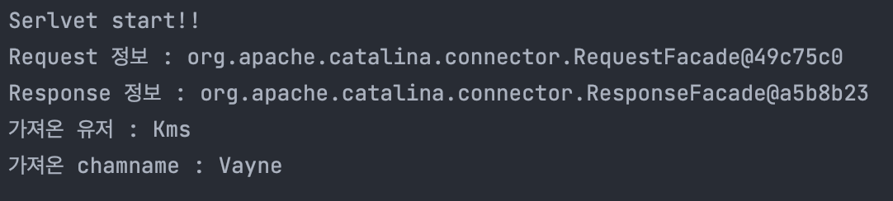
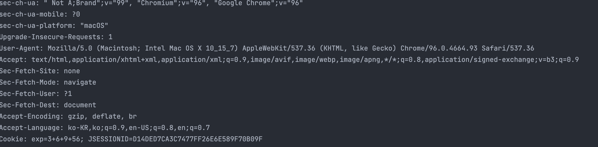

# 1. Servlet 노트

## 1.2 프로젝트 생성  

서블릿을 사용하기 위해서 프로젝트를 생성한다.

<https://start.spring.io/>에서 다음과 같이 설정한다.


Group명과 Artifact는 적절하게 바꾸면 된다.

중요한 것은 Servlet을 원할하게 사용하기 위해서는 Packaging을 Jar가 아닌 *War*로 설정해야 한다.

전부 설정했다면 Intellij에서 불러오면 된다.

## 1.3 서블릿 기초 코드

부트로 설정 하지 않아도 서블릿을 동작시킬 수 있다.

하지만 부트에서는 내장톰캣을 제공해서 서버를 작동시키기 편하다. 부트의 기능을 이용하지 않으면 직접 톰캣 설정을 해줘야하기 때문이다.

먼저 서블릿 메인 함수에 다음과같이 애노테이션을 달아준다.

```java
@ServletComponentScan //서블릿을 자동으로 등록해준다.
@SpringBootApllication
대충 메인 클래스
```

### 1.3.1 ServletComponentScan ? 

이게 무슨 애노테이션일까? 찾아보니 다음과 같다.

SpringBoot 환경에서 basePackages 하위

서블릿컴포넌트(필터, 서블릿, 리스너)를 스캔해서 빈으로 등록한다.

다만 서블릿컴포넌트를 그냥 등록하는게 아니고 해당 서블릿컴포넌트 클래스에는

아래와 같이 별도의 어노테이션이 추가되어 있어야 한다.

- 필터: @WebFilter
- 서블릿: @WebServlet
- 리스너: @WebListener
이는 SpringBoot의 내장톰캣을 사용하는 경우에만 동작한다. 라고 되어있지만 나는 톰캣 설정을 따로 해줘도 동작한다고 생각. 되던데?


이게 무슨 소리인지 나는 알겠지만 처음 배우는 사람들은 모를 것이다.

첨언을 하자면, 필터는 서블릿이 동작하기 전에 사전작업을 해주는데, boot에서 서블릿을 실행하기 전에 저 애노테이션이 달린 것들을 스캔해서 실행한다는 의미같다. 서블릿은 마찬가지로 저 애노테이션이 달린 것들을 스캔하여 서블릿을 동작시킨다. 

WebListner는 나도 몰라서 찾아봤다.

<https://dololak.tistory.com/616>여기 글을 인용하였다.

간단하게 WebListner는 어플리케이션이 실행될 때, 종료될 때 이벤트를 설정할 수 있는 핸들러이다.


새로운 자바클래스를 만들어서 서블릿을 작성해본다.

```java

//name은 서블릿 이름, urlPatterns은 접근 url
//즉 localhost:8080/lol로 접근이 가능하다.
@WebServlet(name = "servletbasic", urlPatterns = "/lol")
public class Servletbasic extends HttpServlet {
    @Override
    protected void service(HttpServletRequest request, HttpServletResponse response) throws ServletException, IOException {
        //콘솔에 찍힘
        System.out.println("Serlvet start!!");
        System.out.println("Request 정보 : " + request);
        System.out.println("Response 정보 : " + response);

        //get변수들에 url에 적은 값들을 가져옴.
        //getParameter안에 값들은 url에 적을 값들임. 즉, useranme=입력할값. 이렇게
        String getuser = request.getParameter("username");
        String getname = request.getParameter("chamname");

        //콘솔에 가져온 값들을 찍음.
        System.out.println("가져온 유저 : " + getuser);
        System.out.println("가져온 chamname : " +getname);

        //전송형태 지정
        response.setContentType("text/plain");
        response.setCharacterEncoding("utf-8");
        
        //받아온 값을 html에 그려서 클라이언트에 돌려줌.
        response.getWriter().write(getuser);
        response.getWriter().write(getname);


    }
}

```

원래 예제를 적을 수 없으므로 변형을 했다. 기본 예제는 파라미터 값을 1개만 받지만 나는 2개를 받았다.

서버를 구동하고 다음과 같이 url을 적어주자.

'localhost:8080/lol?username=Kms&chamname=Vayne'

이렇게 적으면 화면은 다음과 같이 그려진다.


콘솔창은 다음처럼 찍힐 것이다.

  

로그로 요청메시지를 확인하는 방법이 있다.

application.properties 파일에 다음과 같이 쳐주자.

```xml
logging.level.org.apache.coyote.http11=debug
```

그리고 서버를 재실행하면 콘솔창에 다음과 같이 로그가 찍힌다.



단 운영서버에서는 부하가 걸릴 수 있으므로 개발단계에서만 쓰도록 하자.


쿠키에 exp= 어쩌구 저쩌구가 있는데, 쿠키를 이용한 프로젝트를 수행하다보니 쿠키가 저렇게 남은거므로 무시하면 된다.

## 1.4 동작 방식

서버를 구동시키면 톰캣을 띄우면서 우리가 작성한 'servletbasic'이라는 서블릿을 생성하여 서블릿 컨테이너에 집어 넣고 대기하고 있음.

요청이 오면 request와 response를 생성하여 전처리를 한 다음 서블릿컨테이너에 전달.

서블릿 컨테이너는 service함수를 동작시켜 response 객체를 조작하고 이를 받은 곳에 다시 반환.

반환 받은 곳에서는 HTTP응답을 생성하여 클라이언트에 전달.
