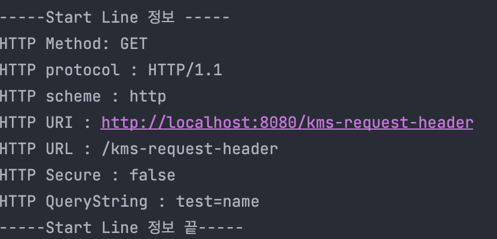

# HTTPServletRequest에 대해

HTTPServletRequest는 HTTP 요청 메시지를 개발자가 편리하게 사용할 수 있도록 개발자 대신에 HTTP 요청 메시지를 파싱해옴. 이런 것이 없다면 개발자가 직접 파싱해야할 것이다.!

이렇게 파싱한 결과를 HTTPServletRequest객체에 담아서 제공한다.

중요한 것은 HTTPservletRequest객체는 파싱한 정보를 개발자가 편히 사용할 수 있게끔 도와주는 것이므로 HTTP 파싱정보에 대한 해석은 개발자 몫이다. 따라서 HTTP에 대한 이해가 기본적으로 깔려있어야 한다는 것이다.

HTTPServletReqeust는 파싱한 정보를 제공할 뿐만 아니라 추가적인 기능이 있다.

```java
//Key와 Value로 데이터를 임시 저장
request.setAttribute(name,value)
//Key로 데이터를 꺼냄.
request.getAttribute(name)

//세션관리 기능.
//세션 확인
request.getSession(create: true)
```

위 처럼 임시 저장소 기능도 제공하며 세션관리 기능도 제공한다.

# HTTPServletRequest 메소드들

새 자바파일을 만들어서 Servlet을 등록해보자.

```java
package hello.servlet.basic.request;

import javax.servlet.ServletException;
import javax.servlet.annotation.WebServlet;
import javax.servlet.http.HttpServlet;
import javax.servlet.http.HttpServletRequest;
import javax.servlet.http.HttpServletResponse;
import java.io.IOException;

@WebServlet(name = "httprequesttest", urlPatterns = "/kms-request-header")
public class HttpRequestTest extends HttpServlet {

    @Override
    protected void service(HttpServletRequest request, HttpServletResponse response) throws ServletException, IOException {
        printStartLine(request);
        printHeaderData(request);
        printHeaderUtils(request);
        printEtc(request);
    }
}

```

## printStartLine() - > StartLine에 대한 정보.

```java
private void printStartLine(HttpServletRequest request) {
        System.out.println("-----Start Line 정보 -----");
        //Post, Get, Put 등 요청 방식
        System.out.println("HTTP Method: " + request.getMethod());
        //Protocol 정보 HTTP 버전 등
        System.out.println("HTTP protocol : " + request.getProtocol());
        //scheme 정보 http
        System.out.println("HTTP scheme : " + request.getScheme());
        //URL 정보 (전체 경로)
        System.out.println("HTTP URI : " + request.getRequestURL());
        //URI 정보 (루트에서의 경로)
        System.out.println("HTTP URL : " + request.getRequestURI());
        //Secure 정보 https 여부
        System.out.println("HTTP Secure : " + request.isSecure());
        //Query String 정보 확인하려면 url의 끝에 아무값이나 넣어보자.
        System.out.println("HTTP QueryString : " + request.getQueryString());
        System.out.println("-----Start Line 정보 끝-----");
        System.out.println();
    }
```

이렇게 작성하고 <localhost:8080/kms-request-header?test=name>에 접근하면 다음과 같이 콘솔에 찍힌다.



## printHeaderData() -> 헤더 정보

```java
    private void printHeaderData(HttpServletRequest request){
        System.out.println("-----Header 정보 -----");

        //옛날방식으로 헤더정보 꺼내오기.
        /*
        Enumeration<String> headerNames = request.getHeaderNames();

        while(headerNames.hasMoreElements()){
            String headerdata = headerNames.nextElement();
            System.out.println(headerdata + request.getHeader(headerdata));
        }
         */

        //최근 방법으로 꺼내기.
        request.getHeaderNames().asIterator().
                forEachRemaining(headername -> System.out.println(headername + request.getHeader(headername)));
        System.out.println("-----Header 정보 끝-----");
        System.out.println();
    }
```

## printHeaderUtils() - > 헤더 편의 기능

```java
    private void printHeaderUtils(HttpServletRequest request) {
        System.out.println("--- Header 편의 조회 start ---");
        System.out.println("[Host 편의 조회]");
        //Host 정보
        System.out.println("request.getServerName() = " + request.getServerName());
        //Port 정보
        System.out.println("request.getServerPort() = " + request.getServerPort());
        System.out.println();
        System.out.println("[Accept-Language 편의 조회]");
        //lcoal 정보 (언어 우선순위)
        request.getLocales().asIterator()
                .forEachRemaining(locale -> System.out.println("locale = " + locale));
        System.out.println("request.getLocale() = " + request.getLocale());
        System.out.println();
        //쿠키
        System.out.println("[cookie 편의 조회]");
        //쿠키 정보들
        if (request.getCookies() != null) {
            for (Cookie cookie : request.getCookies()) {
                System.out.println(cookie.getName() + ": " + cookie.getValue());
            } }
        System.out.println();
        System.out.println("[Content 편의 조회]");
        //Post방식으로 데이터를 전송하면 알 수 있다.
        //받은 데이터의 전송 형식 text 등
        System.out.println("request.getContentType() = " + request.getContentType());
        //받은 데이터의 길이 (byte)
        System.out.println("request.getContentLength() = " +request.getContentLength());
        //받은 데이터의 인코딩 형식
        System.out.println("request.getCharacterEncoding() = " + request.getCharacterEncoding());
        System.out.println("--- Header 편의 조회 끝 ---");
        System.out.println();

    }
```

## printEtc() -> 네트워크 관련

```java
private void printEtc(HttpServletRequest request) {
        System.out.println("--- 그 외의 기능 (네트워크 관련) ---");
        System.out.println("request getRemoteUser() : " + request.getRemoteUser());
        System.out.println("request getRemoteAddr() : " + request.getRemoteAddr());
        System.out.println("request getRemoteHost() : " + request.getRemoteHost());
        System.out.println("request getRemotePort() : " + request.getRemotePort());

        //

        System.out.println("request getLocalAddr() : " + request.getLocalAddr());
        System.out.println("request getLocalName() : " + request.getLocalName());
        System.out.println("request getLocalPort() : " + request.getLocalPort());

        System.out.println("--- 그 외의 기능 (네트워크 관련) 끝 ---");
        System.out.println();
    }
```