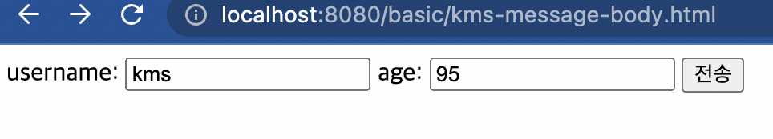
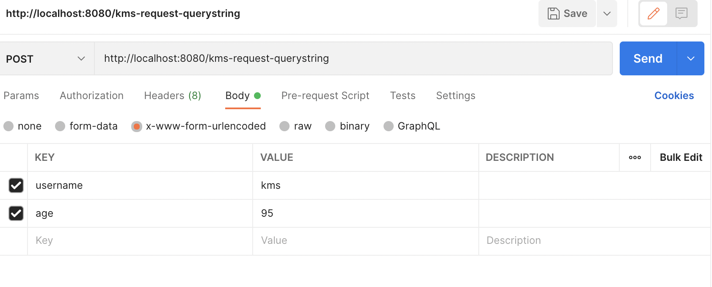

# Http Request에 대한 내용

HTTP 요청 메시지를 통해서 클라이언트에서 서버로 전달하는 방식은 크게 3가지가 있다.

## 1. GET 쿼리 파라미터

- url에 직접 요청 데이터를 때려 박는다.

- 구문은 'url?username=kms&city=goyang' 이런식으로 때려박으면된다.

- URL에 데이터를 담아 보내고, 검색이나 필터 등에서 많이 사용하는 방식이다.


만들어보자.

```java
package hello.servlet.basic.request;

import javax.servlet.ServletException;
import javax.servlet.annotation.WebServlet;
import javax.servlet.http.HttpServlet;
import javax.servlet.http.HttpServletRequest;
import javax.servlet.http.HttpServletResponse;
import java.io.IOException;
import java.util.Enumeration;

//url : localhost:8080//kms-request-querystring?username=kms&age=27
@WebServlet(name = "requestquerystring", urlPatterns = "/kms-request-querystring")
public class ReqeustQueryString extends HttpServlet {

    @Override
    protected void service(HttpServletRequest request, HttpServletResponse response) throws ServletException, IOException {
        System.out.println("전체 파라미터 조회하는 법");
        request.getParameterNames().asIterator()
                .forEachRemaining(param -> System.out.println(request.getParameter(param)));

        System.out.println("단일 파라미터 조회하는 법");
        String username = request.getParameter("username");
        String age = request.getParameter("age");
        System.out.println("username : " +username);
        System.out.println("age : " + age);

        System.out.println("복수 파라미터 조회하는 법");
        //url : localhost:8080/kms-request-querystring?username=kms&age=27&username=Vayne
        String[] names = request.getParameterValues("username");
        for(String name : names){
            System.out.println("usernames : " + name);
        }

        response.getWriter().write("ok");
    }
}

```

주석으로 처리된 url을 직접 때려박으면 된다.

- 동일 파라미터의 경우 호출하는 메소드가 다르다는 것을 인지하고 있자. 그리고 중복인 경우 getParameter()를 사용하면 getParameterValues()의 첫 번째 값을 반환한다.

  


## 2. POST HTML Form

- 헤더값들을 뒤져보면 'content-type: application/x-www-form-unlencoded'라는 것이 있다. 이런것들은 Form형식으로 데이터를 보낸 것이다.
- 메시지 바디에 쿼리 파라미터 형식으로 전달한다. 위와 같이 'username=kms&city=goyang' 처럼 말이다.
- 회원 가입, 상품 주문 등에서 사용된다.

쿼리 파라미터 형식과 보내는 데이터의 구문은 같은데 뭐가 다른걸까?  

내 생각이다.  
일단 메시지바디에 'username=kms&city=goyang'을 담으므로 url에 데이터가 나타나지 않는다.

Form형식으로 보내기 위해서 새로운 HTML파일을 만들어본다.

*kms-message-body.html*  

```HTML
<!DOCTYPE html>
<html>
<head>
  <meta charset="UTF-8">
  <title>Title</title>
</head>
<body>
<form action="/kms-request-querystring" method="post">
  username: <input type="text" name="username" /> age: <input type="text" name="age" /> <button type="submit">전송</button>
</form>
</body>
</html>

```

'/kms-request-quertstring'에 Post 형식으로 username과 age를 보낼 것이다.

접근한 url에 데이터를 입력하고 전송 버튼을 누르면 제대로 전달되는 것을 알 수 있다.

  

결과  c

  

이걸 테스트 하려고 매 번 폼을 작성하는 것은 번거롭다.

Postman을 사용해서 작성해보자.

  

Post 형식으로 HTMl Form은 Content-Type이 x-www-urlencoded이므로 'x-www-urlencoded'에 체크해주자.

그리고 key과 value값을 위처럼 설정해주면 똑같은 결과를 얻을 수 있다.


## 3. HTTP message Body에 데이터를 직접 담아서 요청.

- HTTP API에서 주로 사용된다. JSON, XML, TEXT 등.


### String 단순 메시지 보내기.

java 파일을 생성하자.

```java
package hello.servlet.basic.request;

import org.springframework.util.StreamUtils;
import org.springframework.util.StringUtils;

import javax.servlet.ServletException;
import javax.servlet.ServletInputStream;
import javax.servlet.annotation.WebServlet;
import javax.servlet.http.HttpServlet;
import javax.servlet.http.HttpServletRequest;
import javax.servlet.http.HttpServletResponse;
import java.io.IOException;
import java.io.InputStream;
import java.nio.charset.StandardCharsets;

@WebServlet(name = "httpmessagebody",urlPatterns = "/kms-request-body-string")
public class HttpMessageBody extends HttpServlet {
    @Override
    protected void service(HttpServletRequest request, HttpServletResponse response) throws ServletException, IOException {
        //messagebody릃 가져옴.
        ServletInputStream inputStream = request.getInputStream();
        //알아볼 수 있는 String으로 가져와야함. UTF-8형식으로
        String text = StreamUtils.copyToString(inputStream, StandardCharsets.UTF_8);
        //콘솔에 출력
        System.out.println("message body String : " + text);
        response.getWriter().write("ok");
    }
}

```

Postman으로 보내보자.

  

body에 체크해주고 raw로 보내고 싶은 메시지를 보내보자.

  

잘 간다.

### JSON 형식으로 보내보기

JSON 방식으로 보내기 위해 객체를 만들 것이다.
객체 정보를 담는 클래스 파일을 만들어본다.

```java
package hello.servlet.basic;

import lombok.Getter;
import lombok.Setter;

@Getter @Setter
public class JSONData {
    private String username;
    private int age;
}
```

그리고 새로운 서블릿을 만들어주자.

```java
package hello.servlet.basic.request;

import com.fasterxml.jackson.databind.ObjectMapper;
import hello.servlet.basic.JSONData;
import org.springframework.util.StreamUtils;
import org.springframework.util.StringUtils;

import javax.servlet.ServletException;
import javax.servlet.ServletInputStream;
import javax.servlet.annotation.WebServlet;
import javax.servlet.http.HttpServlet;
import javax.servlet.http.HttpServletRequest;
import javax.servlet.http.HttpServletResponse;
import java.io.IOException;
import java.nio.charset.StandardCharsets;

@WebServlet(name = "httpMessageBodyJson",urlPatterns = "/kms-reqeust-json")
public class HttpMessageBodyJson extends HttpServlet {
    //Json 객체로 받기위해
    private ObjectMapper objectMapper = new ObjectMapper();
    @Override
    protected void service(HttpServletRequest request, HttpServletResponse response) throws ServletException, IOException {
        ServletInputStream inputStream = request.getInputStream();
        String text = StreamUtils.copyToString(inputStream, StandardCharsets.UTF_8);
        System.out.println("message body : " + text);

        //객체 형태로 받는 방법.
        //위에 Mapper를 선언해야함.
        //객체 형태로 메시지를 받아온다.
        JSONData jsonData = objectMapper.readValue(text, JSONData.class);
        System.out.println("jsonData.username : " + jsonData.getUsername());
        System.out.println("jsonData.age : " + jsonData.getAge());

        response.getWriter().write("ok");
    }
}

```

Postman에서 JSON형식으로 해놓고 raw형태로 다음과 같이 보내보자.

```text
{"username" : "kms", "age" : 95}
```

  

잘 간다.

- 추가로 JSON 결과를 파싱해서 사용할 수 있는 자바 객체로 변환하려면 Jackson, Gson 같은 JSON 변환 라이브러리를 추가해서 사용해야 한다. Spring Boot로 Spring MVC를 선택하면 Jackson라이브러리를 기본적으로 제공한다.

