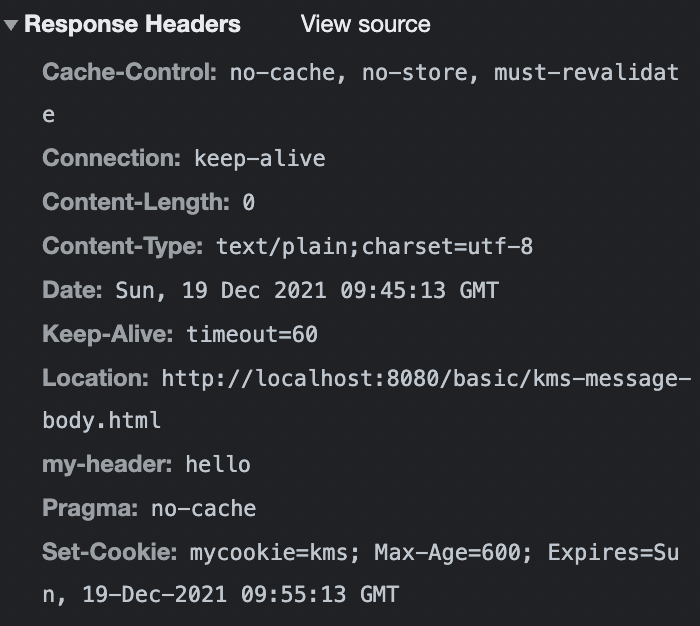
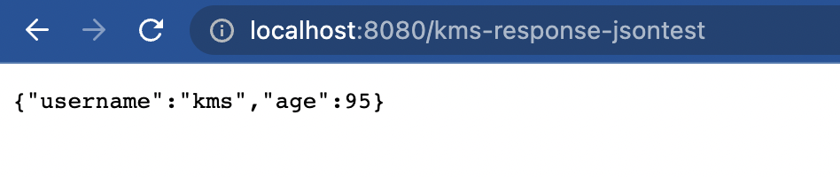

# HttpServletResponse 정리

응답코드를 지정할 수 있는데, 개발자가 편하게 지정할 수 있도록 해당 객체가 많은 기능을 제공한다.

## 기본 사용법

java파일을 만들자.

```java
package hello.servlet.basic.response;

import javax.servlet.ServletException;
import javax.servlet.annotation.WebServlet;
import javax.servlet.http.Cookie;
import javax.servlet.http.HttpServlet;
import javax.servlet.http.HttpServletRequest;
import javax.servlet.http.HttpServletResponse;
import java.io.IOException;

@WebServlet(name = "httpResponse",urlPatterns = "/kms-response-test")
public class HttpResponse extends HttpServlet {

    @Override
    protected void service(HttpServletRequest request, HttpServletResponse response) throws ServletException, IOException {
        //status line 지정 200
        response.setStatus(HttpServletResponse.SC_OK);

        //response header 셋팅
        response.setHeader("Content-Type","text/plain;charset=utf8");
        response.setHeader("Cache-Control", "no-cache, no-store, must-revalidate");
        response.setHeader("Pragma", "no-cache");
        response.setHeader("my-header","hello");

        //header 편의 메서드
        content(response);
        cookie(response);
        redirect(response);
        //message body
        response.getWriter().write("ok");
    }

    private void redirect(HttpServletResponse response) throws IOException {
        response.sendRedirect("/basic/kms-message-body.html");

        //편의 기능없이 setHeader로 만든 것. 302
        //response.setStatus(HttpServletResponse.SC_FOUND);
        //response.setHeader("Location","/basic/kms-message-body.html");

    }

    private void cookie(HttpServletResponse response) {
        //쿠키 생성
        Cookie cookie = new Cookie("mycookie","kms");
        //쿠키 만료일자 지정. 단위는 초
        cookie.setMaxAge(600);
        response.addCookie(cookie);

        //밑 부분은 편의기능 없이 직접 헤더를 조작하여 쿠키를 설정
        //response.setHeader("Set-Cookie", "mycookie=kms; Max-Age=600");
    }
    private void content(HttpServletResponse response) {
        //setHeader()없이 해당 메소드로 편하게 지정해줄 수 있다.
        response.setContentType("text/plain");
        response.setCharacterEncoding("utf-8");
    }
}

```

주석을 참고하자.

결과는 다음과 같다.

  

쿠키가 설정된 것을 보고, 새로만든 헤더가 추가된 것을 보면 된다.

직접 헤더를 조정하는것은 오타가날 위험도 있으므로 객체가 지원하는 편의 메소드들을 사용하자.!!

## 단순 텍스트, HTML 응답.

단순 텍스트 응답은 앞에서 코드로 작성한 

```java
writer.println("ok");
```
가 단순 텍스트 응답이다.

HTML응답을 보내기 위해 자바파일을 생성하자.

```java
package hello.servlet.basic.response;

import javax.servlet.ServletException;
import javax.servlet.annotation.WebServlet;
import javax.servlet.http.HttpServlet;
import javax.servlet.http.HttpServletRequest;
import javax.servlet.http.HttpServletResponse;
import java.io.IOException;
import java.io.PrintWriter;

@WebServlet(name = "httpResponseHTML", urlPatterns = "/kms-response-htmltest")
public class HttpResponseHTML extends HttpServlet {

    @Override
    protected void service(HttpServletRequest request, HttpServletResponse response) throws ServletException, IOException {
        //Content-Type을 HTML로 지정
        response.setContentType("text/html");
        //인코딩 타입 지정
        response.setCharacterEncoding("utf-8");

        PrintWriter writer = response.getWriter();

        writer.println("<html>");
        writer.println("<body>");
        writer.println("<div> 이렇게 코딩은 하지 말자. </div>");
        writer.println("</body>");
        writer.println("</html>");

    }
}

```

이제 지정한 url로 들어가서 확인해보자.


html로 잘 응답한걸 볼 수 있다.

## API JSON으로 응답하기.

java 파일을 생성하자.

```java
package hello.servlet.basic.response;

import com.fasterxml.jackson.databind.ObjectMapper;
import hello.servlet.basic.JSONData;

import javax.servlet.ServletException;
import javax.servlet.annotation.WebServlet;
import javax.servlet.http.HttpServlet;
import javax.servlet.http.HttpServletRequest;
import javax.servlet.http.HttpServletResponse;
import java.io.IOException;
import java.io.PrintWriter;

@WebServlet(name = "httpResponseJson",urlPatterns = "/kms-response-jsontest")
public class HttpResponseJson extends HttpServlet {
    ObjectMapper objectMapper = new ObjectMapper();

    @Override
    protected void service(HttpServletRequest request, HttpServletResponse response) throws ServletException, IOException {
        //ContentType은 application/json으로 설정해야한다.
        response.setContentType("application/json");
        response.setCharacterEncoding("utf-8");

        //JSon으로 만들 객체 생성
        JSONData jsonData = new JSONData();
        jsonData.setUsername("kms");
        jsonData.setAge(95);

        //Json 형식으로 바꿔주자.
        String convertdata = objectMapper.writeValueAsString(jsonData);

        response.getWriter().write(convertdata);
    }
}

```

주석을 참고하고 해당 url로 들어가면 다음과 같이 뜬다.!

  

