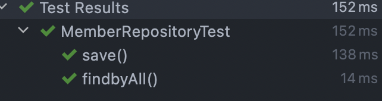

# 1. 도메인 모델 작성

domain 패키지를 만들고 그 안에 Member라는 클래스를 작성하였다.

```java
package hello.servlet.basic.domain;

import lombok.Getter;
import lombok.Setter;

import static java.lang.Math.pow;

//lombok
@Getter @Setter
public class Member {

    //index
    private Long id;
    private String username;
    private int height;
    private int weight;
    private double bmi;

    public Member(){}

    public Member( String username, int height, int weight) {
        this.username = username;
        this.height = height;
        this.weight = weight;
        this.bmi = calbmi(height,weight);

    }

    /*
    BMI계산 산출식 : (남자 기준) 체중/신장^2
     */
    public double calbmi(int height, int weight){
        double calheight = (double)height/100;
        return weight / pow(calheight,2);
    }
}


```

bim계산을 Member 클래스에 넣은 이유는 이제 만들 저장소에 계산 메소드가 들어가는게 아니라고 생각하고 서비스함수이므로 Member 클래스에 넣어 새로운 객체를 만들때마다 자동으로 초기화해주는게 낫다고 생각하였다.


다음은 저장소를 만들어 보겠다.


프로젝트가 크지 않으므로 domain 패키지안에 MemberRepository를 만들겠다.

```java
package hello.servlet.basic.domain;

import java.util.ArrayList;
import java.util.HashMap;
import java.util.List;
import java.util.Map;

import static java.lang.Math.pow;

public class MemberRepository {

    //저장소
    private static final Map<Long,Member> store = new HashMap<>();
    //index가 증가할수록 1씩 늘어남.
    private static long sequence = 0L;

    //싱글톤 기법으로 객체 생성
    private static final MemberRepository instance = new MemberRepository();

    private MemberRepository(){}

    public static MemberRepository getInstance(){
        return instance;
    }

    //Method

    /*
    멤버 저장
     */
    public Member save(Member member){
        member.setId(++sequence);
        store.put(member.getId(), member);
        return member;
    }
    /*
    단일 멤버 조회
     */
    public Member findById(Long id){
        return store.get(id);
    }

    /*
    전체 멤버 조회
     */
    public List<Member> findByAll(){
        return new ArrayList<>(store.values());
    }

    /*
    저장소 삭제
     */
    public void clearStore(){
        store.clear();
    }


}

```

Spring을 사용하면 스프링빈으로 등록하여 싱글톤 패턴을 사용하지 않아도 되지만, 스프링을 아직 사용할 생각이 없다고 강의에서 그런다.

싱글톤 패턴이 뭘까?

## 1.1 싱글톤 패턴

하나의 인스턴스를 생성하여 모든 클라이언트에게 동일한 객체를 반환하는 패턴이다.

원래 기본 코드는 

```java
if(instance == null){ //최초 한번만 new 연산자를 통하여 메모리에 할당한다.
    instance = new SingleTon();
}	
```

최초 할당시 위처럼 객체를 새로 생성하지만 위의 코드는 그렇지 않다. 자동으로 감지하여 생성해주나보다.

# 2. 테스트 코드


테스트 코드를 작성해보자.

## 2.1 멤버 저장 테스트 코드

```java
package hello.servlet.domain;

import hello.servlet.basic.domain.Member;
import hello.servlet.basic.domain.MemberRepository;
import org.assertj.core.api.Assertions;
import org.junit.jupiter.api.AfterEach;
import org.junit.jupiter.api.Test;

class MemberRepositoryTest {

    MemberRepository memberRepository = MemberRepository.getInstance();

    //테스트를 끝나고 저장소를 초기화
    @AfterEach
    void afterEach(){
        memberRepository.clearStore();
    }

    @Test
    void save(){
        //given
        Member member= new Member("kms",178,74);
        //when
        Member savemember = memberRepository.save(member);
        //then
        Member findmember = memberRepository.findById(savemember.getId());

        Assertions.assertThat(savemember).isEqualTo(findmember);
    }
}

```

## 2.2 findByall Test

```java
    @Test
    void findbyAll(){
        //given
        Member user1 = new Member("kms", 178, 74);
        Member user2 = new Member("jyb", 160, 46);

        memberRepository.save(user1);
        memberRepository.save(user2);

        //when
        List<Member> members = memberRepository.findByAll();
        System.out.println(user2.getBmi());
        //then
        Assertions.assertThat(members.size()).isEqualTo(2);
        Assertions.assertThat(members).contains(user1,user2);
    }
```

## 2.3 결과

  

findById()나 bmi계산관련 테스트는 없다. 간단해서

2편에서 서블릿을 사용한 동적 html을 만들어보도록 하겠다.