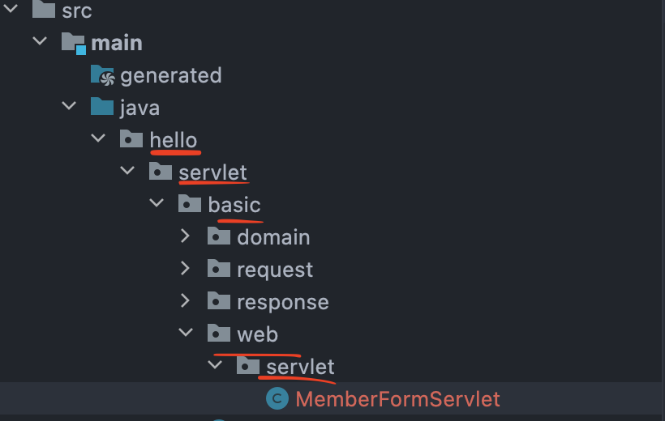
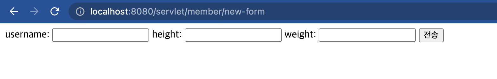
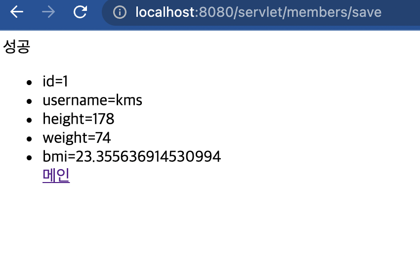
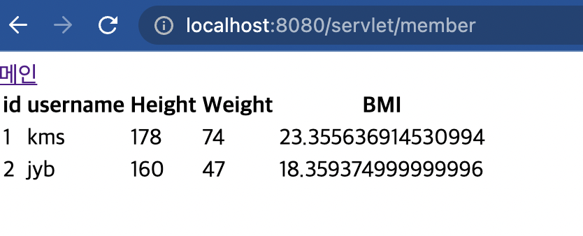

# 1. 서블릿으로 웹 어플리케이션 제작

개요 부분에서 작성한 코드를 가지고 서블릿을 통한 동적 웹을 작성해보자.

먼저 회원을 저장하기 위해 등록 폼을 만들어야 할 것이다.

대충 패키지를 만들자

나의 프로젝트 경로는 다음과 같다.

  

web.servlet에 코드를 다 넣을 것이다.

## 1.1 MemberFormServlet - 회원 등록 폼

```java
package hello.servlet.basic.web.servlet;

import hello.servlet.basic.domain.MemberRepository;

import javax.servlet.ServletException;
import javax.servlet.annotation.WebServlet;
import javax.servlet.http.HttpServlet;
import javax.servlet.http.HttpServletRequest;
import javax.servlet.http.HttpServletResponse;
import java.io.IOException;
import java.io.PrintWriter;

@WebServlet(name = "memberFormServlet",urlPatterns = "/servlet/member/new-form")
public class MemberFormServlet extends HttpServlet {
    MemberRepository memberRepository = MemberRepository.getInstance();

    @Override
    protected void service(HttpServletRequest request, HttpServletResponse response) throws ServletException, IOException {
        //셋팅
        response.setCharacterEncoding("utf-8");
        response.setContentType("text/html");

        PrintWriter w = response.getWriter();

        w.write("<!DOCTYPE html>\n" +
                "<html>\n" +
                "<head>\n" +
                "    <meta charset=\"UTF-8\">\n" +
                "    <title>Title</title>\n" +
                "</head>\n" +
                "<body>\n" +
                "<form action=\"/servlet/members/save\" method=\"post\">\n" +
                "    username: <input type=\"text\" name=\"username\" />\n" +
                "    height:      <input type=\"text\" name=\"height\" />\n" +
                "    weight:      <input type=\"text\" name=\"weight\" />\n" +
                " <button type=\"submit\">전송</button>\n" + "</form>\n" +
                "</body>\n" +
                "</html>\n");
    }
}

```

이렇게 만들고 해당 url로 접근해서 다음과 같이 폼이 뜨면 성공이다.



아직 해당 전달받는 서블릿을 만들지 않아서 '전달'버튼을 눌러서 오류가 뜨는건 정상이다.

전달받는 부분을 만들어보자.

## 1.2 MemberSaveServlet - 회원 저장

```java
package hello.servlet.basic.web.servlet;

import hello.servlet.basic.domain.Member;
import hello.servlet.basic.domain.MemberRepository;

import javax.servlet.ServletException;
import javax.servlet.annotation.WebServlet;
import javax.servlet.http.HttpServlet;
import javax.servlet.http.HttpServletRequest;
import javax.servlet.http.HttpServletResponse;
import java.io.IOException;
import java.io.PrintWriter;

@WebServlet(name = "memberSaveServlet",urlPatterns = "/servlet/members/save")
public class MemberSaveServlet extends HttpServlet {
    MemberRepository memberRepository = MemberRepository.getInstance();

    @Override
    protected void service(HttpServletRequest request, HttpServletResponse response) throws ServletException, IOException {
        //동작 확인용
        System.out.println("memberSaveServlet");

        //회원정보를 받아오자. 정보들은 전부 String이므로 int로 반환해줄건 해주자.
        String username = request.getParameter("username");
        int height = Integer.parseInt(request.getParameter("height"));
        int weight = Integer.parseInt(request.getParameter("weight"));

        //멤버 객체 만들고 저장소에 저장.
        Member member  = new Member(username,height,weight);
        System.out.println("member : " + member);
        memberRepository.save(member);

        //셋팅
        response.setContentType("text/html");
        response.setCharacterEncoding("utf-8");

        PrintWriter w = response.getWriter();

        w.write("<html>\n" +
                "<head>\n" +
                " <meta charset=\"UTF-8\">\n" + "</head>\n" +
                "<body>\n" +
                "성공\n" +
                "<ul>\n" +
                "    <li>id="+member.getId()+"</li>\n" +
                "    <li>username="+member.getUsername()+"</li>\n" +
                "    <li>height="+member.getHeight()+"</li>\n" +
                "    <li>weight="+member.getWeight()+"</li>\n" +
                "    <li>bmi="+member.getBmi()+"</li\n"+
                "</ul>\n" +
                "<a href=\"/index.html\">메인</a>\n" + "</body>\n" +
                "</html>");
    }
}

```

자 이렇게 만들고 아까 등록 폼에서 '전달' 버튼을 눌러보자.

  

참고로 뒤로가기를 누르고 다른 회원을 등록하면 id값이 하나 증가한걸 볼 수 있다.

그리고 코드에서 
```html
"<a href=\"/index.html\">메인</a>\n" + "</body>\n" 
```

이부분은 기본 예제에 있던 코드이므로 자신이 index페이지가 없다면 무시해도 된다.


이제 회원 전체 목록을 조회하는 폼을 만들어볼 것이다.

## 1.3 MemberListServlet - 회원 목록

```java
package hello.servlet.basic.web.servlet;

import hello.servlet.basic.domain.Member;
import hello.servlet.basic.domain.MemberRepository;

import javax.servlet.ServletException;
import javax.servlet.annotation.WebServlet;
import javax.servlet.http.HttpServlet;
import javax.servlet.http.HttpServletRequest;
import javax.servlet.http.HttpServletResponse;
import java.io.IOException;
import java.io.PrintWriter;
import java.util.List;

@WebServlet(name = "memberListServlet",urlPatterns = "/servlet/member")
public class MemberListServlet extends HttpServlet {
    MemberRepository memberRepository = MemberRepository.getInstance();

    @Override
    protected void service(HttpServletRequest request, HttpServletResponse response) throws ServletException, IOException {

        //셋팅
        response.setCharacterEncoding("utf-8");
        response.setContentType("text/html");

        List<Member> members = memberRepository.findByAll();

        PrintWriter w = response.getWriter();

        w.write("<html>");
        w.write("<head>");
        w.write("    <meta charset=\"UTF-8\">");
        w.write("    <title>Title</title>");
        w.write("</head>");
        w.write("<body>");
        w.write("<a href=\"/index.html\">메인</a>");
        w.write("<table>");
        w.write("    <thead>");
        w.write("    <th>id</th>");
        w.write("    <th>username</th>");
        w.write("    <th>Height</th>");
        w.write("    <th>Weight</th>");
        w.write("    <th>BMI</th>");
        w.write("    </thead>");
        w.write("    <tbody>");
        for(Member member : members){
            w.write("    <tr>");
            w.write("        <td>" + member.getId() + "</td>") ;
            w.write("        <td>" + member.getUsername() + "</td>") ;
            w.write("        <td>" + member.getHeight() + "</td>") ;
            w.write("        <td>" + member.getWeight() + "</td>") ;
            w.write("        <td>" + member.getBmi() + "</td>") ;
        }
        w.write("    </tbody>");
        w.write("</table>");
        w.write("</body>");
        w.write("</html>");
    }
}

```

따로 설명할 부분이 없다.

등록 폼에서 객체들을 추가하고 해당 url로 들어가면 다음과 같은 화면을 볼 수 있다.

  

# 2. 결론

동적으로 HTML을 만들 수 있지만, 태그를 직접 출력해야하고 오타가 날 위험이 있다.
매우 복잡하면서도 비효율적인 이 코드는 결국 자바를 이용해서 문서를 출력하는 것 보다는 HTML에 자바 코드를 넣는게 더 편리할 것이라는 생각으로 템플릿 엔진이 탄생하였다.  
템플릿 엔진은 HTML문서에 필요한 곳에만 코드를 넣어서 동적으로 페이지를 생성할 수 있게 한다.

JSP, Thymeleaf, Freemarker, Velocity 등이 있다.

다음은 JSP로 페이지를 만들어볼 것이다.

