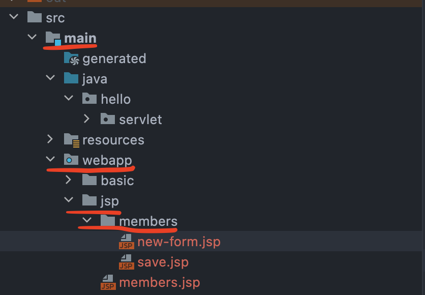
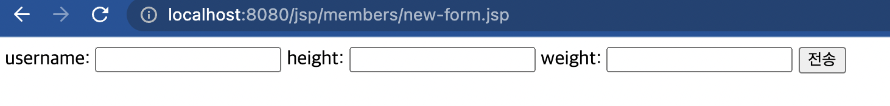
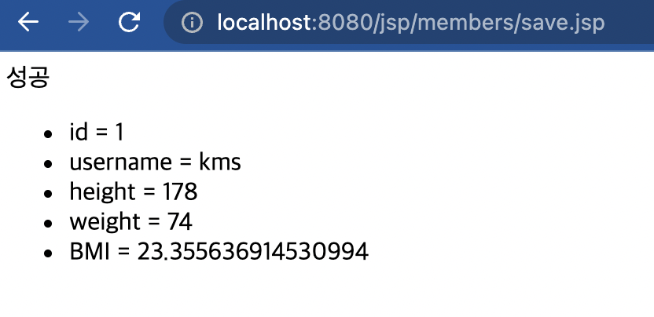
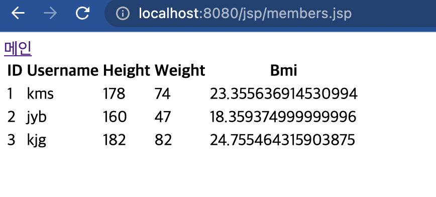

# JSP로 웹 어플리케이션 만들기

Servlet으로 웹 어플리케이션을 만들기는 굉장히 비효율적이라는 것을 알았다.

JSP로 만들어보자.

```jsp
<% %>
```
이 안에 코드를 넣으면 자바문법을 사용할 수 있다. 

```jsp
<%= %>
```
이 안에 값을 넣으면 출력한다는 의미이다.

먼저 JSP 라이브러리를 추가해야한다.

build.gradle에 다음과 같이 추가하자.

```java
//JSP 추가 시작
implementation 'org.apache.tomcat.embed:tomcat-embed-jasper'   implementation 'javax.servlet:jstl'
//JSP 추가 끝
```

gradle을 다시 빌드해주자.

프로젝트 구성은 다음과 같다.

  

위처럼 3가지 파일을 만들어줄 것이다.

## 회원 등록 폼 JSP (main/webapp/jsp/members/new-form.jsp)

```jsp
<%@ page contentType="text/html;charset=UTF-8" language="java" %>
<html>
<head>
    <title>Title</title>
</head>
<body>
    <form action="/jsp/members/save.jsp" method="post">
        username: <input type="text" name="username" />
        height:   <input type="text" name="height" />
        weight:   <input type="text" name="weight" />
        <button type="submit">전송</button>
    </form>
</body>
</html>
```

url로 접근해보자.

  

참고로 <%@ ~ %> 문법은 설정을 명시하는 것이다. jsp가 가장 먼저 읽는 부분이다.

이제 Post로 보낸 데이터를 받아 출력하는 페이지를 작성한다.

## 회원 저장 JSP (main/webapp/jsp/members/save.jsp)


```jsp
<%@ page import="hello.servlet.basic.domain.MemberRepository" %>
<%@ page import="hello.servlet.basic.domain.Member" %>
<%@ page contentType="text/html;charset=UTF-8" language="java" %>
<%
    MemberRepository memberRepository = MemberRepository.getInstance();

    //확인용
    System.out.println("save.jsp");
    String username = request.getParameter("username");
    int height = Integer.parseInt(request.getParameter("height"));
    int weight = Integer.parseInt(request.getParameter("weight"));

    Member member = new Member(username,height,weight);
    memberRepository.save(member);


%>
<html>
<head>
    <meta charset="UTF-8">
    <title>Title</title>
</head>
<body>
성공
<ul>
    <li>id = <%=member.getId()%></li>
    <li>username = <%=member.getUsername()%></li>
    <li>height = <%=member.getHeight()%></li>
    <li>weight = <%=member.getWeight()%></li>
    <li>BMI = <%=member.getBmi()%></li>
</ul>
</body>
</html>

```

결과화면이 다음과 같이 뜨면 성공이다.



마지막으로 회원 목록을 조회하는 JSP를 작성해보겠다.

## 회원 목록 JSP (main/webapp/jsp/members.jsp)

```jsp
<%@ page import="hello.servlet.basic.domain.MemberRepository" %>
<%@ page import="hello.servlet.basic.domain.Member" %>
<%@ page import="java.util.List" %>
<%@ page contentType="text/html;charset=UTF-8" language="java" %>
<%
    MemberRepository memberRepository = MemberRepository.getInstance();
    List<Member> members = memberRepository.findByAll();
%>
<html>
<head>
    <meta charset="UTF-8">
    <title>Title</title>
</head>
<body>
    <a href="/index.html">메인</a>
    <table>
        <thead>
        <th>ID</th>
        <th>Username</th>
        <th>Height</th>
        <th>Weight</th>
        <th>Bmi</th>
        </thead>
        <tbody>
        <%
            for(Member member : members){
                out.write("    <tr>\n");
                out.write("        <td>" + member.getId() + "</td>\n");
                out.write("        <td>" + member.getUsername() + "</td>\n");
                out.write("        <td>" + member.getHeight() + "</td>\n");
                out.write("        <td>" + member.getWeight() + "</td>\n");
                out.write("        <td>" + member.getBmi() + "</td>\n");
                out.write("    </tr>\n");
            }
        %>
        </tbody>
    </table>
</body>
</html>

```

데이터를 넣고 결과를 확인해보자.

  

성공이다.


# 결론 / 서블릿과 JSP의 한계

서블릿으로 개발할 때 뷰화면을 위한 HTML을 만드는 작업이 자바 코드에 섞여서 복잡했다.  
이에 대한 해결방안으로 JSP가 나왔다. 뷰를 생성하는 HTML 작업을 깔끔하게 가져갔지만 한 페이지에 JAVA 코드, 저장소에 대한 정보, HTML코드 다 짬뽕되어서 JSP가 너무 많은 역할을 한다. 유지보수에서도 골치가 아플 것이다.

이를 해결하기 위해서 *MVC*패턴이 등장했다.

## MVC 패턴

Model, View, Controller의 약자로 비즈니스 로직은 서블릿처럼 다른곳에서 처리하고, HTML은 View를 그리는 역할로 분리하여 코드를 작성하자는 뜻이다.


