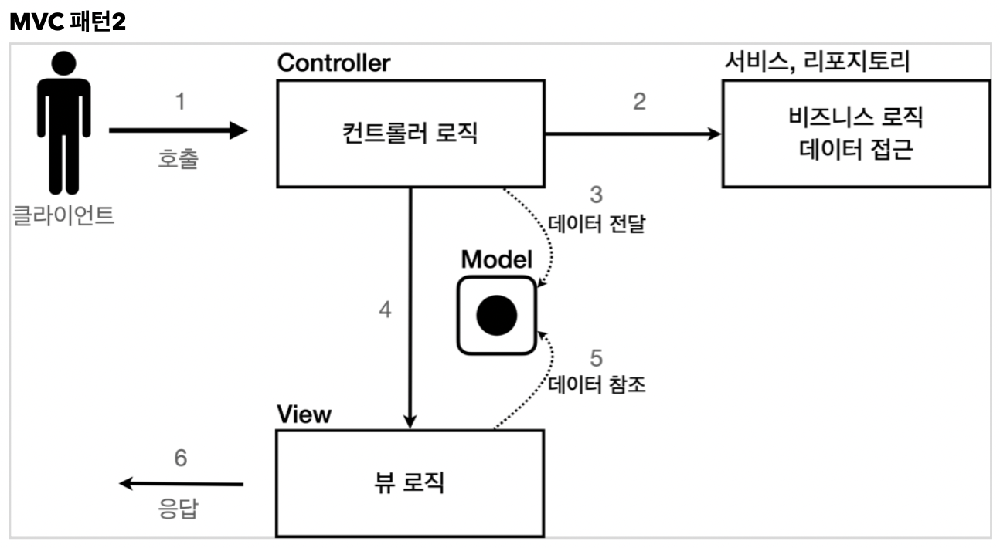
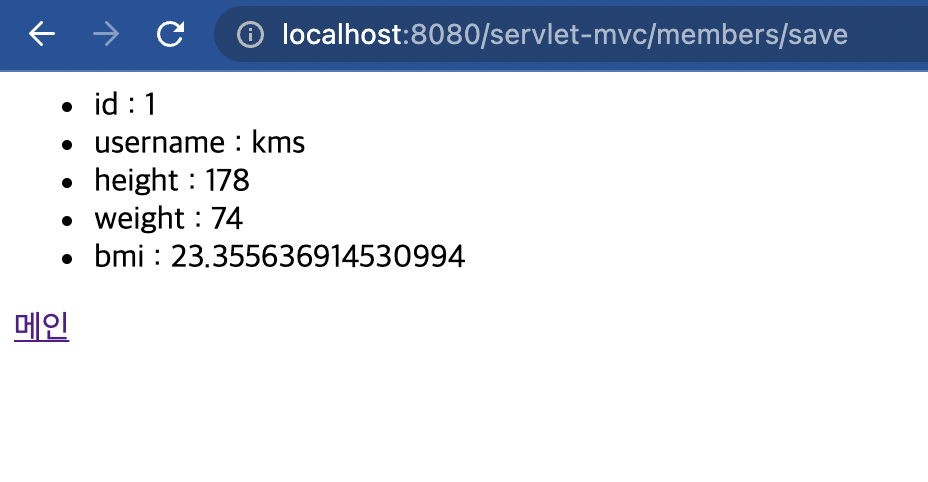
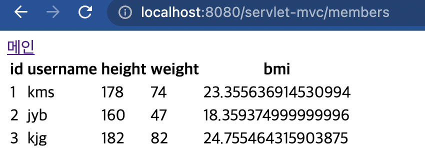

# 1. MVC 패턴 개요

- 서블릿과 JSP만으로 비즈니스 로직과 뷰 렌더링까지 모두 처리하게 되는 것은 너무 많은 역할을 맡기고, 유지보수도 어려워진다.  
- 버튼 하나 옮기는 작업에 Java코드가 섞인 JSP파일을 본다면 머리가 어질어질할 것이다.  
- 마찬가지로 비즈니스 로직을 바꾸려고 Java코드를 건드려야 하는데 HTML 코드가 수백줄이라고 하면 머리가 띵할 것이다.

- JSP 같은 뷰 템플릿은 화면을 렌더링 하는데 최적화 되어 있기 때문에 이 부분의 업무만 담당하는 것이 효과적이다.

## 1.1 MVC

- Model : 뷰에 출력할 데이터를 담아놓음. 뷰가 필요한 데이터를 모두 모델에 담아서 전달해주는 덕분에 뷰는 비즈니스 로직이나 데이터 접근을 몰라도 되고, 화면을 렌더링 하는 일에 집중할 수 있음.
- View : 모델에 담겨있는 데이터를 사용해서 화면을 그리는 일에 집중한다. HTML을 생성하는 부분을 말함.
- Controller : HTTP 요청을 받아서 파라미터를 검증하고, 비즈니스 로직을 실행하는 부분. 그리고 뷰에 전달할 결과 데이터를 모델에 담음.



# 2. MVC패턴 적용.

request.setAttribute(), request.getAttribute()를 사용할 것이다.

먼저 컨트롤러를 만들어보자.

## 2.1 회원등록 컨트롤러 MvcMemberFormServlet

```java
package hello.servlet.web.servletmvc;

import hello.servlet.basic.domain.MemberRepository;

import javax.servlet.RequestDispatcher;
import javax.servlet.ServletException;
import javax.servlet.annotation.WebServlet;
import javax.servlet.http.HttpServlet;
import javax.servlet.http.HttpServletRequest;
import javax.servlet.http.HttpServletResponse;
import java.io.IOException;

@WebServlet(name="mvcMemberFormServlet",urlPatterns = "/servlet-mvc/members/new-form")
public class MvcMemberFormServlet extends HttpServlet {

    @Override
    protected void service(HttpServletRequest request, HttpServletResponse response) throws ServletException, IOException {
        String viewPath = "/WEB-INF/views/new-form.jsp";
        //다른 서블릿이나 JSP로 이동할 수 있는 기능. 리다이렉션이 아닌 서부 내부에서 호출이 발생한다.
        RequestDispatcher dispatcher = request.getRequestDispatcher(viewPath);
        dispatcher.forward(request,response);
    }
}

```

'/WEB-INF/views/new-form.jsp'에 있는 jsp파일을 보여달라고 했으니 해당 파일을 만들어보자.

그 전에 /WEB_INF가 뭘까?

### 2.1.1 /WEB_INF

- 일종의 약속이다. 이 경로안에 JSP가 있으면 외부에서 직접 JSP를 호출할 수 없다. 즉 컨트롤러를 통해서 JSP를 호출하도록 한다.

### 2.1.2 redirect vs forward

리다이렉트는 호출이 2번 일어난다. 왜일까? 클라이언트 -> 서버로 최초 한 번 서버가 리다이렉션 302를 클라이언트에 보내면 해당 페이지에 대한 요청을 클라이언트가 다시 한 번 서버에 요청해서 2번 일어나는 것이다.  
따라서 클라이언트가 인지할 수 있고, URL 경로도 실제로 변경된다. 반면에 forward는 서버 내부에서 일어나는 호출이기 때문에 클라이언트가 전혀 인지하지 못한다.

## 2.2 회원등록 폼 (main/webapp/WEB_INF/views/new-form.jsp)

```jsp
<%@ page contentType="text/html;charset=UTF-8" language="java" %>
<html>
<head>
    <title>Title</title>
</head>
<body>
<!-- 상대경로 사용할 것. 계속 수정해줄 것임. -->
<form action="save" method="post">
    username : <input type="text" name="username">
    height :   <input type="text" name="height">
    weight :   <input type="text" name="weight">
    <button type="submit">전송</button>
</form>
</body>
</html>

```

실행해보자.

  

성공이다.

이제 전송경로인 '/servlet-mvc/members/save'에 대한 컨트롤러를 작성해보겠다.

## 2.3 회원저장 컨트롤러 MvcMemberSaveServlet

```java
package hello.servlet.web.servletmvc;

import hello.servlet.basic.domain.Member;
import hello.servlet.basic.domain.MemberRepository;

import javax.servlet.RequestDispatcher;
import javax.servlet.ServletException;
import javax.servlet.annotation.WebServlet;
import javax.servlet.http.HttpServlet;
import javax.servlet.http.HttpServletRequest;
import javax.servlet.http.HttpServletResponse;
import java.io.IOException;

@WebServlet(name = "mvcMemberSaveServlet",urlPatterns = "/servlet-mvc/members/save")
public class MvcMemberSaveServlet extends HttpServlet {

    MemberRepository memberRepository = MemberRepository.getInstance();

    @Override
    protected void service(HttpServletRequest request, HttpServletResponse response) throws ServletException, IOException {

        String username = request.getParameter("username");
        int height = Integer.parseInt(request.getParameter("height"));
        int weight = Integer.parseInt(request.getParameter("weight"));

        Member member = new Member(username,height,weight);

        memberRepository.save(member);

        //모델 등록
        request.setAttribute("member",member);

        //forward
        String viewPath = "/WEB-INF/views/save-result.jsp";
        RequestDispatcher dispatcher = request.getRequestDispatcher(viewPath);
        dispatcher.forward(request,response);
    }
}
```

'/WEB-INF/views/save-result.jsp'로 화면을 그려야하므로 해당경로에 jsp파일을 생성하자

## 2.4 회원저장 뷰 save-result.jsp

```jsp
<%@ page import="hello.servlet.basic.domain.Member" %>
<%@ page contentType="text/html;charset=UTF-8" language="java" %>
<html>
<head>
    <meta charset="UTF-8">
    <title>Title</title>
</head>
<body>
<ul>
  <!-- 정석으로 꺼내는 법-->
  <li>id : <%=((Member)request.getAttribute("member")).getId()%></li>
  <li>username : ${member.username}</li>
  <li>height : ${member.height}</li>
  <li>weight : ${member.weight}</li>
  <li>bmi : ${member.getBmi()}</li>
</ul>
<a href="/index.html">메인</a>
</body>
</html>


```

이 부분은 봐야할 것이 많다. 정석으로 꺼내는 법과, ${}문법을 사용해서 변수와 함수를 사용하는 법을 배울 수 있다.




마지막으로 전체리스트를 조회하는 컨트롤러, 뷰를 작성하자.

## 2.5 회원 목록 조회 - 컨트롤러 MvcMemberListServlet


```java
package hello.servlet.web.servletmvc;

import hello.servlet.basic.domain.Member;
import hello.servlet.basic.domain.MemberRepository;

import javax.servlet.RequestDispatcher;
import javax.servlet.ServletException;
import javax.servlet.annotation.WebServlet;
import javax.servlet.http.HttpServlet;
import javax.servlet.http.HttpServletRequest;
import javax.servlet.http.HttpServletResponse;
import java.io.IOException;
import java.util.List;

@WebServlet(name = "mvcMemberListServlet",urlPatterns = "/servlet-mvc/members")
public class MvcMemberListServlet extends HttpServlet {
    MemberRepository memberRepository = MemberRepository.getInstance();

    @Override
    protected void service(HttpServletRequest request, HttpServletResponse response) throws ServletException, IOException {
        List<Member> members = memberRepository.findByAll();

        request.setAttribute("members",members);
        String viewPath = "/WEB-INF/views/members.jsp";
        RequestDispatcher dispatcher = request.getRequestDispatcher(viewPath);
        dispatcher.forward(request,response);
    }
}

```

이쯤되면 viewPath 작성하는 코드부터 반복되는 코드가 있다는 것을 알 수 있다.  
추후 Spring MVC를 배우면 해결될 것이다.

그리고 List도 request.setAttribute()를 통해서 저장되는 것을 알 수 있다.

## 2.6 회원 목록 조회 뷰 (main/webapp/WEB-INF/views/members.jsp)

```jsp
<%@ taglib prefix="c" uri="http://java.sun.com/jsp/jstl/core"%>
<%@ page contentType="text/html;charset=UTF-8" language="java" %>
<html>
<head>
    <meta charset="UTF-8">
    <title>Title</title>
</head>
<body>
<a href="/index.html">메인</a>
<table>
  <thead>
  <th>id</th>
  <th>username</th>
  <th>height</th>
  <th>weight</th>
  <th>bmi</th>
  </thead>
  <tbody>
  <!-- for문 사용하는것을 보자!-->
  <c:forEach var="item" items="${members}">
    <tr>
      <td>${item.id}</td>
      <td>${item.username}</td>
      <td>${item.height}</td>
      <td>${item.weight}</td>
      <td>${item.bmi}</td>
    </tr>
  </c:forEach>
  </tbody>
</table>
</body>
</html>

```

for문을 저렇게 사용하려면 첫 번째줄의 설정을 넣어줘야한다.

> members 리스트에서 member를 순서대로 꺼내서 item 변수에 담고, 출력하는 과정을 반복한다. 

  

성공

# 3. MVC 패턴의 한계

## 3.1 중복 코드가 너무 많다.

뷰는 잘 분리하였지만, 컨트롤러에 불필요한 중복이 너무 많다.

- 포워드 중복  
```java
RequestDispathcer dispatcher = request.getrequestDispatcher(viewPath);
dispatcher.forward(request,response);
```

이 코드를 컨트롤러 3개에 전부 작성하였다. 사용자 메서드로 만들어도 결국 그 메서드를 반복 사용해야한다는 것은 똑같다.

- ViewPath의 중복
```java
String viewPath = "/WEB-INF/views/new-form.jsp"
```

접두사인 'WEB-INF/view'와 접미사인 '.jsp'의 중복이 있다.

- 사용하지 않는 코드

컨트롤러에서 'response'객체는 단 한 번도 사용되지 않았다.

- 공통 처리의 어려움
  
세 컨트롤러에 어떠한 메소드를 추가한다고 하면 컨트롤러마다 추가해줘야하는 번거로움이 있다. 해결할 수 없을까? 

그래서 나온 것이 **프론트 컨트롤러(Front Controller)** 패턴이다.

프론트 컨트롤러는 컨트롤러 호출 전에 먼저 공통 기능을 처리하는 수문장 역할을 하게하는 패턴이다.

다음 시간에는 프론트 컨트롤러에 대해 학습하겠다.

