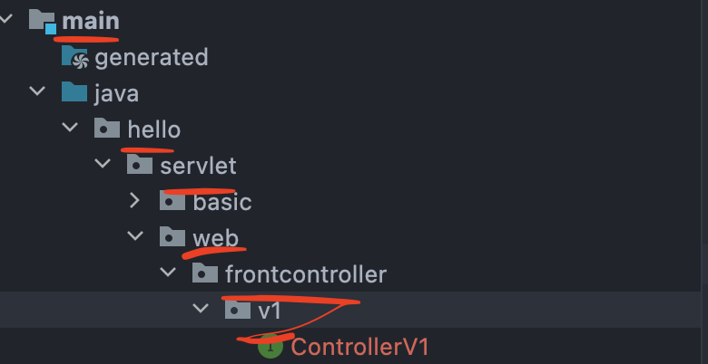

# 1. 프론트 컨트롤러 도입 - v1

먼저 구조를 바꿔볼 것이다.

각자의 역할을 하는 컨트롤러의 인터페이스 만들어보자.

## 1.2 프로젝트 구조

  

## 1.3 ControllerV1 Interface

```java
package hello.servlet.web.frontcontroller.v1;

import javax.servlet.ServletException;
import javax.servlet.http.HttpServletRequest;
import javax.servlet.http.HttpServletResponse;
import java.io.IOException;

public interface ControllerV1 {

    void process(HttpServletRequest request, HttpServletResponse response) throws IOException, ServletException;
}
```

이제 필요한 컨트롤러는 이 인터페이스를 이용해서 구현하면 된다.  
먼저 회원 등록 컨트롤러를 만들어보자.

## 1.4 MemberFormControllerV1 - 회원 등록 컨트롤러

```java
package hello.servlet.web.frontcontroller.v1.controller;

import hello.servlet.web.frontcontroller.v1.ControllerV1;

import javax.servlet.RequestDispatcher;
import javax.servlet.ServletException;
import javax.servlet.http.HttpServletRequest;
import javax.servlet.http.HttpServletResponse;
import java.io.IOException;

public class MemberFormControllerV1 implements ControllerV1 {

    @Override
    public void process(HttpServletRequest request, HttpServletResponse response) throws ServletException, IOException {
        String viewPath = "/WEB-INF/views/new-form.jsp";
        //다른 서블릿이나 JSP로 이동할 수 있는 기능. 리다이렉션이 아닌 서부 내부에서 호출이 발생한다.
        RequestDispatcher dispatcher = request.getRequestDispatcher(viewPath);
        dispatcher.forward(request,response);
    }
}
```

내부 코드는 Servlet-mvc에서 작성한 코드랑 동일하다.

## 1.5 MemberSaveControllerV1 - 회원 저장 컨트롤러

```java
package hello.servlet.web.frontcontroller.v1.controller;

import hello.servlet.basic.domain.Member;
import hello.servlet.basic.domain.MemberRepository;
import hello.servlet.web.frontcontroller.v1.ControllerV1;

import javax.servlet.RequestDispatcher;
import javax.servlet.ServletException;
import javax.servlet.http.HttpServlet;
import javax.servlet.http.HttpServletRequest;
import javax.servlet.http.HttpServletResponse;
import java.io.IOException;

public class MemberSaveControllerV1 implements ControllerV1 {

    MemberRepository memberRepository = MemberRepository.getInstance();

    @Override
    public void process(HttpServletRequest request, HttpServletResponse response) throws IOException, ServletException{

        String username = request.getParameter("username");
        int height = Integer.parseInt(request.getParameter("height"));
        int weight = Integer.parseInt(request.getParameter("weight"));

        Member member = new Member(username,height,weight);

        memberRepository.save(member);

        //모델 등록
        request.setAttribute("member",member);

        //forward
        String viewPath = "/WEB-INF/views/save-result.jsp";
        RequestDispatcher dispatcher = request.getRequestDispatcher(viewPath);
        dispatcher.forward(request,response);
    }
}

```

마찬가지로 앞에서 작성한 servlet-mvc의 save코드와 다른게 없다.

## 1.6 MemberListControllerV1 - 회원 목록 컨트롤러

```java
package hello.servlet.web.frontcontroller.v1.controller;

import hello.servlet.basic.domain.Member;
import hello.servlet.basic.domain.MemberRepository;
import hello.servlet.web.frontcontroller.v1.ControllerV1;

import javax.servlet.RequestDispatcher;
import javax.servlet.ServletException;
import javax.servlet.http.HttpServletRequest;
import javax.servlet.http.HttpServletResponse;
import java.io.IOException;
import java.util.List;

public class MemberListControllerV1 implements ControllerV1 {

    MemberRepository memberRepository = MemberRepository.getInstance();

    @Override
    public void process(HttpServletRequest request, HttpServletResponse response) throws IOException, ServletException {

        List<Member> members = memberRepository.findByAll();

        request.setAttribute("members",members);
        String viewPath = "/WEB-INF/views/members.jsp";
        RequestDispatcher dispatcher = request.getRequestDispatcher(viewPath);
        dispatcher.forward(request,response);
    }
}
```

마찬가지다. 코드는 동일하다.

프론트 컨트롤러를 만들어볼 것이다.

## 1.7 FrontControllerServletV1 - 프론트 컨트롤러

```java
package hello.servlet.web.frontcontroller.v1;

import hello.servlet.web.frontcontroller.v1.controller.MemberFormControllerV1;
import hello.servlet.web.frontcontroller.v1.controller.MemberListControllerV1;
import hello.servlet.web.frontcontroller.v1.controller.MemberSaveControllerV1;

import javax.servlet.ServletException;
import javax.servlet.annotation.WebServlet;
import javax.servlet.http.HttpServlet;
import javax.servlet.http.HttpServletRequest;
import javax.servlet.http.HttpServletResponse;
import java.io.IOException;
import java.util.HashMap;
import java.util.Map;

//url을 보면 v1으로 들어오는 url은 모두 이 서블릿을 거치게 되어있다.
@WebServlet(name = "frontControllerServletV1", urlPatterns = "/front-controller/v1/*")
public class FrontControllerServletV1 extends HttpServlet {

    private Map<String,ControllerV1> controllerV1Map = new HashMap<>();

    //생성자
    public FrontControllerServletV1() {
        controllerV1Map.put("/front-controller/v1/members/new-form",new MemberFormControllerV1());
        controllerV1Map.put("/front-controller/v1/members/save",new MemberSaveControllerV1());
        controllerV1Map.put("/front-controller/v1/members",new MemberListControllerV1());
    }

    @Override
    protected void service(HttpServletRequest request, HttpServletResponse response) throws ServletException, IOException {
        StringBuffer requestURL = request.getRequestURL();
        //요청 url로 들어온 컨트롤러를 꺼냄
        ControllerV1 controllerV1 = controllerV1Map.get(requestURL);

        //만약 컨트롤러가 없다면
        if(controllerV1 == null){
            response.setStatus(HttpServletResponse.SC_NOT_FOUND);
            return;
        }

        //있다면 함수 실행.
        controllerV1.process(request,response);


    }
}
```

map에 컨트롤러 객체들을 넣고 꺼내서 쓴다.

나는 전부 잘 된다.

코드를 수정한 부분이 없어서 잘 되는게 맞다.

이렇게 컨트롤러를 인터페이스로 구현하니까 앞에 진입점이 생긴다는 점과 1개의 서블릿을 구현한다는 것은 매력적이다.  


하지만 매 번 컨트롤러가 생길때마다 Map 자료구조에 넣어주는 반복적인 코드가 발생한다는 것을 알게 되었다.

그리고 'viewPath'관련한 코드는 여전히 중복이므로 이를 개선할만한 방법이 있을거라 생각한다.

점점 바꿔나가 결국 SpringMVC형태로 갖춰진다는데 궁금하다.


