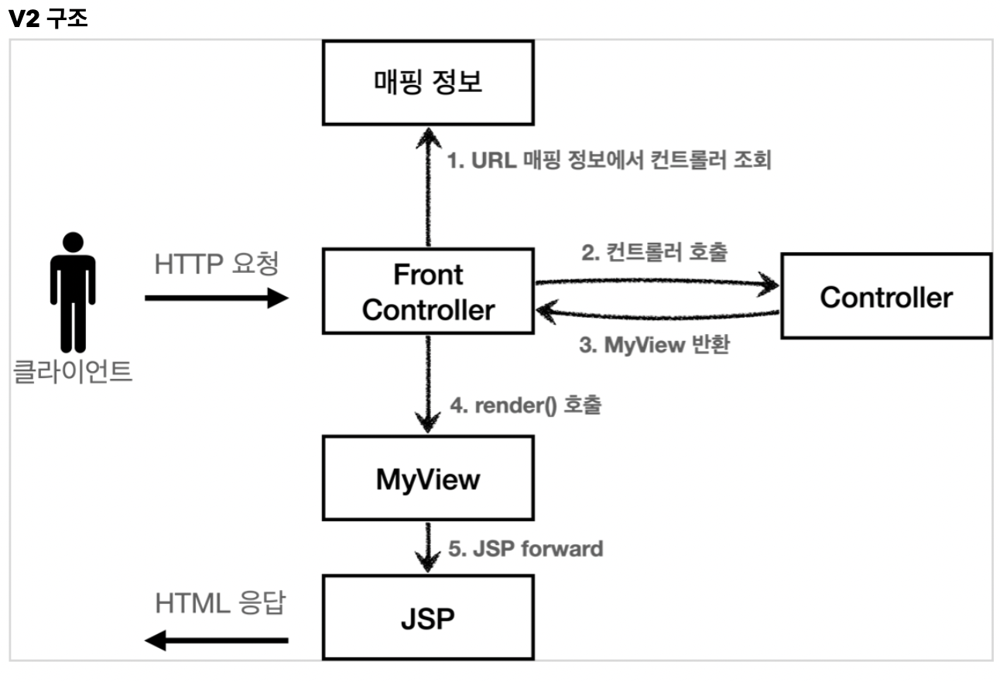
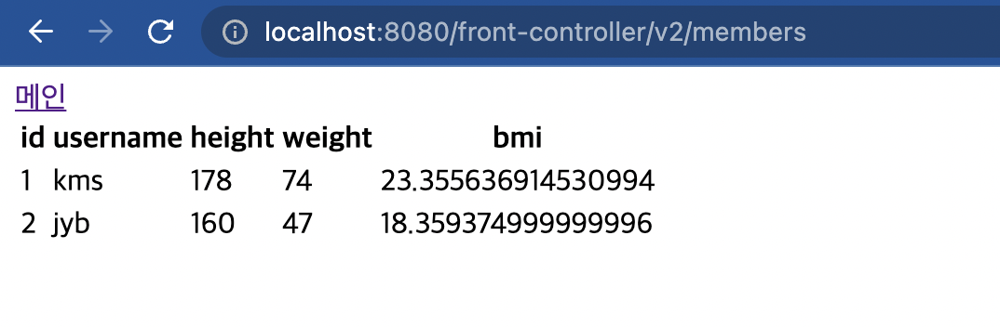

# 1. View 분리 - v2

기존 코드를 보면 뷰를 이렇게 출력해줬다.

```java
String viewPath = "/WEB-INF/views/new-form.jsp";
RequestDispatcher dispatcher = request.getRequestDispatcher(viewPath);
dispatcher.forward(request,response);
```

이 부분을 깔끔하게 분리하기 위해 별도로 뷰를 처리하는 객체를 만들어보자.

구조는 다음과 같다.



Controller가 이제 View에 대한 정보를 가진 MyView 객체를 반환할 것이다.

그러므로 MyView객체를 만들어보자.

```java
package hello.servlet.web.frontcontroller;

import javax.servlet.RequestDispatcher;
import javax.servlet.ServletException;
import javax.servlet.http.HttpServletRequest;
import javax.servlet.http.HttpServletResponse;
import java.io.IOException;

public class MyView {
    private String viewPath;

    public MyView(String viewPath) {
        this.viewPath = viewPath;
    }

    public void render(HttpServletRequest request,HttpServletResponse response) throws IOException, ServletException{
        RequestDispatcher dispatcher = request.getRequestDispatcher(viewPath);
        dispatcher.forward(request,response);
    }
}

```

render()라는 함수가 중복되는 dispatcher부분을 담당하였다.

우리는 이 객체를 반환하기로 했으므로 Controller 인터페이스도 바꿔주자.

```java
//이전 코드
void process(HttpServletRequest request, HttpServletResponse response) throws IOException, ServletException;

//바뀐 코드
MyView process(HttpServletRequest request, HttpServletResponse response) throws IOException, ServletException;
```

이제 각 컨트롤러도 수정해주자.

## 1.1 MemberFormController 수정 - 회원 등록폼

```java
 @Override
public MyView process(HttpServletRequest request, HttpServletResponse response) throws ServletException, IOException {
    return new MyView("/WEB-INF/views/new-form.jsp");
}
```

굉장히 간결해졌다.

## 1.2 MemberSaveController 수정 - 회원 저장

```java
    @Override
    public MyView process(HttpServletRequest request, HttpServletResponse response) throws IOException, ServletException{

        String username = request.getParameter("username");
        int height = Integer.parseInt(request.getParameter("height"));
        int weight = Integer.parseInt(request.getParameter("weight"));

        Member member = new Member(username,height,weight);

        memberRepository.save(member);

        //모델 등록
        request.setAttribute("member",member);

        //수정한 부분
        return new MyView("/WEB-INF/views/save-result.jsp");
    }
```

마찬가지로 View부분만 수정해주면 된다.

## 1.3 MemberListController 수정 - 회원 목록

```java
    @Override
    public MyView process(HttpServletRequest request, HttpServletResponse response) throws IOException, ServletException {
        List<Member> members = memberRepository.findByAll();
        request.setAttribute("members",members);
        return new MyView("/WEB-INF/views/members.jsp");
    }
```

3줄로 줄었다.

마지막으로 프론트 컨트롤러를 고쳐주자.

## 1.4 프론트 컨트롤러 수정

이 부분도 크게 다를건 없다.

```java
//기존 코드
controllerV1.process(request,response);
//바뀐 코드
MyView myView = controllerV2.process(request, response);
myView.render(request,response);
```

결과를 확인해보자.

  

나의 경우 URL을 따로 지정해서 v2/~로 시작하게 된다. url을 수정하지 않았다면 v1/~로 나오는게 정상이다.!!

# 2. 한계

- 서블릿 종속성을 제거
    + view에 관한 정보만 리턴하는 MemberFormController의 경우는 HttpServletRequest, HttpServletResponse객체가 필요가 없다. 어떻게 해결할 수 있을까?
- 뷰 이름 중복 제거
    + '/WEB-INF/views/~' 는 중복된 url이다. 다음에 이를 고쳐보도록 하겠다.