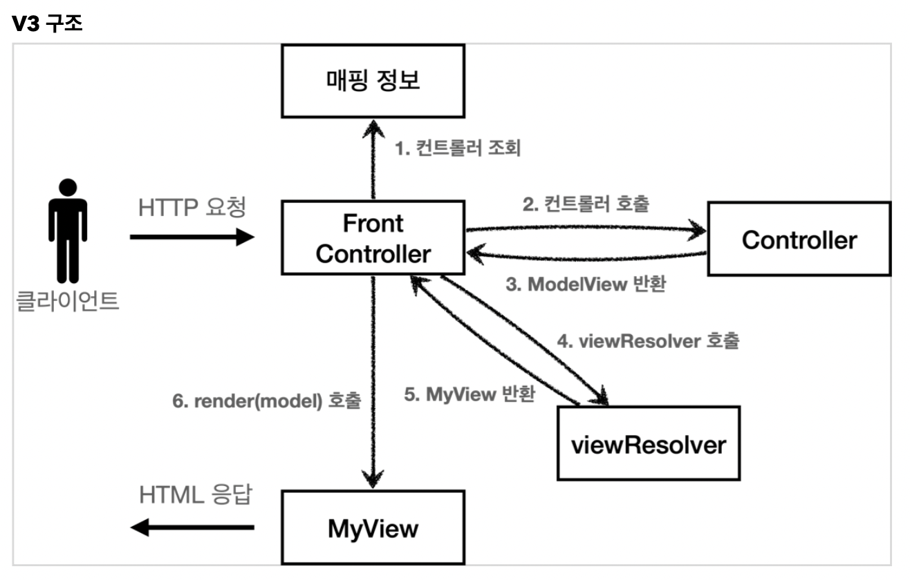
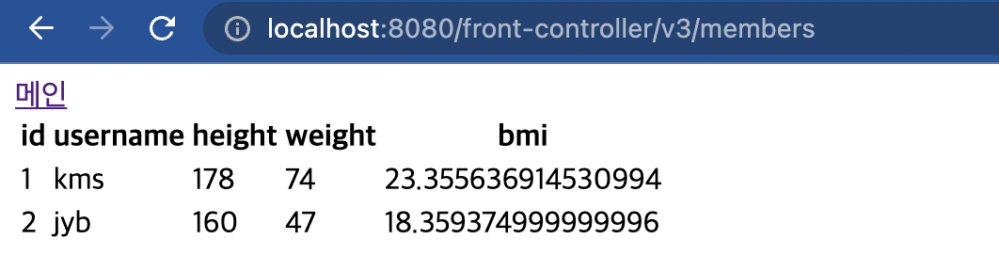

# Model 추가 v3

2가지를 바꿀 것이다.

- 컨트롤러 입장에서는 HttpServletRequest, HttpServletResponse가 필요 없을 수 있다. 그렇기에 Model이라는 객체를 만들어서 반환할 것이다. 

- 뷰 이름 중복을 제거할 것이다. 앞에서 언급했던 'WEB-INF/views'라는 접두사와 '.jsp'라는 접미사를 따로 처리할 것이다. 이렇게 해두면 향후 뷰의 폴더 위치가 함께 이동해도 프론트 컨트롤러만 고치면 된다. (각 컨트롤러를 고칠 필요가 없다는 이야기)

즉 프론트 컨트롤러에 역할을 더 많이 추가하여 유지보수에서 있어서 프론트 컨트롤러만 건들게끔 만들 것이다.

  

1. url 요청을 받고 해당 컨트롤러를 꺼내오는 컨트롤러 조회를 함.
2. 꺼내온 컨트롤러를 통해 비즈니스로직을 수행하고, 뷰의 이름과 뷰를 렌더링할 때 필요한 model 객체를 가지고 있는 Model View를 리턴함. 
3. 가져온 Model View를 프론트 컨트롤러가 View Resolver라는 곳에 보냄. View Resolver는 전달받은 뷰 이름을 **물리뷰 경로**로 바꿔주는 역할을 수행한다. 그리고 MyView라는 객체를 반환.
4. 받은 MyView를 통해 render를 함.

먼저 ModelView가 새로 추가되므로 모델의 이름과 정보를 담는 Modelview를 작성하자.


## 1. ModelView class

```java
package hello.servlet.web.frontcontroller;

import java.util.HashMap;
import java.util.Map;

public class ModelView {
    private String viewName;
    private Map<String,Object> model = new HashMap<>();

    public String getViewName() {
        return viewName;
    }

    public void setViewName(String viewName) {
        this.viewName = viewName;
    }

    public Map<String, Object> getModel() {
        return model;
    }

    public void setModel(Map<String, Object> model) {
        this.model = model;
    }
}

```

그 다음은 controller 인터페이스를 수정해주자.

## 2. Controller Interface

```java
//기존 코드
MyView process(HttpServletRequest request, HttpServletResponse response) throws IOException, ServletException;
//새로운 코드
ModelView process(Map<String,String> paramMap);
//서블릿 기술을 전혀 사용하지 않게 된다. 따라서 구현이 쉬워진다.
```

HttpServletRequest가 제공하는 파라미터는 프론트 컨트롤러가 paramMap에 담아서 호출해줄 것이다. 응답 결과로 뷰 이름과 뷰에 전달할 Model 데이터를 포함하는 Modelview객체를 반환 받을 것이다.

각 컨트롤러도 수정해주자.

## 3. MemberFormController - 회원 등록

```java
//기존 코드
@Override
public MyView process(HttpServletRequest request, HttpServletResponse response) throws ServletException, IOException {
    return new MyView("/WEB-INF/views/new-form.jsp");
}
//새로운 코드
@Override
public ModelView process(Map<String,String> paramMap){
    return new ModelView("new-form");
}
```

여기서 'new-form'은 논리적 명칭이다. 아무렇게나 지어도 된다. 사용자가 짓고싶은대로 짓되, 나중에 찾을때 기억하면 된다.

## 4. MemberSaveController - 회원 저장

```java
//기존 코드
MemberRepository memberRepository = MemberRepository.getInstance();

@Override
public MyView process(HttpServletRequest request, HttpServletResponse response) throws IOException, ServletException{

    String username = request.getParameter("username");
    int height = Integer.parseInt(request.getParameter("height"));
    int weight = Integer.parseInt(request.getParameter("weight"));

    Member member = new Member(username,height,weight);

    memberRepository.save(member);

    //모델 등록
    request.setAttribute("member",member);

    return new MyView("/WEB-INF/views/save-result.jsp");
}

//바뀐 코드

MemberRepository memberRepository = MemberRepository.getInstance();

@Override
public ModelView process(Map<String,String> paramMap){
    //요청 정보를 가져옴.
    String username = paramMap.get("username");
    int height = Integer.parseInt(paramMap.get("height"));
    int weight = Integer.parseInt(paramMap.get("weight"));

    Member member = new Member(username,height,weight);

    memberRepository.save(member);

    //뷰에 대한 이름을 논리적으로 명시함.
    ModelView mv = new ModelView("save-result");
    //저장된 객체의 정보를 넘김.
    mv.getModel().put("member", member);
    return mv;
}

```

paramMap이 Request객체를 대신한다고 보면 된다.

## 5. MemberListController - 회원 목록

```java
//기존 코드
MemberRepository memberRepository = MemberRepository.getInstance();

@Override
public MyView process(HttpServletRequest request, HttpServletResponse response) throws IOException, ServletException {
    List<Member> members = memberRepository.findByAll();
    request.setAttribute("members",members);
    return new MyView("/WEB-INF/views/members.jsp");
}

//바뀐 코드

MemberRepository memberRepository= MemberRepository.getInstance();

@Override
public ModelView process(Map<String,String> paramMap){
    List<Member> members = memberRepository.findByAll();

    ModelView mv = new ModelView("members");
    mv.getModel().put("members",members);

    return mv;
}
```

마찬가지로 객체에 대한 정보를 ModeView 객체에 뷰 이름과 함께 넣어준다.

## 5. FrontControllerServlet

프론트 컨트롤러에 많은 역할을 위임할 것이다.

```java
//이전 코드 Service() 메소드 속
MyView myView = controllerV2.process(request, response);
myView.render(request,response);


//바뀐코드

Map<String, String> paramMap = createMap(request);
ModelView mv = controllerV3.process(paramMap);


String viewName = mv.getViewName();
MyView myView = viewResolver(viewName);
myView.render(mv.getModel(),request,response);

//createMap()
private Map<String,String> createMap(HttpServletRequest request) {
    Map<String,String> paramMap = new HashMap<>();
    request.getParameterNames().asIterator()
            .forEachRemaining(paramname -> paramMap.put(paramname, request.getParameter(paramname)));
    return paramMap;
}

//viewResolver()
private MyView viewResolver(String viewName) {
    return new MyView("/WEB-INF/views/" + viewName + ".jsp");
}

```


추가로 view.render()함수도 바뀌어서 추가해줘야한다.

### MyView class 추가해야할 부분

```java
public void render(Map<String, Object> model, HttpServletRequest request, HttpServletResponse response) throws ServletException, IOException {
    modelToRequestAttribute(model, request);
    RequestDispatcher dispatcher = request.getRequestDispatcher(viewPath);
    dispatcher.forward(request,response);
}

private void modelToRequestAttribute(Map<String, Object> model, HttpServletRequest request) {
    model.forEach((key, value) -> request.setAttribute(key,value));
}
```

  


# 동작방식 설명

이번에 굉장히 많이 추가해서 나도 헷갈리는 부분이 많았다. 그래서 따로 로직을 그려가며 순서를 기억했다.

직접 경로를 그려가며 따라가는게 제일 좋은 것 같다.

1. Client가 'localhost:8080/front-controller/v3/new-form' 요청
2. Server가 요청을 받고 Servlet컨테이너를 검사.
3. Front-Controller에 달린 '/front-controller/v3/*'를 보고 로직 수행
4. service()함수 실행  
5. requestURI에 reuqest.getURI()["/front-controller/v3/new-form"]을 담음
6. 해당 URI을 통해 Controller를 ControllerMap에서 찾음. 저장된 URI이므로 MemberFormController를 리턴
7. 리턴값이 NULL이 아니므로 404에러를 내지 않고 로직 수행
8. request정보를 담고있는 paramMap을 createParamMap()를 통해 담음. 해당 컨트롤러에서는 request에 값을 담지 않았으므로 아무것도 담기지 않을 것임.
9. MemberFormController에 있는 process()를 실행. 파라미터에 저장된 paramMap을 사용할 일은 없음. mv에 저장된 값은 ViewName("new-form")과 아무것도 담지 않은 model을 담은 ModelView 객체 반환.
10. mv 객체에 저장된 논리적 주소인 "new-form"을 ViewName에 저장.
11. MyView 객체인 view에는  viewResolver()함수를 이용한 뷰의 절대경로를 반환.
12. view.render()수행. mv.getModel()에 아무것도 들어있지 않은 상태. request, response는 스펙을 맞추기 위함.


이런식으로 save로직, list로직을 따라가면 쉽다.

NULL로 저장된 mv변수 내의 Model객체는 save로직과 list로직에는 NULL이아니게 되고 쌓여서 사용된다.

결국 request.setAttribute()했던 것들은 paramMap에 담아서 수행되다가(save로직에서는 member객체로 만들어서 ModelView객체의 Map에 추가 등) 마지막에 render()부분에서 request에 담아서 사용됨.

