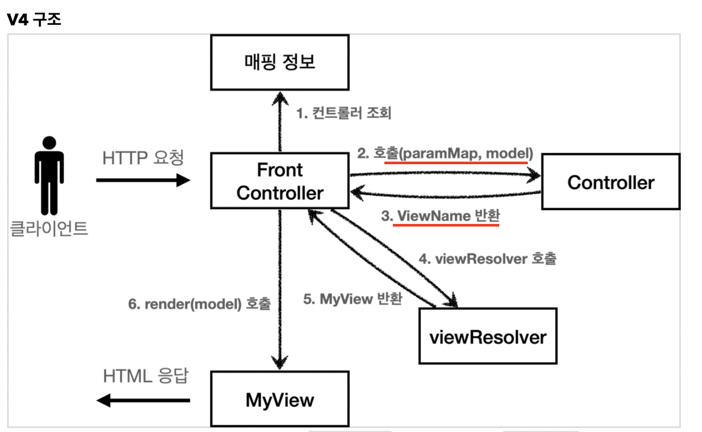
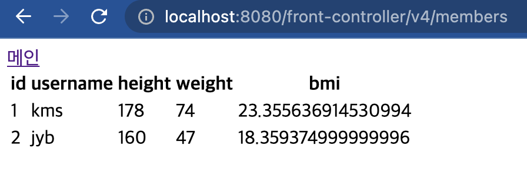

# 프론트 컨트롤러 업그레이드

단순한 아이디어를 적용할 것이다. Controller인터페이스의 process함수의 리턴값을 String으로 바꾸어 ViewName을 리턴하고, 파라미터로 Map<String,Object> model을 넘길 것이다.

  

## 1. Controller Interface

```java
//기존 코드
ModelView processs(Map<String,String> paramMap)

//바뀐 코드
String process(Map<String,String> paramMap,Map<String,Object> model);
```

리턴값이 String이고, 파라미터에 model라는 map객체가 추가되었다.


## 2. MemberFormController 회원 등록폼 수정

```java
//기존 코드
@Override
public ModelView process(Map<String,String> paramMap){
    return new ModelView("new-form");
}
//바뀐 코드
@Override
public String process(Map<String, String> paramMap, Map<String, Object> model){
    return "new-form";
}
```

객체에 담을 필요없이, 논리적 주소만 반환시켜주면 된다.

## 3. MemberSaveController 회원 저장폼 수정

```java
//기존 코드
ModelView mv = new ModelView("save-result");
mv.getModel().put("member", member);
return mv;
//바뀐 코드
model.put("member",member);
return "save-result";
```

## 4. MemberListController 회원 조회 수정

```java
//기존 코드
List<Member> members = memberRepository.findByAll();
ModelView mv = new ModelView("members");
mv.getModel().put("members",members);
return mv;

//바뀐 코드
List<Member> members = memberRepository.findByAll();
model.put("members",members);
return "members";
```

상당히 간결해졌다.

## 5. FrontControllerServlet 수정

```java
//기존 코드
Map<String, String> paramMap = createMap(request);
ModelView mv = controllerV3.process(paramMap);


String viewName = mv.getViewName();
MyView myView = viewResolver(viewName);
myView.render(mv.getModel(),request,response);

//바뀐 코드
Map<String, String> paramMap = createMap(request);
Map<String,Object> model = new HashMap<>();

String viewName = controllerV4.process(paramMap,model);

MyView myView = viewResolver(viewName);
myView.render(model,request,response);
```

조금 더 직관적이게 바뀌었다고 생각한다.

결과

  


# 결론

v4sms 이전 버전과 크게 다르지 않다. process()함수가 논리적 뷰의 이름을 반환하고 model을 추가적으로 파라미터로 넘긴다는 것 말고는 다른 것이 없다고 봐도 무방하다.

이런 사소한 아이디어가 개발자의 편의성을 증대시켜준다.


# 한계

이 모델은 군더더기 없지만 아쉬운 점이 있다.

유연하지 않다는 것이다. 유연하다는 것은 뭘까? 내가 지금까지 작성한 코드들 중 어느 모델이 제일 낫다고는 할 수 없을 수 있다. 파라미터에 모델을 넘기는 버전4보다 버전3가 편할 수도 있고, 버전1이 편할 수도 있다. 이를 개발자가 하여금 맞춰 끼고 싶은데 아직까지는 불가능하다. 이를 가능토록 다음에 학습할 것이다. 즉, 프론트 컨트롤러가 다양한 방식의 컨트롤러를 처리할 수 있도록 변경할 것이다.!!

