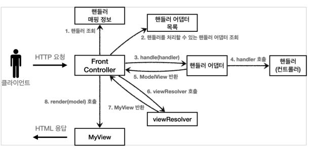

# Adapter 패턴 구현 v3

Controller를 다형성을 이용해서 다양한 Controller를 호출할 수 있게 하자.

  

>출처 김영한 선생님 강의

- 핸들러 어댑터 : 중간에 어댑터 역할을 하는 어댑터이다. 다양한 종류의 컨트롤러를 호출할 수 있게 한다.
- 핸들러 : 컨트롤러의 이름을 더 넓은 범위인 핸들러로 변경.  

먼저 어댑터 인터페이스를 만들어주자.

## 1. MyHandlerAdapter

```java
package hello.servlet.web.frontcontroller.v5;

import hello.servlet.web.frontcontroller.ModelView;

import javax.servlet.ServletException;
import javax.servlet.http.HttpServletRequest;
import javax.servlet.http.HttpServletResponse;
import java.io.IOException;

public interface MyHandlerAdapter {

    boolean supports(Object handler);

    ModelView handle(HttpServletRequest request, HttpServletResponse response, Object handler) throws ServletException, IOException;
}
```

앞에서 구현했던 ControllerV3을 지원하는 어댑터를 만들 것이다.

## 2. ControllerV3HandlerAdapter

```java
package hello.servlet.web.frontcontroller.v5.adapter;

import hello.servlet.web.frontcontroller.ModelView;
import hello.servlet.web.frontcontroller.v3.ControllerV3;
import hello.servlet.web.frontcontroller.v5.MyHandlerAdapter;

import javax.servlet.ServletException;
import javax.servlet.http.HttpServletRequest;
import javax.servlet.http.HttpServletResponse;
import java.io.IOException;
import java.util.HashMap;
import java.util.Map;

public class ControllerV3HandlerAdapter implements MyHandlerAdapter {


    @Override
    public boolean supports(Object handler) {
        return (handler instanceof ControllerV3);
    }

    @Override
    public ModelView handle(HttpServletRequest request, HttpServletResponse response, Object handler) throws ServletException, IOException {
        ControllerV3 controller = (ControllerV3) handler;

        Map<String,String> paramMap = createParamMap(request);

        ModelView mv = controller.process(paramMap);
        return mv;
    }

    private Map<String, String> createParamMap(HttpServletRequest request) {
        Map<String,String> paramMap = new HashMap<>();
        request.getParameterNames().asIterator()
                .forEachRemaining(paramName -> paramMap.put(paramName,request.getParameter(paramName)));
        return paramMap;
    }
}

```

## 3. FrontControllerServletV5

```java
package hello.servlet.web.frontcontroller.v5;

import hello.servlet.web.frontcontroller.ModelView;
import hello.servlet.web.frontcontroller.MyView;
import hello.servlet.web.frontcontroller.v1.ControllerV1;
import hello.servlet.web.frontcontroller.v3.ControllerV3;
import hello.servlet.web.frontcontroller.v3.controller.MemberFormControllerV3;
import hello.servlet.web.frontcontroller.v3.controller.MemberListControllerV3;
import hello.servlet.web.frontcontroller.v3.controller.MemberSaveControllerV3;
import hello.servlet.web.frontcontroller.v5.adapter.ControllerV3HandlerAdapter;

import javax.servlet.ServletException;
import javax.servlet.annotation.WebServlet;
import javax.servlet.http.HttpServlet;
import javax.servlet.http.HttpServletRequest;
import javax.servlet.http.HttpServletResponse;
import java.io.IOException;
import java.util.ArrayList;
import java.util.HashMap;
import java.util.List;
import java.util.Map;

@WebServlet(name = "frontControllerServletV5", urlPatterns = "/front-controller/v5/*")
public class FrontControllerServletV5 extends HttpServlet {

    private final Map<String,Object> handlerMappingMap = new HashMap<>();
    private final List<MyHandlerAdapter> handlerAdapters = new ArrayList<>();

    //생성자
    public FrontControllerServletV5() {
        initHandlerMappingMap();
        initHandlerAdapters();

    }


    private void initHandlerMappingMap(){
        handlerMappingMap.put("/front-controller/v5/v3/members/new-form",new MemberFormControllerV3());
        handlerMappingMap.put("/front-controller/v5/v3/members/save",new MemberSaveControllerV3());
        handlerMappingMap.put("/front-controller/v5/v3/members" ,new MemberListControllerV3());
    }
    private void initHandlerAdapters() {
        handlerAdapters.add(new ControllerV3HandlerAdapter());
    }
    @Override
    protected void service(HttpServletRequest request, HttpServletResponse response) throws ServletException, IOException {

        Object handler = getHandler(request);
        if(handler == null){
            response.setStatus(HttpServletResponse.SC_NOT_FOUND);
            return;
        }

        MyHandlerAdapter adapter = getHandlerAdapter(handler);
        ModelView mv = adapter.handle(request, response, handler);

        MyView view = viewResolver(mv.getViewName());
        view.render(mv.getModel(),request,response);
    }


    private Object getHandler(HttpServletRequest request){
        String requestURI = request.getRequestURI();
        return handlerMappingMap.get(requestURI);
    }
    private MyHandlerAdapter getHandlerAdapter(Object handler) {
        for (MyHandlerAdapter adapter : handlerAdapters) {
            if(adapter.supports(handler))
                return adapter;
        }
        throw new IllegalArgumentException("handler adapter를 찾을 수 없습니다. handler = " + handler);
    }

    private MyView viewResolver(String viewName) {
        return new MyView("/WEB-INF/views/" + viewName + ".jsp");
    }

}
```

정리는 마지막에 이 챕터를 마무리하고 추가하겠다.

일단 진행하겠다.!!

# Adapter 패턴 구현 v4

어댑터의 힘을 느껴보자.

## FrontControllerServletV5 

생성자에 V4에 대한 정보만 추가해주면 된다.

```java
private void initHandlerMappingMap(){
    handlerMappingMap.put("/front-controller/v5/v3/members/new-form",new MemberFormControllerV3());
    handlerMappingMap.put("/front-controller/v5/v3/members/save",new MemberSaveControllerV3());
    handlerMappingMap.put("/front-controller/v5/v3/members" ,new MemberListControllerV3());

    //v4 추가
    handlerMappingMap.put("/front-controller/v5/v4/members/new-form",new MemberFormControllerV4());
    handlerMappingMap.put("/front-controller/v5/v4/members/save",new MemberSaveControllerV4());
    handlerMappingMap.put("/front-controller/v5/v4/members" ,new MemberListControllerV4());
}

private void initHandlerAdapters() {
        handlerAdapters.add(new ControllerV3HandlerAdapter());
        //추가
        handlerAdapters.add(new ControllerV4HandlerAdapter());
    }
```

V4 어댑터에 관한 코드를 추가해주기 위해 새로운 자바 파일을 만들자.

## ControllerV4HandlerAdapter

```java
package hello.servlet.web.frontcontroller.v5.adapter;

import hello.servlet.web.frontcontroller.ModelView;
import hello.servlet.web.frontcontroller.v4.ControllerV4;
import hello.servlet.web.frontcontroller.v5.MyHandlerAdapter;

import javax.servlet.ServletException;
import javax.servlet.http.HttpServletRequest;
import javax.servlet.http.HttpServletResponse;
import java.io.IOException;
import java.util.HashMap;
import java.util.Map;

public class ControllerV4HandlerAdapter implements MyHandlerAdapter {
    @Override
    public boolean supports(Object handler) {
        return (handler instanceof ControllerV4);
    }

    @Override
    public ModelView handle(HttpServletRequest request, HttpServletResponse response, Object handler) throws ServletException, IOException {
        ControllerV4 controller = (ControllerV4) handler;

        Map<String,String> paraMap = createParamMap(request);
        Map<String,Object> model = new HashMap<>();

        String viewName = controller.process(paraMap, model);

        ModelView mv = new ModelView(viewName);
        mv.setModel(model);
        return mv;
    }

    private Map<String, String> createParamMap(HttpServletRequest request) {
        Map<String,String> paramMap = new HashMap<>();
        request.getParameterNames().asIterator()
                .forEachRemaining(paramName -> paramMap.put(paramName,request.getParameter(paramName)));
        return paramMap;
    }
}
```

이제 실행해보자.


잘 된다.!!

정리는 그림을 그려서 따로 하겠다.

# 정리 (추가예정)

