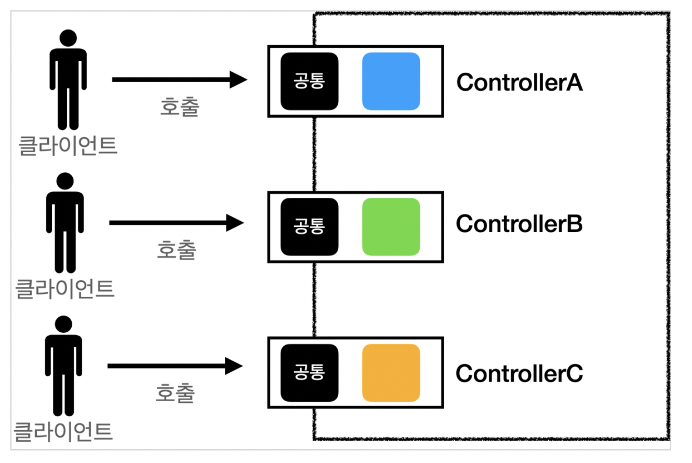
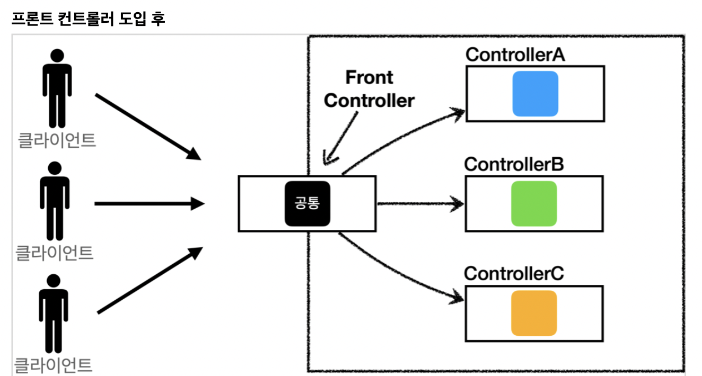

# 개요

프론트 컨트롤러에 대해 설명한다. 

현재 Spring MVC 패턴도 결국 Front Controller 패턴을 사용한 것이 핵심이다.

다양한 Controller에 접근하기 전에 Front Controller라는 서블릿을 둬서 공통로직을 처리하고 요청에 따른 Controller에 넘겨주는 형식이다.

#### 프론트 컨트롤러 도입 전

  
> 출처 : 김영한 선생님의 강의 노트

#### 프론트 컨트롤러 도입 후

  
> 출처 : 김영한 선생님의 강의 노트

**즉 입구를 하나로 만들어서 공통로직을 처리한다는 것이다.**

이를 통해서 프론트 컨트롤러를 제외한 나머지 컨트롤러는 서블릿을 사용하지 않아도 된다.

이 챕터에서는 다음을 다룰 것이다.

1. 프론트 컨트롤러 도입 (1_Front_Controller_Introduction.md)
2. view 분리
3. Model 추가
4. 단순한 컨트롤러
5. 유연한 컨트롤러
6. 마무리
