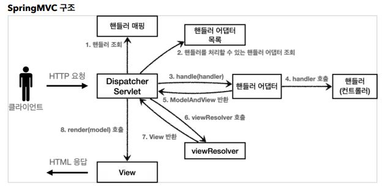

# 스프링 MVC 구조

  

보면은 여태까지 작성한 구조와 비슷하다.

다음과 같이 매칭된다.

- FrontController -> DispatcherServlet
- handlerMappingMap -> HandlerMapping
- MyHandlerAdapter -> HandlerAdapter
- Modelview -> ModelAndView
- viewResolver -> ViewResolver
- MyView -> View

결국 핵심은 DsipathcerServlet인데, 이 서블릿은 부모 클래스에서 HttpServlet을 상속 받아서 사용되기에 서블릿으로 동작된다.

스프링부트는 자동으로 DispatcherServlet을 서블릿으로 자동으로 등록하면서 urlPattern="/"에 대해서 매핑한다.!

이 스프링MVC의 요청흐름은 직접 작성한 코드와 비슷하게 동작한다.

1. HttpServlet이 제공하는 service()가 호출
2. 근데, DispatcherServelt의 부모에서 service()를 오버라이드 했기에 이를 호출.
3. 오버라이드된 service()가 호출되면서 여러 메서드가 호출되는데 DispatcherServlet.doDispatch()가 호출됨.
4. doDispatch()는 직접 작성한 코드와 비슷하게 동작한다는 것이다.

한 번 봐보길 바란다. 원래 한 곳에 뭉쳐 있었지만, 최근 코드를 보니 렌더부분을 따로 나눠버렸다.

위의 그림과 아무튼 비슷하게 동작한다는 것.

회사에서 강의 보고 다시 정리하려니 좀 귀찮네..  