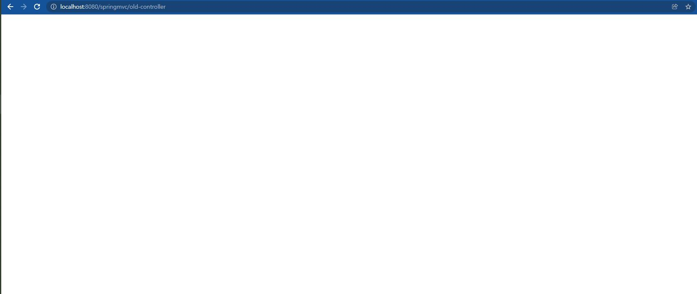
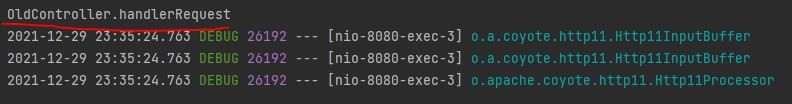
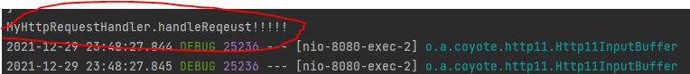

# 핸들러 매핑과 핸들러 어댑터

과거에 주로 사용했던 스프링이 제공하는 간단한 컨트롤러로 핸들러 매핑과 어댑터를 이해해보도록 하겠다.


## 과거 버전 스프링 컨트롤러 

코드를 하나 작성하자.

```java
package hello.servlet.web.Controller;

import org.springframework.stereotype.Component;
import org.springframework.web.servlet.ModelAndView;
import org.springframework.web.servlet.mvc.Controller;

import javax.servlet.http.HttpServletRequest;
import javax.servlet.http.HttpServletResponse;

//스프링빈에 등록함.
@Component("/springmvc/old-controller")
public class OldController implements Controller {
    @Override
    public ModelAndView handleRequest(HttpServletRequest request, HttpServletResponse response) throws Exception {
        System.out.println("OldController.handlerRequest");
        return null;
    }
}

```

참고로 상속받은 Controller는 @Controller와 다르다.!  


실행하고 해당 url로 가면 다음과 같이 공백이 화면 공백이 뜨면 성공이다.  

  

  

디버그창에 우리가 콘솔에 출력한게 찍힌다.

왜 이런 일이 벌어진걸까?

컨트롤러가 호출되려면 2가지가 필요하다.

1. HandlerMapping(핸들러 매핑)
2. HandlerAdapter(핸들러 어댑터)

그럼 먼저, 핸들러 매핑은 어떻게 핸들러를 찾을까?

많은 방법이 있지만 짤막하게 다음과 같은 우선순위를 갖는다.

```text
0 = RequestMappingHandlerMapping : 애노테이션 기반 컨트롤러인 @RequestMapping에서 찾는다.
1 = BeanNameUrlHandlerMapping : 스프링 빈의 이름으로 핸들러를 찾는다.
```

Component로 스프링 빈의 이름을 url을 지정했다. 그렇기에 핸들러 매핑을 할 수 있었던 것이다. 따라서 작성한 OldController가 반환된다.

핸들러 어댑터를 조회하는 방식에도 다음과 같은 우선순위를 갖는다.

```text
0 = RequestMappingHandlerAdapter : 애노테이션 기반 컨트롤러인 @RequestMapping에서 찾는다.
1 = HttpReqeustHandlerAdapter : HttpRequestHandler 처리
2 = SimpleControllerHandlerAdapter : Controller 인터페이스 처리
```

즉 우리는 2번인 SimpleControllerHandlerAdapter룰의 따라 핸들러 어댑터를 조회할 수 있다.

디스패처 서블릿이 조회한 SimpleControllerHandlerAdapter를 실행하면서 핸들러 정보도 함께 넘겨준다. SimpleControllerHandlerAdapter는 핸들러인 OldController를 내부에서 실행하고, 그 결과를 반환한다. 즉, 우리는 콘솔에 문자를 찍었으므로 문자를 찍는다.

HttpRequestHandler라는 핸들러도 알아보자. 이 핸들러는 **서블릿과 가장 유사한 형태**의 핸들러라고 한다.

코드는 다음과 같이 되어있다.

```java
public interface HttpRequestHandler {
void handleRequest(HttpServletRequest request, HttpServletResponse response) throws ServletException, IOException;
}
```

이제 구현하기 위해 간단한 자바파일을 만들자.!!

## HttpRequestHandler 구현

```java
package hello.servlet.web.old;

import org.springframework.stereotype.Component;
import org.springframework.web.HttpRequestHandler;

import javax.servlet.ServletException;
import javax.servlet.http.HttpServletRequest;
import javax.servlet.http.HttpServletResponse;
import java.io.IOException;

@Component("/springmvc/kms_request-handler")
public class MyHttpRequestHandler implements HttpRequestHandler {
    @Override
    public void handleRequest(HttpServletRequest request, HttpServletResponse response) throws ServletException, IOException {
        System.out.println("MyHttpRequestHandler.handleReqeust!!!!!");
    }
}

```

실행방법이나 확인방법은 위의 과거 스프링컨트롤러 방식과 같으므로 따로 첨부하지는 않겠다.

  

위의 컨트롤러에서 흐름을 따라간것 처럼 따라가 보겠다.

1. HandlerMapping을 순서대로 실행해서 핸들러를 찾아야한다.
2. 이 경우 RequestMapping도 없고 우선순위에 밀려서 빈의 이름으로 핸들러를 찾게 되는데 'BeanNameUrlHandlerMapping'이 실행에 성공하고 핸들러인 MyHttpRequestHandler를 반환한다.  
3. HandlerAdapter의 support()를 순서대로 호출한다. 이때 'HttpRequestHandlerAdapter'가 HttpRequestHandler 인터페이스를 지원하므로 대상이 된다.
4. 디스패처 서블릿이 조회한 HttpRequestHandlerAdapter를 싱행하면서 핸들러 정보도 함께 넘겨준다. HttpRequestHandlerAdapter는 핸들러인 MyHttpRequestHandler를 내부에서 실행하여 내가 작성한 코드인 콘솔에 문자를 찍고 그 결과를 반환한다.

# 결론

하지만 결국 우선순위가 가장 높은 핸들러 매핑과 핸들러 어댑터는

```java
RequestMappingHandlerMapping 
RequestMappingHandlerAdatper
```

이다.

