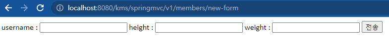
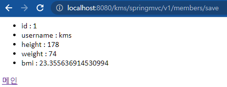
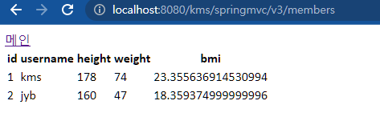
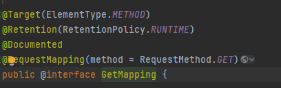

# 스프링MVC 스타트

스프링이 제공하는 컨트롤러는 애노테이션 기반으로 동작한다. 매우 유연하고 실용적임.

옛날에는 스프링 프레임워크가 MVC부분이 약해서 스프링을 사용하더라도 MVC 웹 기술은 스트럿츠 같은 다른 프레임워크를 사용했다고 한다.  

하지만, _@RequestMapping_ 기반의 애노테이션 컨트롤러가 등장하면서 MVC도 스프링의 완승으로 끝나버렸다.

## @RequestMapping

이 애노테이션은 _RequestMappingHandlerMapping_ 과 _RequestMappingHandlerAdapter_ 를 포함한다.

한 번 기존 코드를 바꿔보도록 하겠다.

## 1. SpringMemberFormController - 회원 등록 폼

```java
package hello.servlet.web.v1;

import org.springframework.stereotype.Controller;
import org.springframework.web.bind.annotation.RequestMapping;
import org.springframework.web.servlet.ModelAndView;

@Controller
public class SpringMemberFormControllerV1 {

    @RequestMapping("/kms/springmvc/v1/members/new-form")
    public ModelAndView process(){
        return new ModelAndView("new-form");
    }
}
```

참고로 위의 논리뷰에 해당되는 페이지는 작성이 되어 있어야 한다.


이런 식으로

new-form.jsp파일.

```jsp
<%@ page contentType="text/html;charset=UTF-8" language="java" %>
<html>
<head>
    <title>Title</title>
</head>
<body>
<!-- 상대경로 사용할 것. 계속 수정해줄 것임. -->
<form action="save" method="post">
    username : <input type="text" name="username">
    height :   <input type="text" name="height">
    weight :   <input type="text" name="weight">
    <button type="submit">전송</button>
</form>
</body>
</html>
```


아무튼 실행하면 성공이다.

  


### @Controller

- 스프링이 자동으로 스프링 빈으로 등록한다. (내부에 @Component 애노테이션이 있어서 컴포넌트 스캔의 대상이 된다.!)
- 스프링MVC에서 애노테이션 기반 컨트롤러로 인식(저번에 설명한 우선순위가 높다는 뜻)

### @RequestMapping

- 요청 정보를 매핑한다. 해당 URL이 호출되면 이 메서드가 호출된다. 애노테이션 기반으로 동작하기 때문에, 메서드의 이름은 임의로 지으면 된다.

### ModelAndVeiw

- 모델과 뷰 정보를 담아서 반환한다.

참고로 _RequestMappingHandlerMapping_ 은 스프링 빈 중에서 _@RequestMapping_ 또는 _@Controller_ 가 클래스 레벨에 붙어있는 경우에 매핑 정보로 인식.  
따라서 다음 코드도 동일하게 작동한다.

```java
package hello.servlet.web.v1;

import org.springframework.stereotype.Component;
import org.springframework.stereotype.Controller;
import org.springframework.web.bind.annotation.RequestMapping;
import org.springframework.web.servlet.ModelAndView;

@Component
@RequestMapping
public class SpringMemberFormControllerV1 {

    @RequestMapping("/kms/springmvc/v1/members/new-form")
    public ModelAndView process(){
        return new ModelAndView("new-form");
    }
}

```

또한, 컴포넌트 스캔을 안 쓰고 직접 빈에 등록해도 동작한다.

다음은 기존에 작성했던 회원 저장 폼을 바꿔보겠다.

## 2. SpringMemberSaveController - 회원 저장

```java
package hello.servlet.web.v1;

import hello.servlet.basic.domain.Member;
import hello.servlet.basic.domain.MemberRepository;
import org.springframework.stereotype.Controller;
import org.springframework.web.bind.annotation.RequestMapping;
import org.springframework.web.servlet.ModelAndView;

import javax.servlet.http.HttpServletRequest;
import javax.servlet.http.HttpServletResponse;

@Controller
public class SpringMemberSaveControllerV1 {

    private MemberRepository memberRepository = MemberRepository.getInstance();

    @RequestMapping("/kms/springmvc/v1/members/save")
    public ModelAndView process(HttpServletRequest request, HttpServletResponse response){
        //요청 정보를 가져옴.
        String username = request.getParameter("username");
        int height = Integer.parseInt(request.getParameter("height"));
        int weight = Integer.parseInt(request.getParameter("weight"));

        Member member = new Member(username,height,weight);

        memberRepository.save(member);

        ModelAndView mv = new ModelAndView("save-result");

        //객체를 넣음
        mv.addObject("member",member);
        return mv;
    }
}

```

객체를 넣고 ModelAndView 객체를 반환한다는 것 말고는 특이 사항이 없다. 파라미터 값으로 request와 response를 받는다.

  

## 3. SpringMemberListControllerV1 - 회원 목록

```java
package hello.servlet.web.v1;

import hello.servlet.basic.domain.Member;
import hello.servlet.basic.domain.MemberRepository;
import org.springframework.stereotype.Controller;
import org.springframework.web.bind.annotation.RequestMapping;
import org.springframework.web.servlet.ModelAndView;

import java.util.List;

@Controller
public class SpringMemberListControllerV1 {

    private MemberRepository memberRepository = MemberRepository.getInstance();

    @RequestMapping("/kms/springmvc/v1/members")
    public ModelAndView process(){

        List<Member> members = memberRepository.findByAll();

        ModelAndView mv = new ModelAndView("members");
        mv.addObject("members",members);
        return mv;
    }
}
```

어려운 내용은 없다.

  

다만, List코드에서 mv를 반환했는데, 어떤 동작방식으로 흘러가길래 뷰까지 처리하는걸까? 뒤에서 알아볼 것이다.


일단 하나의 컨트롤러에 몰아넣어보자.


# 컨트롤러 통합 ControllerV2

```java
package hello.servlet.web.v2;

import hello.servlet.basic.domain.Member;
import hello.servlet.basic.domain.MemberRepository;
import org.springframework.stereotype.Controller;
import org.springframework.web.bind.annotation.RequestMapping;
import org.springframework.web.servlet.ModelAndView;

import javax.servlet.http.HttpServletRequest;
import javax.servlet.http.HttpServletResponse;
import java.util.List;

@Controller
public class SpringMemberControllerV2 {

    private MemberRepository memberRepository = MemberRepository.getInstance();

    @RequestMapping("/kms/springmvc/v2/members/new-form")
    public ModelAndView newform(){
        return new ModelAndView("new-form");
    }


    @RequestMapping("/kms/springmvc/v2/members")
    public ModelAndView members(){

        List<Member> members = memberRepository.findByAll();

        ModelAndView mv = new ModelAndView("members");
        mv.addObject("members",members);
        return mv;
    }


    @RequestMapping("/kms/springmvc/v2/members/save")
    public ModelAndView save(HttpServletRequest request, HttpServletResponse response){
        //요청 정보를 가져옴.
        String username = request.getParameter("username");
        int height = Integer.parseInt(request.getParameter("height"));
        int weight = Integer.parseInt(request.getParameter("weight"));

        Member member = new Member(username,height,weight);

        memberRepository.save(member);

        ModelAndView mv = new ModelAndView("save-result");

        //객체를 넣음
        mv.addObject("member",member);
        return mv;
    }

}

```

그냥 다 복붙했다. 물론 URL경로는 수정해주었다.

확인해볼 것도 없이 잘 돌아간다.

하지만, 매 번 RequestMapping()을 넣는건 번거롭다. 클래스단위로 바꿔서 수정해보자.

```java

@Controller
@RequestMapping("/kms/springmvc/v2/members")
public class SpringMemberControllerV2 {
@RequestMapping("/new-form")
    public ModelAndView newform(){
        ...
    }

    @RequestMapping()
    public ModelAndView members(){
        ...
    }


    @RequestMapping("/save")
    public ModelAndView save(HttpServletRequest request, HttpServletResponse response){
        ...
    }

}
```

요로콤 수정해주면 잘 돌아간다.

결국 근데 코드에서 ModelAndView라는 객체를 매 번 생성해줘서 작업을 해주고 있다.

이를 바꿔볼 것이다.

새로운 자바 코드를 만들어서 다음과 같이 수정하자.

# 컨트롤러 리팩토링 ControllerV3

```java
@Controller
@RequestMapping("/kms/springmvc/v3/members")
public class SpringMemberControllerV3 {

    private MemberRepository memberRepository = MemberRepository.getInstance();

    @RequestMapping("/new-form")
    public String newform(){
        return "new-form";
    }

    @RequestMapping()
    public String members(Model model){

        List<Member> members = memberRepository.findByAll();
        model.addAttribute("members",members);
        return "members";
    }

    @RequestMapping("/save")
    public String save(
            @RequestParam("username") String username,
            @RequestParam("height") int height,
            @RequestParam("weight") int weight,
            Model model
    ){
        Member member = new Member(username,height,weight);
        memberRepository.save(member);

        model.addAttribute("member",member);
        return "save-result";
    }
}
```

먼저, 기존에 리턴값이 ModelAndView인거와 달리 Stringd으로 논리적 뷰 이름을 전달하게 바꾸었다.

또한, Model이라는 객체를 통해 ModelAndView를 따로 생성하지 않게 되었다.  
_@RequestParam_ 이라는 애노테이션 덕분에 request, response객체를 파라미터로 넘길 필요가 없어졌고, **형변환**또한 스프링에게 맡길 수 있게 되었다.

결과를 보자.

  


잘된다.

근데 이것도 불편한 부분이 있다.

요청을 아무거나 받는다는 것이다.

Restful하게 짜려면 어떤 요청에 대해서 Get만 받고, Post만 받는건 당연한건데 위의 방식은 Get이고 Post고 뭐고 요청만 보내면 다 받아버린다는 것이다.

이렇게 해결하자.

_@RequestMapping_ 애노테이션에 명시를 해주는 것이다.

```java
    @RequestMapping(value = "/new-form" ,method = RequestMethod.GET)
    public String newform(){
        ...
    }

    @RequestMapping(method = RequestMethod.GET)
    public String members(Model model){
        ...
    }

    @RequestMapping(value = "/save",method = RequestMethod.POST)
    public String save(
            @RequestParam("username") String username,
            @RequestParam("height") int height,
            @RequestParam("weight") int weight,
            Model model
    ){
        ...
    }
```

요로콤  _method_ 를 작성해주면 아무요청이나 받지않는다. Postman에서 확인할 수 있다.

근데 이 마저도 불편한 점이 있다.

_@RequestMapping_ 의 구문이 길어져서 치기 힘들다는 것이다. 이것도 고쳐버리자.

```java
    @GetMapping(value = "/new-form")
    public String newform(){
        ...
    }

    @GetMapping
    public String members(Model model){
        ...
    }

    @PostMapping(value = "/save")
    public String save(
            @RequestParam("username") String username,
            @RequestParam("height") int height,
            @RequestParam("weight") int weight,
            Model model
    ){
        ...
    }
```

_@GetMapping_ 과 _@PostMapping_ 를 사용해서 더 편리하게 코드를 작성할 수 있다.

참고로 _@GetMapping_ 에 들어가보면 다음과 같이 따로 적어뒀던 구문이 애노테이션으로 적혀있다.

  
