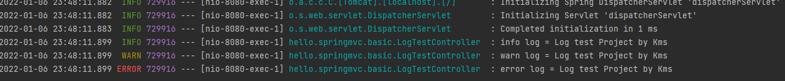
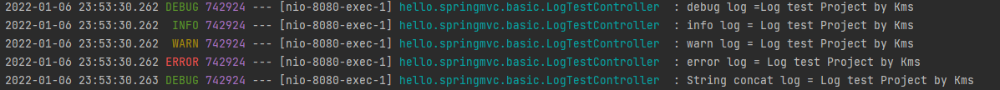

# 로깅

로그를 왜 사용할까?

보통 운영 시스템에서는 _System.out.println()_ 같은 시스템 콘솔을 사용해서 정보를 출력하지 않고 로깅 라이브러리를 사용해서 로그를 출력한다.

스프링 부트 로깅 라이브러리는 기본으로 SLF4J, Logback이라는 로깅 라이브러리를 사용한다.

로그 라이브러리는 Logback, Log4J, Log4J2 등 수많은 라이브러리가 있는데, 그것을 통합해서 인터페이스로 제공하는 것이 SLF4J이다.

Logback을 사용해보자.

테스트 컨트롤러를 하나 작성하겠다.

```java
package hello.springmvc.basic;

import org.slf4j.Logger;
import org.slf4j.LoggerFactory;
import org.springframework.web.bind.annotation.RequestMapping;
import org.springframework.web.bind.annotation.RestController;

@RestController
public class LogTestController {

    private final Logger log = LoggerFactory.getLogger(getClass());

    @RequestMapping("/log-test")
    public String logTest(){
        String name = "Log test Project by Kms";

        log.trace("trace log ={}",name);
        log.debug("debug log ={}",name);
        log.info("info log = {}",name);
        log.warn("info log = {}",name);
        log.error("error log = {}",name);


        //다른 방식. 이런식으로 사용하지 말자. 계산 로직이 먼저 실행되어서 불필요한 CPU, 메모리 사용으로 이어질 수 있다.
        log.debug("String concat log = " + name);
        return "ok";
    }
}

```

하나하나 설명하겠다.

## RestController

- @Controller와 달리 리턴 String이 뷰 이름이 아닌 HTTP 메시지 바디에 바로 입력해버린다. 그렇기에 실행 결과로 "ok"가 출력된 것. 

## log.debug 연산

- _log.debug("String concat log = " + name)_ 의 코드를 봐라. 이런식으로 짜면 안 된다. 로그를 출력하기 전에 먼저 저 문자열을 합쳐버리는 연산을 수행하기 때문이다.


# 결과

  

보면, info ~ / warn ~ / error ~ 로 로그가 정상출력된 것을 볼 수 있다.

로그 출력 포맷을 보면 시간  + 로그 레벨 + 프로세스 ID + 쓰레드 이름 + 클래스명 + 로그메시지 순으로 보여준다.

보통 개발 서버는 debug 수준, 운영 서버는 info 수준으로 로그를 출력한다.

여기서 debug 수준 infd 수준이라고 함은 로그 레벨을 설정해줄 수 있고 출력범위를 지정해줄 수 있다.

TRACE > DEBUG > INFO > WARN > ERROR 순으로 로그 레벨이 포괄적이다.

WARN로 설정하면 ERROR와 WARN만 보여주고, INFO로 설정하면 INFO와 WARN, ERROR를 보여주는 것이다.

설정 파일을 건드려서 log 레벨을 지정해줄 수 있다.

```xml
#전체 로그 레벨 설정(기본 info
logging.level.root=info

#내가 만든 패키지와 그 하위 로그 레벨 설정.
logging.level.hello.springmvc=debug
```

참고로 밑의 경로가 더 세부적이라 우선순위는 밑의 설정을 따른다.

  

보면 Debug수준의 로그까지 보여주는걸 볼 수 있다.


자 로그를 왜 쓸까?

- 쓰레드 정보, 클래스 이름 같은 부가 정보를 볼 수 있고, 출력 모양을 조정할 수 있다.
- 로그 레벨에 따라 출력을 지정할 수 있으므로 상황에 따라 유연하게 조절 가능하다.
- 로그의 기능 중 따로 파일에 저장하는 기능도 있는데, 해당 기능을 통하여 네트워크 등 로그를 별도의 위치에 남길 수 있다. 또한 파일이 커지면 자동으로 분할 및 압축시켜버릴 수도 있다.
- 그냥 성능이 System.out보다 더 좋다. (내부 버퍼링, 멀티 쓰레드 등등) 그래서 실무에서는 꼭 로그를 사용해야 한다.
