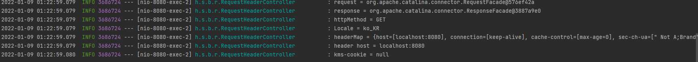

# 1. 요청 매핑


## 1.1 기본 매핑

기본적인 형태의 매핑 방식이다. 

저번에 작성한 양식이랑 같다.

```java
package hello.springmvc.basic.reqeustmapping;

import org.slf4j.Logger;
import org.slf4j.LoggerFactory;
import org.springframework.web.bind.annotation.RequestMapping;
import org.springframework.web.bind.annotation.RestController;

@RestController
public class MappingController {

    private Logger log = LoggerFactory.getLogger(getClass());

    @RequestMapping("/kms-basic-request")
    public String basicreq(){
        log.info("basic reqeust  kms");
        return "ok";
    }
}

```

그냥 "/kms-basic-reqeust"로 요청이 들어오면 로그로 string을 찍어주고 _@RestController_로 인해 웹에 ok를 뿌려주는 간단한 로직이다.

- 참고로 대부분의 속성을 배열[]로 제공하므로 다중 설정이 가능하다.  
    ex) "/kms-basic-request , /kms-basic-requestMap"  
- 다음 두 요청은 다른 URL이지만 스프링은 같은 요청으로 매핑한다.  
    ex) "/kms-basic-request", "/kms-basic-request/"

## 1.2 HTTP 메서드 매핑

```java

     * method 특정 HTTP 메서드 요청만 허용
     * GET, HEAD, POST, PUT, PATCH, DELETE
     */
    @RequestMapping(value = "/kms-mapping-get-v1", method = RequestMethod.GET)
    public String mappingGetv1(){
        log.info("mappingGetv1");
        return "ok";
    }
```

애노테이션 값안에 _method_ 파라미터를 달아줘서 요청을 지정해줄수 있다.

즉 저 URL로 POST요청이 오면 스프링 MVC는 HTTP 405(Method Not Allowed)를 반환한다.

  

사진을 보면 POST 요청을 보냈을 때 로그가 Warn로 해당 메서드는 지원하지 않는다고 로그를 찍는걸 볼수 있다.

위에 로그들은 GET요청을 보냈을 때 정상적으로 로직이 수행된 것이다.

## 1.3 HTTP 메서드 축약

```java
    /**
     * 편리한 축약 애노테이션
     * @GetMapping
     * @PostMapping
     * @PutMapping
     * @DeleteMapping
     * @PatchMapping
     */
    @GetMapping(value = "/kms/mapping-get-v2")
    public String mappingGetv2(){
        log.info("mappingGetv2");
        return "ok";
    }
```

즉, 위처럼 _GetMapping_ 라는 애노테이션을 달아주면 _@RequestMapping_ 에 _method = RequestMethod.GET_ 을 써준거나 똑같아진다.

## 1.4 PathVariable(경로 변수)

최근 HTTP API는 리소스 경로에 식별자를 넣는 스타일을 선호한다.

- /mapping/userA (userA는 변수)
- /users/1 (1은 변수)

이렇게 말이다.

이렇게 경로에 변수가 있을때 꺼내게 해주는 애노테이션이 있다.

```java
    /**
     * PathVariable 사용.
     * @param id
     * @return
     */
    @GetMapping("/kms/mapping/{userId}")
    public String mappingPath(@PathVariable("userId") String id){
        log.info("mapping path userId = {}",id);
        return "ok";
    }

```

_@GetMapping_ 안에는 '{}'에 변수 값이 들어온다는 것을 알려주고 _@PathVariable 속성값으로 변수를 받아올 수 있다.

참고로 _@PathVariable_ 의 이름과 파라미터 이름이 같으면 생략할 수 있다.

  

## 1.5 PathVariable 사용 - 다중

```java
    @GetMapping("/kms/mapping/{userId}/champion/{chamname}")
    public String mappingPath(@PathVariable String userId, @PathVariable String chamname){
        log.info("mapping path userId = {}, champion name = {}",userId,chamname);
        return "ok";
    }
```

@PathVariable을 다중으로 사용했을때, 파라미터 이름이 같으면 속성값을 생략할 수 있다는 것을 보여주기 위해 만든 예지이다.

  

자알된다.

## 1.6 특정 파라미터 조건 매핑

```java
    /**
     * 파라미터로 추가 매핑
     * parmas = "lang"
     * params ="!lang"
     * params = "lang=java"
     * params = "lang!=java"
     * params = {"lang=java","name="kms"}
     * 위와 같은 표현도 가능하다는 것.
     */
    @GetMapping(value = "/kms-mapping-param",params = "lang=java")
    public String mappingParam(){
        log.info("mappingParam");
        return "ok";
    }
```

이런식으로 작성하면 요청값에 꼭 "lang=java"라는 특정 파라미터 값이 들어와야한다.

  

보다시피 'kms=kms'라는 쓰잘데기 없는 값을 추가해도 "ok"가 떨어진다.

특정 파라미터 값이라는 'lang=java'를 없애보겠다.

  

400에러뜬다.

이런 기능이다.

## 1.7 특정 헤더 조건 매핑

```java
    /**
     * 특정 헤더로 추가 매핑
     * headers = "champion"
     * headers = "!champion"
     * headers = "champion = vayne"
     * headers = "champion != vayne"
     */
    @GetMapping(value = "/kms-mapping-headers", headers = "champion=vayne")
    public String mappingHeader(){
        log.info("mappingHeader");
        return "ok";
    }
```

파라미터 매핑과 비슷하지만, HTTP 헤더를 사용한다.

  

champion 헤더와 그 값으로 vayne을 갖는 헤더를 추가해서 요청하면 'ok'가 떨어진다.

## 1.8 미디어 타입 조건 매핑 - ContentType, consume

```java
   /**
     * Content-Type 헤더 기반 추가 매핑 Media Type
     * consumes = "application/json"
     * consumes = "!application/json"
     * consumes = "aplication/*"
     * consumes = "*\/*"
     * MediaType.APPLICATION_JSON_VALUE
     */

    @PostMapping(value = "/kms-mapping-consume", consumes = "application/json")
    public String mappingConsumes(){
        log.info("mappingConsumes");
        return "ok";
    }
```

  


## 1.9 미디어 타입 조건 매핑 Accept, produce

```java
   /**
    * Accept 헤더 기반 Media Type
    * produces = "text/html"
    * produces = "!text/html"
    * produces = "text/*"
    * produces = "*\/*"
    */
    @PostMapping(value = "/kms-mapping-produce", produces = "text/html")
    public String mappingProduces() {
        log.info("mappingProduces");
        return "ok";
    }
```

consume과 비슷하게 produce는 Accept헤더를 보고 작동한다.

### 1.9.1 Accept, Conent-Type

- Accept은 클라이언트가 선호하는 표현을 요청한다. 즉, 클라이언트 입장에서 응답을 받을때, Accept 헤더에 있는 데이터 타입이 오지 않으면 거절한다. 즉, 서버입장에서는 생성(produce)한 데이터 타입이 맞지 않으면 거절.

- Content-Type은 해당 헤더에 있는 데이터가 오지 않았을 경우 서버 입장에서 요청 거부 즉 서버는 헤더요청을 소비(consume)함.


# 2. 요청 매핑 - API 예시

나는 롤을 많이했으므로 롤에 대해 예시를 들겠다.

롤 챔피언 관리를 HTTP API로 만든다 생각하고 매핑을 어떻게 하는지 보자.

- 챔피언 목록 조회 : GET /champions
- 챔피언 등록 : POST /champions
- 챔피언 조회 : GET /champions/{championId}
- 챔피언 수정 : PATCH /champions/{championId}
- 챔피언 삭제 : DELETE /champions/{championId}

```java
package hello.springmvc.basic.reqeustmapping;

import org.springframework.web.bind.annotation.*;

@RestController
@RequestMapping("/kms-mapping/champions")
public class ChampionController {

    /**
     * GET /kms-mapping/champions
     */
    @GetMapping
    public String champions(){
        return "get champions";
    }

    /**
     * POST /kms-mapping/champions
     */
    @PostMapping
    public String addChampions(){
        return "post champions";
    }

    /**
     * GET /kms-mapping/champions/{champions}
     */
    @GetMapping("/{championId}")
    public String findChampion(@PathVariable String championId){
        return "get championId :" + championId;
    }

    /**
     * PATCH /kms-mapping/champions/{champions}
     */
    @PatchMapping("/{championId}")
    public String updateChampion(@PathVariable String championId){
        return "patch championId : " + championId;
    }

    /**
     * DELETE /kms-mapping
     */
    @DeleteMapping("/{championId}")
    public String deleteChampion(@PathVariable String championId){
        return "delete championId : " + championId;
    }
}

```

Postman으로 다 테스트하면 다 잘된다.


# 3. 요청 매핑 - 기본, 헤더 조회

이번에는 HTTP 헤더를 조회하는 방법을 알아보자.

직관적이다.

```java
package hello.springmvc.basic.reqeustmapping;

import lombok.extern.slf4j.Slf4j;
import org.springframework.http.HttpMethod;
import org.springframework.util.MultiValueMap;
import org.springframework.web.bind.annotation.CookieValue;
import org.springframework.web.bind.annotation.RequestHeader;
import org.springframework.web.bind.annotation.RequestMapping;
import org.springframework.web.bind.annotation.RestController;

import javax.servlet.http.HttpServletRequest;
import javax.servlet.http.HttpServletResponse;
import java.util.Locale;

@Slf4j
@RestController
public class RequestHeaderController {

    @RequestMapping("/headers")
    public String headers(HttpServletRequest request,
                          HttpServletResponse response,
                          HttpMethod httpMethod,
                          Locale locale,
                          @RequestHeader MultiValueMap<String,String> headerMap,
                          @RequestHeader("host") String host,
                          @CookieValue(value = "kms-cookie",required = false) String cookie){
        log.info("request = {}",request);
        log.info("response = {}",response);
        log.info("httpMethod = {}",httpMethod);
        log.info("Locale = {}",locale);
        log.info("headerMap = {}",headerMap);
        log.info("header host = {}",host);
        log.info("kms-cookie = {}",cookie);

        return "ok";
    }
}

```

결과

  

설명할 부분이 많지는 않다.

- 먼저, _@RequestHeader MultiValueMap<String,String> headerMap_ 이부분에서 MultiValueMap이 뭔지 궁금하다.

    크게 다른건 없다. 하나의 key와 여러 value를 갖는 맵이다.

- _@RequestHeader("host") String host_ 는 특정 HTTP 헤더를 조회한다.
- _@CookieValue_ 또한 특정 쿠키를 조회한다. 코드에는 쿠키설정 을 안 해줘서 null로 나온다.

