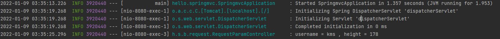
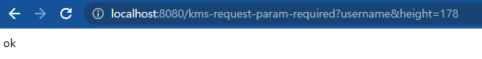
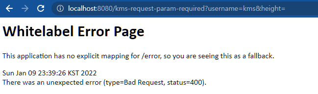
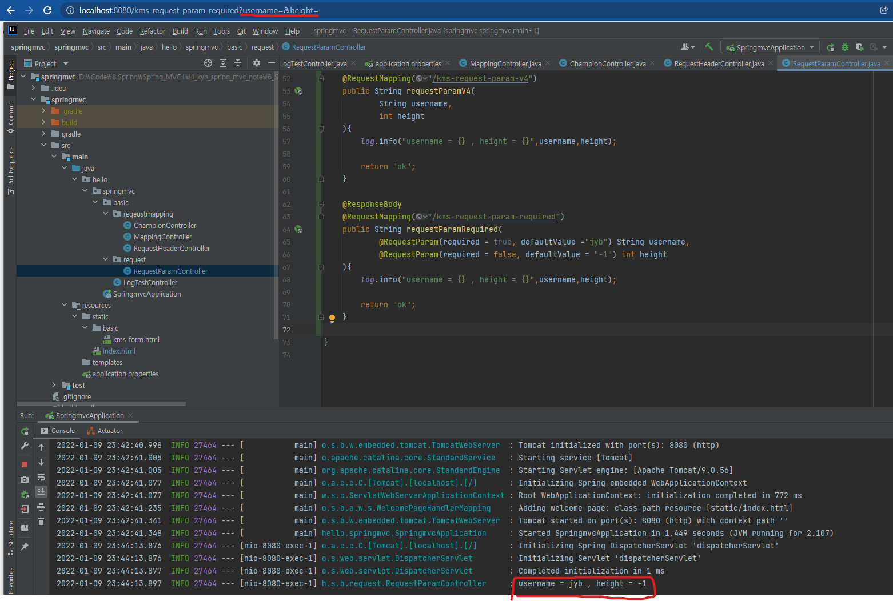

# HTTP 요청 파라미터 - 쿼리파라미터, HTML FORM

클라이언트에서 서버로 요청 데이터를 전달할 때는 주로 다음 3가지 방법을 사용한다.

- GET - 쿼리 파라미터
  - 메시지 바디 없이, URL의 쿼리 파라미터에 데이터를 포함해서 전달
  - /url?username=kms&hegiht=178

- POST - HTML Form
  - content-type:application/x-www-form-urlencoded
  - 메시지 바디에 쿼리 파라미터 형식으로 전달함.  

- HTTP message body에 데이터를 직접 담아서 요청
  - HTTP API에 주로 사용된다. JSON, XML, TEXT
  - 데이터 형식은 주로 JSON이 사용된다.

## GET,쿼리 파라미터로 전송.

자바 파일을 만들자.

```java
package hello.springmvc.basic.request;

import lombok.extern.slf4j.Slf4j;
import org.springframework.stereotype.Controller;
import org.springframework.web.bind.annotation.RequestMapping;

import javax.servlet.http.HttpServletRequest;
import javax.servlet.http.HttpServletResponse;
import java.io.IOException;

@Slf4j
@Controller
public class RequestParamController {

    //기본적인 형태

    @RequestMapping("/kms-request-param-v1")
    public void requestParamv1(HttpServletRequest request, HttpServletResponse response) throws IOException {

        String username = request.getParameter("username");
        int height = Integer.parseInt(request.getParameter("height"));
        log.info("username = {} , height = {}",username,height);

        response.getWriter().write("ok");
    }
}

```

기본적인 예제이다. <http://localhost:8080/kms-request-param-v1?username=kms&height=178> 으로 들어가면 된다.

## Post로 Form 전송

전송하기 위해 html 파일을 만들어야한다.

경로는 _main/resources/static/basic/kms-from.html_ 이다.

```html
<!DOCTYPE html>
<html>
<head>
  <meta charset="UTF-8">
  <title>Title</title>
</head>
<body>
<form action="/kms-request-param-v1" method="post">
  username: <input type="text" name="username" />
  height: <input type="text" name="height" />
  <button type="submit">전송</button>
</form>
</body>
</html>
```

<localhost:8080/kms-request-param-v1> 으로 가면 입력폼에 입력하고 전송 버튼을 누르면 

위에서 작성한 java에서 요청값을 받아 로그에 잘 찍고 잘 받아온다.

  

쿼리 파라미터와 다른 점은 뭘까?

url에 데이터를 넣냐 html에 데이터 넣냐의 차이다.

보안적으로 GET Query보다는 Post Form이 더 좋아보이지 않는가?

GET은 데이터를 보낸다는 것 보다는 조회목적으로 쓰자.


# HTTP 요청 파라미터 - @RequestParam

_@RequestParam_ 애노테이션을 이용해서 요청 파라미터를 관리해보자.

가장 기본적인 형태는 다음과 같다.

```java
package hello.springmvc.basic.request;

import lombok.extern.slf4j.Slf4j;
import org.springframework.stereotype.Controller;
import org.springframework.web.bind.annotation.RequestMapping;
import org.springframework.web.bind.annotation.RequestParam;
import org.springframework.web.bind.annotation.ResponseBody;

import javax.servlet.http.HttpServletRequest;
import javax.servlet.http.HttpServletResponse;
import java.io.IOException;

@Slf4j
@Controller
public class RequestParamController {
    @ResponseBody
    @RequestMapping("/kms-request-param-v2")
    public String requestParamV2(
            @RequestParam("username") String myname,
            @RequestParam("height") int myheight
    ){
        log.info("username = {} , height = {}",myname,myheight);

        return "ok";
    }
}

```

_@ResponseBody_ 를 사용해준 이유는 @Controller 애노테이션 때문에 리턴값으로 지정한 "ok"를 논리적 뷰 이름으로 판단하지 않게끔 하기 위해서이다. 이렇게 설정하면 _@RestController_ 처럼 HTTP message body에 리턴값을 넣어버려 반환한다.  
뒤에서 설명할것!!

만약 HTTP 요청 파라미터 이름이 변수 이름과 같다면 _@RequestParam()_ 속성값을 생략할 수 있다.

```java
package hello.springmvc.basic.request;

import lombok.extern.slf4j.Slf4j;
import org.springframework.stereotype.Controller;
import org.springframework.web.bind.annotation.RequestMapping;
import org.springframework.web.bind.annotation.RequestParam;
import org.springframework.web.bind.annotation.ResponseBody;

import javax.servlet.http.HttpServletRequest;
import javax.servlet.http.HttpServletResponse;
import java.io.IOException;

@Slf4j
@Controller
public class RequestParamController {
    @ResponseBody
    @RequestMapping("/kms-request-param-v3")
    public String requestParamV3(
            @RequestParam String username,
            @RequestParam int height
    ){
        log.info("username = {} , height = {}",username,height);

        return "ok";
    }

}

```

즉 url에서 요청을 보낼때 <http://localhost:8080/kms-request-param-v3?username=kms&height=178> 이런식으로 파라미터 이름과 _@RequestParam_ 의 변수값이 같아야 한다.

심지어 위와 같은 상황에서 _@RequestParam_ 을 생략할수 있다.

```java
    package hello.springmvc.basic.request;

import lombok.extern.slf4j.Slf4j;
import org.springframework.stereotype.Controller;
import org.springframework.web.bind.annotation.RequestMapping;
import org.springframework.web.bind.annotation.RequestParam;
import org.springframework.web.bind.annotation.ResponseBody;

import javax.servlet.http.HttpServletRequest;
import javax.servlet.http.HttpServletResponse;
import java.io.IOException;

@Slf4j
@Controller
public class RequestParamController {

    @ResponseBody
    @RequestMapping("/kms-request-param-v4")
    public String requestParamV4(String username,int height){
        log.info("username = {} , height = {}",username,height);

        return "ok";
    }

}

```

이러한 방식은 팀원들끼리 협의가 되어있어야 한다. 너무 줄여서 헷갈릴수 있기 때문이다. _@RequestParam_ 을 명시하여 요청 파라미터에서 데이터를 읽는 다는 것을 알 수 있다.

## 파라미터 필수 여부 - requestParamRequired

```java
package hello.springmvc.basic.request;

import lombok.extern.slf4j.Slf4j;
import org.springframework.stereotype.Controller;
import org.springframework.web.bind.annotation.RequestMapping;
import org.springframework.web.bind.annotation.RequestParam;
import org.springframework.web.bind.annotation.ResponseBody;

import javax.servlet.http.HttpServletRequest;
import javax.servlet.http.HttpServletResponse;
import java.io.IOException;

@Slf4j
@Controller
public class RequestParamController {

    @ResponseBody
    @RequestMapping("/kms-request-param-required")
    public String requestParamRequired(
            @RequestParam(required = true) String username,
            @RequestParam(required = false) int height
    ){
        log.info("username = {} , height = {}",username,height);

        return "ok";
    }

}

```

_@RequestParam_ 의 속성 값으로 'required = true', 'required = false'가 있다.

딱봐도 username은 꼭 요청파라미터로 들어와야하고, height는 요청 파라미터로 없어도 된다는걸 알수 있다.

다만, 여기서 주의할 점이 있다.

요청 파라미터로, 

username=&height=178

username&height=178

라는 값이 들어오면 400(Bad request)가 뜰까??

  

"ok"가 뜬다. 빈문자로 넣어버리기 때문이다.

만약 height도 required = true로 놓고 'height='나 'height'까지만 넣으면 어떻게 될까?

  

400 error가 뜬다. 이유는 int로 선언해서 그렇다. int로 선언한 변수에는 NULL값을 넣지 못한다.

여기서 필요한건 _requestParamDefault_ 이다.

### 기본값 적용 - requestParamDefault

```java
package hello.springmvc.basic.request;

import lombok.extern.slf4j.Slf4j;
import org.springframework.stereotype.Controller;
import org.springframework.web.bind.annotation.RequestMapping;
import org.springframework.web.bind.annotation.RequestParam;
import org.springframework.web.bind.annotation.ResponseBody;

import javax.servlet.http.HttpServletRequest;
import javax.servlet.http.HttpServletResponse;
import java.io.IOException;

@Slf4j
@Controller
public class RequestParamController {

    @ResponseBody
    @RequestMapping("/kms-request-param-required")
    public String requestParamRequired(
            @RequestParam(required = true, defaultValue ="jyb") String username,
            @RequestParam(required = false, defaultValue = "-1") int height
    ){
        log.info("username = {} , height = {}",username,height);

        return "ok";
    }

}

```

어떤 의미인지 직관적으로 알수 있다.

요청 파라미터가 비어있다(NULL)면 username에는  'jyb'를 넣어주고, height에는 '-1'를 넣어준다.

  

또한 파라미터를 Map으로 조회할 수 있다.

## requestParamMap


```java
package hello.springmvc.basic.request;

import lombok.extern.slf4j.Slf4j;
import org.springframework.stereotype.Controller;
import org.springframework.web.bind.annotation.RequestMapping;
import org.springframework.web.bind.annotation.RequestParam;
import org.springframework.web.bind.annotation.ResponseBody;

import javax.servlet.http.HttpServletRequest;
import javax.servlet.http.HttpServletResponse;
import java.io.IOException;
import java.util.Map;

@Slf4j
@Controller
public class RequestParamController {
    @ResponseBody
    @RequestMapping("/kms-request-param-map")
    public String requestParamMap(@RequestParam Map<String,Object> paramMap){
        log.info("username = {} , height = {}",paramMap.get("username"),paramMap.get("height"));

        return "ok";
    }

}

```

파라미터의 값이 1개가 확실하다면 _Map_ 을 사용해도 되지만, 그렇지 않다면 _MultiValueMap_ 을 사용하자.!

