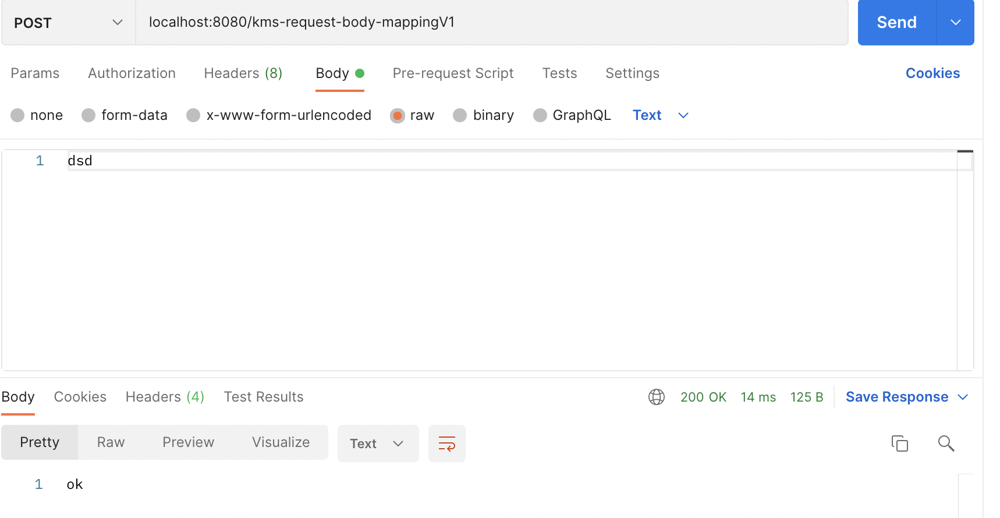

# HTTP Request Body

## HTTP Request Message - 단순  텍스트

요청 파라미터와 다르게 HTTP 바디를 통해서 데이터가 직접 데이터로 넘어오는 경우는 _@RequestParam_, _@ModelAttribute_를 사용할 수 없다. 

가장 원초적인 방법으로 텍스트를 읽는법을 알아보자.

### 1. InputStream을 사용한 방법.

```java
package hello.springmvc.basic.request;

import lombok.extern.slf4j.Slf4j;
import org.springframework.stereotype.Controller;
import org.springframework.util.StreamUtils;
import org.springframework.web.bind.annotation.PostMapping;

import javax.servlet.ServletInputStream;
import javax.servlet.http.HttpServletRequest;
import javax.servlet.http.HttpServletResponse;
import java.io.IOException;
import java.nio.charset.StandardCharsets;

@Slf4j
@Controller
public class RequestBodyController {

    @PostMapping("kms-request-body-mappingV1")
    public void requestbodyV1(HttpServletRequest request, HttpServletResponse response) throws IOException {
        ServletInputStream inputStream = request.getInputStream();
        String messagebody = StreamUtils.copyToString(inputStream, StandardCharsets.UTF_8);

        log.info("messagebody = {}",messagebody);

        response.getWriter().write("ok");
    }
}

```

결과



불편한점이 있다. 클래스들의 이름이 너무 길다. 설정도 해줘야하고.. Spring에서는 이러한 설정들을 본인들이 직접하여 개발자가 편리하게 messagebody를 다룰 수 있도록 도와준다.

### 2. InputStream, Writer를 이용한 방법.

```java
package hello.springmvc.basic.request;

import lombok.extern.slf4j.Slf4j;
import org.springframework.stereotype.Controller;
import org.springframework.util.StreamUtils;
import org.springframework.web.bind.annotation.PostMapping;

import javax.servlet.ServletInputStream;
import javax.servlet.http.HttpServletRequest;
import javax.servlet.http.HttpServletResponse;
import java.io.IOException;
import java.io.InputStream;
import java.io.Writer;
import java.nio.charset.StandardCharsets;

@Slf4j
@Controller
public class RequestBodyController {

    @PostMapping("/kms-request-body-mappingV2")
    public void requestbodyV2(InputStream inputStream, Writer writer) throws IOException {
        String messagebody = StreamUtils.copyToString(inputStream, StandardCharsets.UTF_8);

        log.info("v2 messagebody = {}",messagebody);

        writer.write("ok");
    }
}

```
스프링 MVC는 다음 파라미터를 지원한다.
- InputStream(Reader): HTTP 요청 메시지 바디의 내용을 직접 조회
- OutputStream(Writer): HTTP 응답 메시지의 바디에 직접 결과 출력


v1에서는 request에서 직접 꺼내서 썼다면, v2에서는 아예 꺼낸 Stream을 인자로 받아서 쓰고 있다는 점이다. 더 줄일 수 있을까? 있다.!!

### 3. HttpEntity<> 이용한 방법.

```java
package hello.springmvc.basic.request;

import lombok.extern.slf4j.Slf4j;
import org.springframework.http.HttpEntity;
import org.springframework.stereotype.Controller;
import org.springframework.util.StreamUtils;
import org.springframework.web.bind.annotation.PostMapping;

import javax.servlet.ServletInputStream;
import javax.servlet.http.HttpServletRequest;
import javax.servlet.http.HttpServletResponse;
import java.io.IOException;
import java.io.InputStream;
import java.io.Writer;
import java.nio.charset.StandardCharsets;

@Slf4j
@Controller
public class RequestBodyController {

    @PostMapping("/kms-request-body-mappingV3")
    public HttpEntity<String> requestbodyV3(HttpEntity<String> httpEntity)  {
        String messagebody = httpEntity.getBody();

        log.info("v3 messagebody = {}",messagebody);

        return new HttpEntity<>("im kms OK");
    }
}

```


스프링 MVC가 지원하는 기능이다.

- HTTPEntity<>는 HTTP Header,body를 좀 더 편히 조회할 수 있게 도와준다.
- HTTPEntity<>는 응답용으로도 사용될 수 있다.

HTTPEntity를 상속받은 객체들이 있는데, 이는 더 개발자가 요구하는 바를 더 명확하게 밝히고 기능이 강화되어있다.

### 4. HttpEntity<>를 상속받은 RequestEntity, ResponseEntity객체


```java
package hello.springmvc.basic.request;

import lombok.extern.slf4j.Slf4j;
import org.springframework.http.HttpEntity;
import org.springframework.http.HttpStatus;
import org.springframework.http.RequestEntity;
import org.springframework.http.ResponseEntity;
import org.springframework.stereotype.Controller;
import org.springframework.util.StreamUtils;
import org.springframework.web.bind.annotation.PostMapping;

import javax.servlet.ServletInputStream;
import javax.servlet.http.HttpServletRequest;
import javax.servlet.http.HttpServletResponse;
import java.io.IOException;
import java.io.InputStream;
import java.io.Writer;
import java.nio.charset.StandardCharsets;

@Slf4j
@Controller
public class RequestBodyController {
    @PostMapping("/kms-request-body-mappingV4")
    public HttpEntity<String> requestbodyV4(RequestEntity<String> requestEntity){
        String messagebody =  requestEntity.getBody();

        log.info("v4 messagebody = {}",messagebody);

        return new ResponseEntity<String>("ok", HttpStatus.CREATED);
    }
}

```

이마저도 코드가 길어서 복잡하자. 더 줄여보자.

### 5. @ResponseBody, @RequestBody 사용

```java
package hello.springmvc.basic.request;

import lombok.extern.slf4j.Slf4j;
import org.springframework.http.HttpEntity;
import org.springframework.http.HttpStatus;
import org.springframework.http.RequestEntity;
import org.springframework.http.ResponseEntity;
import org.springframework.stereotype.Controller;
import org.springframework.util.StreamUtils;
import org.springframework.web.bind.annotation.PostMapping;
import org.springframework.web.bind.annotation.RequestBody;
import org.springframework.web.bind.annotation.ResponseBody;

import javax.servlet.ServletInputStream;
import javax.servlet.http.HttpServletRequest;
import javax.servlet.http.HttpServletResponse;
import java.io.IOException;
import java.io.InputStream;
import java.io.Writer;
import java.nio.charset.StandardCharsets;

@Slf4j
@Controller
public class RequestBodyController {

    @ResponseBody
    @PostMapping("/kms-request-body-mappingV5")
    public String requestV5(@RequestBody String messagebody){
        log.info("v5 messagebody = {}", messagebody);
        return "v5 ok!!";
    }
}

```

  

코드가 굉장히 간결해졌다.

이게 요즘 방식이다.

- _@RequestBody_

@RequestBody 를 사용하면 HTTP 메시지 바디 정보를 편리하게 조회할 수 있다.

참고로 헤더 정보가 필요하다면 HttpEntity 를 사용하거나 @RequestHeader 를 사용하면 된다.

이렇게 메시지 바디를 직접 조회하는 기능은 요청 파라미터를 조회하는 @RequestParam ,
@ModelAttribute 와는 전혀 관계가 없다.

- 요청 파라미터 vs HTTP 메시지 바디
요청 파라미터를 조회하는 기능: @RequestParam , @ModelAttribute

HTTP 메시지 바디를 직접 조회하는 기능: @RequestBody

- @ResponseBody
  
@ResponseBody 를 사용하면 응답 결과를 HTTP 메시지 바디에 직접 담아서 전달할 수 있다.
물론 이 경우에도 view를 사용하지 않는다.

-----

## HTTP Request Message - JSON

JSON 형태를 조회하는 방법을 알아볼 것이다.

먼저 원시적인 방법을 보겠다.

### 1. Servlet방식으로 JSON 조회

```java
package hello.springmvc.basic.request;

import com.fasterxml.jackson.databind.ObjectMapper;
import hello.springmvc.basic.BmiData;
import lombok.extern.slf4j.Slf4j;
import org.apache.catalina.mapper.Mapper;
import org.springframework.stereotype.Controller;
import org.springframework.util.StreamUtils;
import org.springframework.web.bind.annotation.PostMapping;

import javax.servlet.ServletInputStream;
import javax.servlet.http.HttpServletRequest;
import javax.servlet.http.HttpServletResponse;
import java.io.IOException;
import java.io.Writer;
import java.nio.charset.StandardCharsets;

@Slf4j
@Controller
public class RequestBodyJSONController {
    private ObjectMapper mapper = new ObjectMapper();

    @PostMapping("/kms-request-body-json-v1")
    public void requestBodyJsonV1(HttpServletRequest request, HttpServletResponse response) throws IOException{
        ServletInputStream inputStream = request.getInputStream();
        String messagebody = StreamUtils.copyToString(inputStream, StandardCharsets.UTF_8);

        log.info("message = {}",messagebody);
        BmiData data = mapper.readValue(messagebody,BmiData.class);
        log.info("name = {}, height = {}, weight = {}",data.getName(),data.getHeight(),data.getWeight());

        response.getWriter().write("ok");
    }

}
```

### 2. ResponseBody, RequestBody 사용.


전통적인 방식이다. mapper를 통해 데이터를 넣고 그 데이터를 출력한다. 

줄이자.

```java
package hello.springmvc.basic.request;

import com.fasterxml.jackson.core.JsonProcessingException;
import com.fasterxml.jackson.databind.ObjectMapper;
import hello.springmvc.basic.BmiData;
import lombok.extern.slf4j.Slf4j;
import org.apache.catalina.mapper.Mapper;
import org.springframework.stereotype.Controller;
import org.springframework.util.StreamUtils;
import org.springframework.web.bind.annotation.PostMapping;
import org.springframework.web.bind.annotation.RequestBody;
import org.springframework.web.bind.annotation.ResponseBody;

import javax.servlet.ServletInputStream;
import javax.servlet.http.HttpServletRequest;
import javax.servlet.http.HttpServletResponse;
import java.io.IOException;
import java.io.Writer;
import java.nio.charset.StandardCharsets;

@Slf4j
@Controller
public class RequestBodyJSONController {
    private ObjectMapper mapper = new ObjectMapper();

    @ResponseBody
    @PostMapping("/kms-request-body-json-v2")
    public String requestBodyJsonV2(@RequestBody String messagebody) throws JsonProcessingException {

        log.info("message = {}", messagebody);
        BmiData data = mapper.readValue(messagebody, BmiData.class);
        log.info("name = {}, height = {}, weight = {}",data.getName(),data.getHeight(),data.getWeight());

        return "json v2 ok";
    }

}

```

  

리턴값을 String으로 바꾸고 메소드 앞에 _@ResponseBody_ 를달아줬다.

또한, 파라미터에는 _@RequestBody_ 를 달아줘서 body값을 직접 가져오도록 하였다.

근데 이것도 불편하다. mapper에 너무 의존적이다. mapper를 안 쓸순 없을까? 있다.

```java
package hello.springmvc.basic.request;

import com.fasterxml.jackson.core.JsonProcessingException;
import com.fasterxml.jackson.databind.ObjectMapper;
import hello.springmvc.basic.BmiData;
import lombok.extern.slf4j.Slf4j;
import org.apache.catalina.mapper.Mapper;
import org.springframework.stereotype.Controller;
import org.springframework.util.StreamUtils;
import org.springframework.web.bind.annotation.PostMapping;
import org.springframework.web.bind.annotation.RequestBody;
import org.springframework.web.bind.annotation.ResponseBody;

import javax.servlet.ServletInputStream;
import javax.servlet.http.HttpServletRequest;
import javax.servlet.http.HttpServletResponse;
import java.io.IOException;
import java.io.Writer;
import java.nio.charset.StandardCharsets;

@Slf4j
@Controller
public class RequestBodyJSONController {
    @ResponseBody
    @PostMapping("/kms-request-body-json-v3")
    public String requestBodyJsonV3(@RequestBody BmiData data)  {
        log.info("name = {}, height = {}, weight = {}",data.getName(),data.getHeight(),data.getWeight());

        return "json v3 ok";
    }
}

```

이처럼 _@RequestBody_ 안에 객체를 넣어버리는 것이다. 단, 요청으로 들어오는 JSON Key의 이름과 객체의 필드 이름이 같아야 Spring의 HTTP 메시지컨버터가 이를 찾고 매핑해준다.

참고로 _@RequestBody_ 를 생략해버리면 스프링의 규칙에 따라 _@ModelAttribute_ 가 적용된다. 즉 생략하면 HTTP 메시지 바디가 아니라 요청 파라미터로 처리해버린다.


> 요청을 일단 받았지만 모두 NULL의 형태가 들어감.

### 3. HTTPEntity로 받기.

```java
package hello.springmvc.basic.request;

import com.fasterxml.jackson.core.JsonProcessingException;
import com.fasterxml.jackson.databind.ObjectMapper;
import hello.springmvc.basic.BmiData;
import lombok.extern.slf4j.Slf4j;
import org.apache.catalina.mapper.Mapper;
import org.springframework.http.HttpEntity;
import org.springframework.stereotype.Controller;
import org.springframework.util.StreamUtils;
import org.springframework.web.bind.annotation.PostMapping;
import org.springframework.web.bind.annotation.RequestBody;
import org.springframework.web.bind.annotation.ResponseBody;

import javax.servlet.ServletInputStream;
import javax.servlet.http.HttpServletRequest;
import javax.servlet.http.HttpServletResponse;
import java.io.IOException;
import java.io.Writer;
import java.nio.charset.StandardCharsets;

@Slf4j
@Controller
public class RequestBodyJSONController {
    @ResponseBody
    @PostMapping("/kms-request-body-json-v4")
    public String requestBodyJsonV4(HttpEntity<BmiData> data)  {
        BmiData body = data.getBody();
        log.info("name = {}, height = {}, weight = {}",body.getName(),body.getHeight(),body.getWeight());

        return "json v4 ok";
    }
}

```


만약 JSON형태로 그대로 반환하고 싶으면 어떻게 할까?


```java
package hello.springmvc.basic.request;

import com.fasterxml.jackson.core.JsonProcessingException;
import com.fasterxml.jackson.databind.ObjectMapper;
import hello.springmvc.basic.BmiData;
import lombok.extern.slf4j.Slf4j;
import org.apache.catalina.mapper.Mapper;
import org.springframework.http.HttpEntity;
import org.springframework.stereotype.Controller;
import org.springframework.util.StreamUtils;
import org.springframework.web.bind.annotation.PostMapping;
import org.springframework.web.bind.annotation.RequestBody;
import org.springframework.web.bind.annotation.ResponseBody;

import javax.servlet.ServletInputStream;
import javax.servlet.http.HttpServletRequest;
import javax.servlet.http.HttpServletResponse;
import java.io.IOException;
import java.io.Writer;
import java.nio.charset.StandardCharsets;

@Slf4j
@Controller
public class RequestBodyJSONController {
    @ResponseBody
    @PostMapping("/kms-request-body-json-v5")
    public BmiData requestBodyJsonV5(@RequestBody BmiData data)  {
        log.info("name = {}, height = {}, weight = {}",data.getName(),data.getHeight(),data.getWeight());
        return data;
    }
}

```


이렇게 리턴값에 클래스명과 리턴값으로 그냥 넘겨버리면 된다.

- @RequestBody 요청  
JSON 요청 -> HTTP 메시지 컨버터 -> 객체
- @ResponseBody 응답  
객체 -> HTTP 메시지 컨버터 -> JSON 응답

즉, HTTP 메시지 컨버터가 중간에서 원하는 데이터의 형태로 바꿔주는 역할을 한다.

요청을 보낼때는 Content-Type이 application/json 이어야하고, 응답을 보낼때에는 Accept가 application/json이어야 한다.!!!
