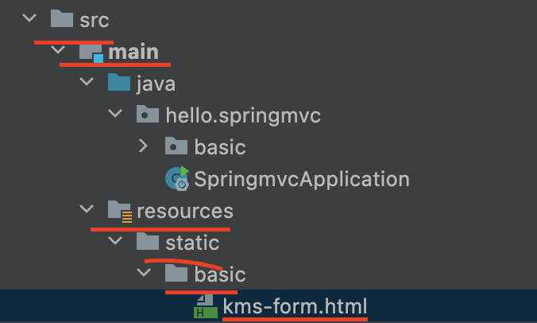
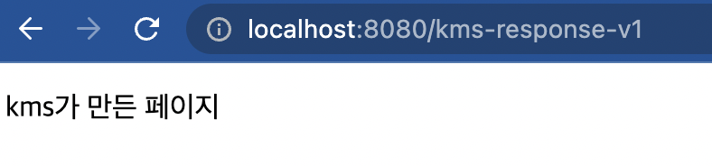
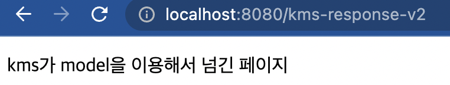
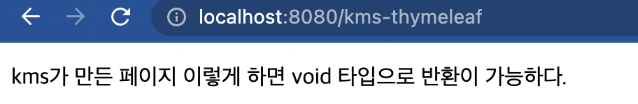

# 1. HTTP Response - 정적 리소스,뷰 템플릿

스프링에서 응답(데이터)를 만드는 방법은 크게 3가지이다.

- 정적 리소스   
  - HTML, CSS, js 등
- 뷰 템플릿 사용
  - 동직인 HTML
- HTTP 메시지 사용
  - HTTP API를 제공하는 경우에는 HTML이 아닌 데이터를 실어 넣어야하므로 HTTP 메시지 바디에 JSON같은 형식의 데이터를 실어서 보냄.

## 1.1 정적 리소스

Spring boot에서 정적 리소스 경로는 정해져있다.

```text
/static 또는
/public 또는
/resources 또는
/META-INF/resources 
```

로 정해져있다. src/main/resources는 리소스를 보관하는 곳이고, 또 클래스패스의 시작경로이다.  
따라서 다음 디렉토리에 리소스를 넣어두면 스프링 부트가 정적 리소스로 서비스를 제공한다.

```text
src/main/resources/static
```

다음 경로에 파일이 들어있다고 치면

```text
src/main/resources/static/basic/kms-form.html
```

```html
<!DOCTYPE html>
<html>
<head>
  <meta charset="UTF-8">
  <title>Title</title>
</head>
<body>
<form action="/kms-request-param-v1" method="post">
  username: <input type="text" name="username" />
  height: <input type="text" name="height" />
  <button type="submit">전송</button>
</form>
</body>
</html>
```


<localhost:8080/basic/kms-form.html>

으로 접근이 가능하다.


> 경로


> URL

## 1.2 뷰 템플릿

뷰 템플릿을 거쳐서 HTML이 생성되고, 뷰가 응답을 만들어서 전달한다.  
일반적으로 HTML을 동적으로 생성하는 용도로 사용하지만, 다른 것들도 가능하다. 뷰 템플릿이 만들 수
있는 것이라면 뭐든지 가능하다.  

**뷰 템플릿 경로**

```text
src/main/resources/templates
```

**해당 경로에 있는 thymeleaf템플릿을 사용한 html code**

```html
<!DOCTYPE html>
<html xmlns:th="http://www.thymeleaf.org">
<head>
    <meta charset="UTF-8">
    <title>Title</title>
</head>
<body>
<p th:text="${data}">empty</p>
</body>
</html>
```

이제 3가지 방법을 통해 컨트롤러에서 저 페이지를 띄워볼 것이다.

### 1.2.1 ModelAndView를 사용하기

```java
package hello.springmvc;

import org.springframework.stereotype.Controller;
import org.springframework.web.bind.annotation.RequestMapping;
import org.springframework.web.servlet.ModelAndView;

@Controller
public class thymeleafTest {

    @RequestMapping("/kms-response-v1")
    public ModelAndView view1(){
        ModelAndView modelAndView = new ModelAndView("/kms-thymeleaf")
                .addObject("data", "kms가 만든 페이지");
        return modelAndView;
    }

}
```



3가지 방법을 쓰면서 지켜봐야할건 return 타입과, 인자다.

ModelAndView 방식은 객체를 반환하게 되어있다. 따라서 새로운 객체를 생성해서 View이름과 데이터를 넣어준것이다.

### 1.2.2 인자에 Model 사용하기

```java
package hello.springmvc;

import org.springframework.stereotype.Controller;
import org.springframework.ui.Model;
import org.springframework.web.bind.annotation.RequestMapping;
import org.springframework.web.servlet.ModelAndView;

@Controller
public class thymeleafTest {
    @RequestMapping("/kms-response-v2")
    public String view2(Model model){
        model.addAttribute("data","kms가 model을 이용해서 넘긴 페이지");
        return "/kms-thymeleaf";
    }
}

```
  

리턴값은 String으로 뷰 이름을 넘겼다. 또한, 인자는 Model을 적어서 보내는 데이터를 추가하였다.

마지막은 추천하지 않지만 소개를 하셨기에 소개하겠다.

### 1.2.3 논리적 뷰와 요청 url의 경로가 같다면..

생략이 가능하다.

```java
package hello.springmvc;

import org.springframework.stereotype.Controller;
import org.springframework.ui.Model;
import org.springframework.web.bind.annotation.RequestMapping;
import org.springframework.web.servlet.ModelAndView;

@Controller
public class thymeleafTest {
    @RequestMapping("/kms-thymeleaf")
    public void view3(Model model){
        model.addAttribute("data","kms가 만든 페이지\n 이렇게 하면 void 타입으로 반환이 가능하다.");
    }
}

```

반환 타입이 없다.



때로는 너무 명시적이지 않다면 협업시 의사소통이 별도로 필요해서 불편할 때가 있다.

이러한 상황이다. 그리고 보안적으로 위험하다고 생각이 든다.

참고로 이미 추가되어 있을 수 있지만, _build.gradle_ 에서 다음과 같이 추가하면 

```text
`implementation 'org.springframework.boot:spring-boot-starter-thymeleaf'`
```


스프링 부트가 자동으로 ThymeleafViewResolver와 필요한 스프링 빈들을 등록한다.

또한, application.properties에 대한 설정도 자동으로 해준다.

```text
//application.properties
spring.thymeleaf.prefix=classpath:/templates/
spring.thymeleaf.suffix=.html
```

따라서 논리적 뷰를 반환할 때 뒤에 .html을 안 붙여도 되는 이유이다.


