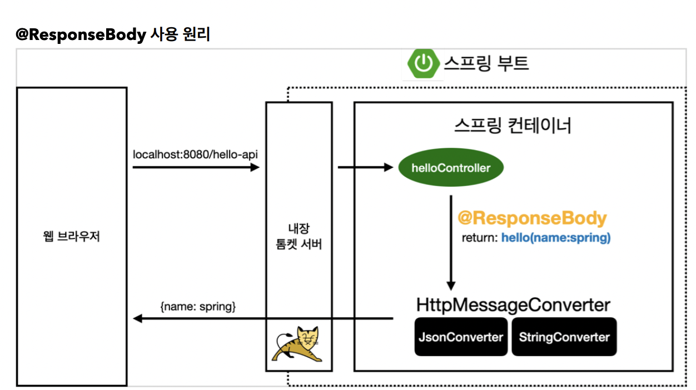
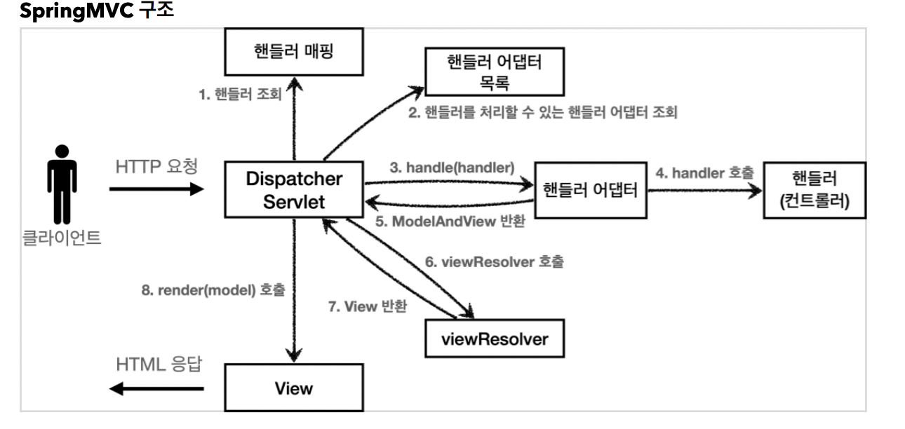
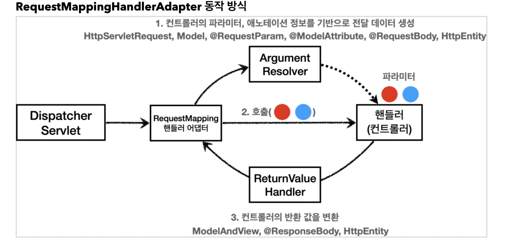
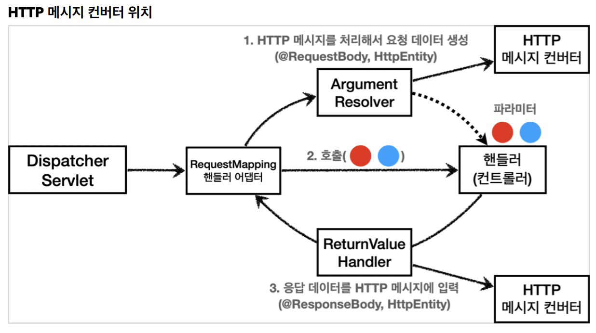

# 메시지 컨버터

뷰 템플릿으로 HTML을 생성해서 응답하는것이 아니라, HTTP API 처럼 JSON같은 데이터로 응답을 보낼때 메시지 컨버터를 사용하면 편하다.

@ResponseBody의 호출 구조는 이렇다.


> 출처 : 김영한 선생님 강의 자료

흐름을 따라가보자.

1. 요청이 들어오면 Controller 호출
2. Controller에 @ResponseBody를 보고 viewResolver 대신 HttpMessageConverter가 동작
3. 들어온 데이터를 보고 JSONConvert, StringConverter, 등등을 파악함.(밑에서 설명)
4. 요청 데이터와 헤더 등을 조합하여 새로운 메시지를 생성하고 반환.

여기서 무엇을 보고 판단할까? 일단 메시지를 반환할 때는 클라이언트의 Accept 헤더와 서버 컨트롤러의 반환 타입을 보고 판단한다.

클라이언트의 Accept는 헤더는 서버에게 요구되는 데이터 방식인데, 당연하게도 클라이언트가 요구하는 데이터가 아니면 안되지 않겠는가.

아무튼 스프링MVC는 다음의 경우에 HTTP 메시지 컨버터를 적용한다.
- HTTP 요청 : @RequestBody, HttpEntity(RequestEntity)
- HTTP 응답 : @ResponseBody, HttpEntity(ResponseEntity)


메시지 컨버터의 인터페이스 코드를 보자.

```java
package org.springframework.http.converter;

public interface HttpMessageConverter<T> {
    boolean canRead(Class<?> clazz, @Nullable MediaType mediaType);
    boolean canWrite(Class<?> clazz, @Nullable MediaType mediaType);

    List<MediaType> getSupportedMediaTypes();

T read(Class<? extends T> clazz, HttpInputMessage inputMessage)
throws IOException, HttpMessageNotReadableException;

void write(T t, @Nullable MediaType contentType, HttpOutputMessage
outputMessage)
throws IOException, HttpMessageNotWritableException;
}
```

당연하게도 can~은 읽을 수 있는지, 쓸 수 있는지에 대한 판단 여부이고 read, write는 데이터를 읽고 쓴다는 것일것이다.

그럼 이 can~이 먼저 동작될 때 나름의 판단 기준이 있을텐데, 그 판단기준을 보자.

```text
(일부 생략)
0 = ByteArrayHttpMessageConverter
1 = StringHttpMessageConverter
2 = MappingJackson2HttpMessageConverter
```

이것도 직관적이다. 0순위는 배열인지, 1순위는 문자열인지, 2순위로 JSON형태인지 확인한다.

그래. 그러면 이게 배열이고 문자열이고 JSON이고는 어떻게 판단할까?

그건 요청으로 들어온 데이터와 헤더값 중 '미디어 타입'에 따라서 달라진다.

- ByteArrayHttpMessageConverter
  - 클래스 타입이 'byte[]'이고, 미디어 타입이 '*/*' 인 경우
  - 요청 예) @RequestBody byte[] data
  - 응답 예) @ResponseBody byte[] data 이 경우 반환 미디어 타입 = application/octet-stream
- StringHttpMessageConverter
  - 클래스 타입이 'String'이고, 미디어 타입이 '*/*'인 경우
  - 요청 예) @RequestBody String data
  - 응답 예) @ResponseBody return "ok"; 이 경우 반환 미디어 타입 = text/plain
- MappingJackson2HttpMessageConverter
  - 클래스 타입이 '객체 또는 HashMap', 미디어 타입이 'application/json'관련 경우
  - 요청 예) @RequestBody BmiData data
  - 응답 예) @ResponseBody bmidata 이 경우 반환 미디어 타입 = application/json
  
예를 들어보자.

```text
content-type: application/json

@RequestMapping
void hello(@RequetsBody String data) {}
```

이런 요청이 들어오면 어떤것을 선택해야할까? 당연히 *StringHttpMessageConverter*이다.

왜냐하면 들어온 데이터의 타입이 String이고, 미디어 타입도 */*에 포함되는 application/json이기 때문이다.

또 다른 예를 들어보자.

```text
content-type: application/json

@RequestMapping
void hello(@RequetsBody BmiData data) {}
```

이건 MappingJackson2HttpMessageConverter가 호출되는걸 알 것이다.

이 경우는 어떨까?

```text
content-type:text/html

@RequestMapping
void hello(@RequestBody BmiData data) {}
```

당연히 아무것도 호출되지 않는다. content-type이 json관련이 아니지 않는가.

이를 토대로 처음부터의 흐름을 다시 정리하겠다.

1. HTTP 요청 데이터를 읽음.
2. 컨트롤러에서 @ResponseBody, HttpEntity 파라미터를 사용한다? 만약 사용한다면
3. 메시지 컨버터가 메시지를 읽을 수 있는지 확인하기 위해 canRead()를 호출.  
    - HTTP 요청의 데이터 자료형을 확인
    - HTTP 요청의 Content-Type 미디어 타입을 지원하는가?
4. canRead()의 조건을 만족하면 read()를 호출해서 객체를 생성하고, 반환한다.

응답 데이터를 생성할 때 

1. 컨트롤러에서 @ResponseBody, HttpEntity로 값이 반환된다?
2. 메시지 컨버터가 메시지를 쓸 수 있는지 확인하기 위해 canWrite()가 호출
    - 대상 클래스 타입을 지원하는가? (데이터 타입)
    - HTTP 요청의 Accept 미디어 타입을 지원하는가?
3. canWrite() 조건을 만족하면 write()를 호출해서 HTTP 응답 메시지 바디에 데이터를 전달!

# 메시지 컨버터의 위치

어딨는걸까?

스프링MVC구조를 보자.

  
> 출처 : 김영한 선생님 강의 노트

어딨음?

잘 생각해보면 뻔하다.

결국 핸들러 어댑터에서 컨트롤러에 등록된 함수들을 실행할텐데 그 함수들에는 애노테이션이 덕지덕지 붙어있을 것 아닌가? 그래서 핸들러 어댑터와 핸들러 사이에 위치해있다.

  
> 출처 : 김영한 선생님 강의 노트

그렇다. 저 중간에서 애노테이션들을 보고 요청값에 따른, 리턴값을 정해주고 데이터를 처리해준다.

## ArgumentResolver

*ArgumentResolver*가 요청에 대한 파라미터들을 처리해버려서 컨트롤러가 필요로 하는 다양한 파라미터 값의 객체를 생성해서 컨트롤러에 넘겨준다.

### 동작방식

*ArgumentResolver*안에 있는 *supportParameter()*를 호출해서 파라미터에 대한 객체를 생성할 수 있는지 여부를 확인한다. 

생성할 수 있으면 객체를 생성해서 컨트롤러에 넘겨준다.

원한다면 개발자가 커스텀마이징을 할 수 있다.!

## ReturnValueHandler

정식명칭은 *HandlerMethodReturnValueHandler*인데 줄여서 *ReturnValueHandler*라고 한다.

간단하게 응답값을 생성해내는데, 컨트롤러에서 String으로 뷰 이름을 반환해도 웹이 띄워지게 되는게 이 놈 덕분이다.

-----

생각해보면 메시지 컨버터는 아직 어딨는지 모르겠다.

도대체 어딨어?

결국 저 두 놈도 객체를 생성할때 누군가의 도움이 필요하다. 저 두 놈이 여러 요청 파라미터에 대해서 여러 객체를 생성할텐데 객체를 생성할때 메시지 컨버터가 도와준다.

따라서 여기에 있다.



흐름을 다시 보자.

**요청의 경우**는 @Requestbody를 처리하는 ArgumentResolver가 있고, HttpEntity를 처리하는 ArgumentResolver가 있을 것이다. 이 ArgumentResolver 들이 HTTP 메시지 컨버터를 사용해서 필요한 객체를 생성하는 것이다.

**응답의 경우**는 @ResponseBody를 처리하는 ReturnValueHandler가 있고, HttpEntity를 처리하는 ReturnValueHandler가 있을 것이다.
여기에 HTTP 메시지 컨버터를 호출해서 응답결과를 만든다.

> 참고 : 스프링 MVC는 @RequestBody @ResponseBody 가 있으면 RequestResponseBodyMethodProcessor (ArgumentResolver) HttpEntity 가 있으면 HttpEntityMethodProcessor (ArgumentResolver)를 사용한다.


## 확장

스프링은 위에서 말한 **HttpMessageConverter,HandlerMethodArgumentResovler, HandlerReturnValueHandler**를 인터페이스로 제공한다.

확장이 가능하다는 것이다.

기능 확장은 **WebMvcConfiguer**를 상속받아서 가능하다. 여기서 다루지는 않을 것이다.!!

필요할때 찾자 ㅎ


