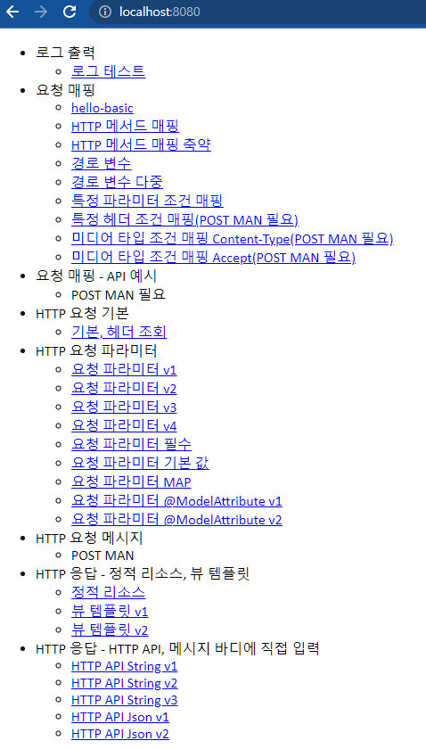

# 개요

프로젝트를 새로 생성해야한다.

의존성

-----

Project : Gradle  
Language : java  
java  : 11  
Dependencies : Spring Web, Thymeleaf, Lombok

-----

강의에서는 Welcome페이지라고 다음과 같이 만들었다.

경로 : main/resources/static/index.html

소스는 공개하기 어려우므로 대충 이런게 있다고 느낌만 받자.

  

1. 로그 테스트(1_Logging.md)
2. 요청 매핑(2_Mapping.md)
3. HTTP 요청에 대하여. 스프링이 받는 파라미터들에 대한 내용. 진화.(3_HTTP_Request.md) 
4. HTTP 에서 응답 하는 방법에 관하여 (4_HTTP_Request_body.md)
5. HTTP 에서 응답하는데 직접 메시지 바디를 꾸려서 응답하는 방법.(5_HTTP_Response_Web.md)
6. HTTP Message Converter에 대한 내용(6_MessageConverter.md)
   

