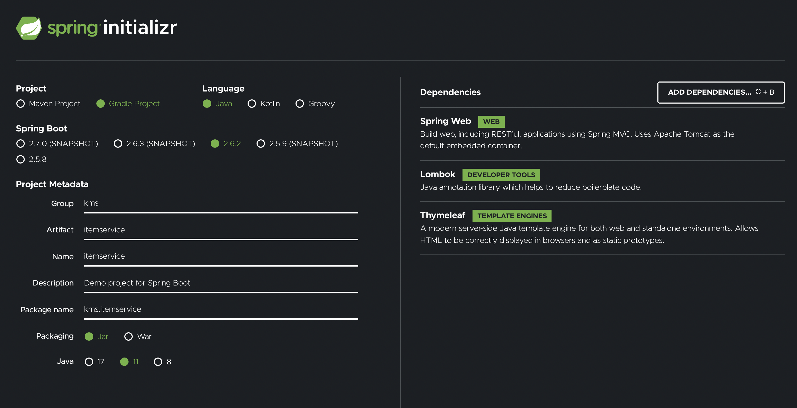

# 1. 프로젝트 세팅

<https://start.spring.io>에서 다음과 같이 프로젝트를 설정해준다.

  


```text
Project: Gradle Project
Language: Java
Spring Boot: 최신버전 단, SNAPSHOT같은거 안 붙은거
Project Metadata
Group: kms(그냥 아무거나)
Artifact: itemservice
Name: itemservice
Package name: hello.itemservice
Packaging: Jar (주의!)
Java: 11
Dependencies: Spring Web, Thymeleaf, Lombok
```

생성하고 빌드를 완료했다면 <http://localhost:8080>에 들어가서 White label이 뜨면 성공!

# 2. 요구사항 분석

### 롤 챔피언 상점 도메인 모델

- 챔피언 ID
- 챔피언 이름
- 가격
- 코멘트

### 롤 챔피언 상점 관리 기능

- 등록된 챔피언 목록
- 챔피언 상세
- 챔피언 등록
- 챔피언 수정
