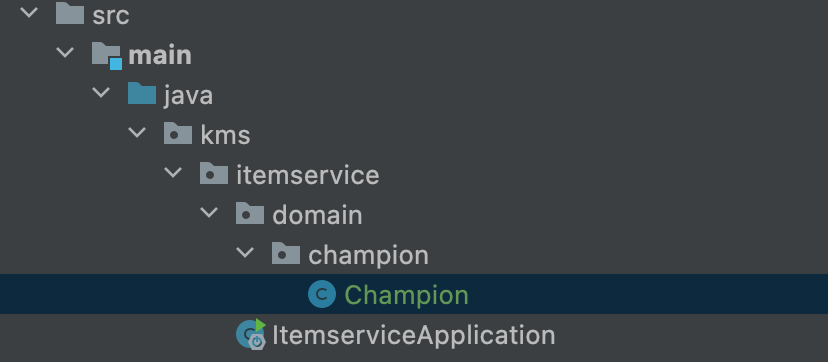
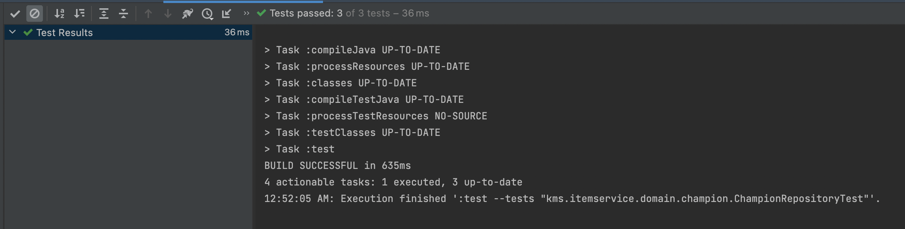

# 도메인 개발

도메인을 개발할 것이다.

프로젝트 구조는 일단 다음과 같다. 코드를 더 늘려나갈 것인데, 초기 구조는 이렇다. 마지막에 또 추가할 것!




## 1. Champion Domain Code

```java
package kms.itemservice.domain.champion;

import lombok.Data;

//프로젝트 규모가 작으므로 사용, 권장 하지 않는다.
@Data
public class Champion {
    private Long id;
    private String chamName;
    private int price; //가격은 NULL이 들어오면 안된다.
    private String comment;

    //생성자
    public Champion(){}

    //생성자
    public Champion(String chamName, int price, String comment) {
        this.chamName = chamName;
        this.price = price;
        this.comment = comment;
    }
}

```

## 2. Repository Code

프로젝트 규모가 작아서 저장소도 캐시메모리를 사용할것이고, 패키지도 분리하지 않을것이다.

```java
package kms.itemservice.domain.champion;

import org.springframework.stereotype.Repository;

import java.util.ArrayList;
import java.util.HashMap;
import java.util.List;
import java.util.Map;

@Repository
public class ChampionRepository {

    //캐시 메모리 사용할 것이므로 HashMap을 사용. 동시성 문제 해결 안되면 권장x
    private static final Map<Long,Champion> store = new HashMap<>();
    private static long sequence = 0L;

    public Champion save(Champion cham){
        cham.setId(++sequence);
        store.put(cham.getId(),cham);
        return cham;
    }

    public Champion findId(Long id){
        return store.get(id);
    }

    public List<Champion> findAll(){
        return new ArrayList<>(store.values());
    }

    public void update(Long id, Champion cham){
        Champion origincham = findId(id);
        origincham.setChamName(cham.getChamName());
        origincham.setPrice(cham.getPrice());
        origincham.setComment(cham.getComment());
    }


}

```

- 저장
- 객체 단일 조회
- 객체 모두 조회
- 객체 업데이트

로 작성하였다.

## 3. Test Code

- Save() 테스트 코드

```java
    @Test
    void save() {
        //Given
        Champion champion = new Champion("vayne",4800,"빨간안경");
        //When
        championRepository.save(champion);

        //Then
        Champion findcham = championRepository.findId(champion.getId());
        Assertions.assertThat(findcham).isEqualTo(champion);
    }
```

새로운 객체를 넣고 저장소에서 직접 찾은 객체와 비교하여 일치하는지 봄.

- findAll() 테스트 코드

```java
    @Test
    void findAll() {
        //Given
        Champion vayne = new Champion("vayne",4800,"빨간안경");
        Champion Ezreal = new Champion("Ezreal",6300,"노머고");
        //When
        championRepository.save(vayne);
        championRepository.save(Ezreal);
        List<Champion> allcham = championRepository.findAll();
        //Then
        Assertions.assertThat(allcham.size()).isEqualTo(2);
        Assertions.assertThat(allcham).contains(vayne,Ezreal);

    }
```

베인이라는 객체와 이즈리얼 객체를 넣고, 저장소에서 꺼냄.

꺼낸 겍체의 사이즈가 2개인지 확인하고 베인과 이즈리얼 객체를 포함하는지 확인.

- update() 테스트 코드

```java
    @Test
    void update() {
        //Given
        Champion champion = new Champion("vayne",4800,"빨간안경");
        Champion vayne = championRepository.save(champion);
        Long vayneid = vayne.getId();

        //When
        Champion updatecham = new Champion("Ezreal",6300,"노머고");
        championRepository.update(vayneid,updatecham);

        Champion ezreal = championRepository.findId(vayneid);
        //Then
        Assertions.assertThat(ezreal.getChamName()).isEqualTo(updatecham.getChamName());
        Assertions.assertThat(ezreal.getPrice()).isEqualTo(updatecham.getPrice());
        Assertions.assertThat(ezreal.getComment()).isEqualTo(updatecham.getComment());

    }
```

베인 객체를 생성하고, 이즈리얼로 바꿔버린다음 맞나 확인함.

**결과**




