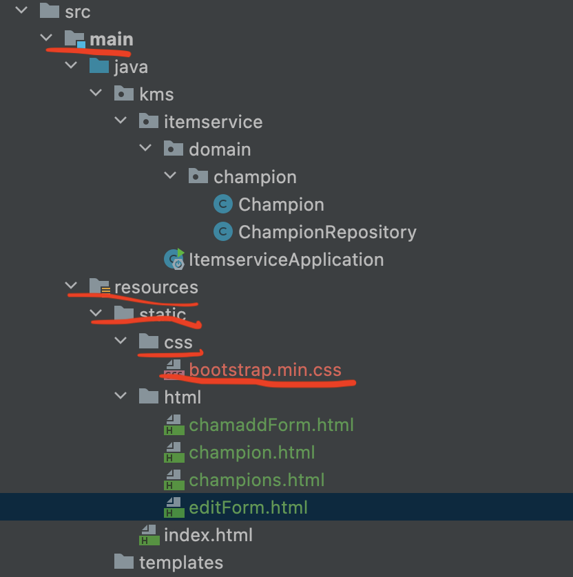
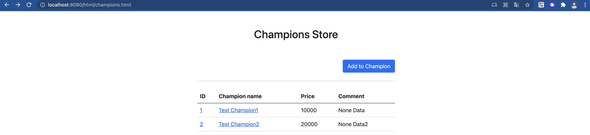

# HTML 개발

bootstrap에서 css를 가져다 사용하는듯하다.

<https://getbootstrap.com/docs/5.0/getting-started/download/>여기서 *bootstrap.min.css*를 복사해서 다음 경로에 추가하자. 

*resources/static/css/bootstrap.min.css*



이제 정적 HTML Form을 작성할 것이다.

## 1. 챔피언목록 HTML - resources/html/champions.html

```html
<!DOCTYPE HTML>
<html>
<head>
  <meta charset="utf-8">
  <link href="../css/bootstrap.min.css" rel="stylesheet">
</head>
<body>
<div class="container" style="max-width: 600px">
  <div class="py-5 text-center">
    <h2>Champions Store</h2>
  </div>
  <div class="row">
    <div class="col">
      <button class="btn btn-primary float-end"
              onclick="location.href='chamaddForm.html'" type="button">Add to Champion</button>
    </div>
  </div>
  <hr class="my-4">
  <div>
    <table class="table">
      <thead>
      <tr>
        <th>ID</th>
        <th>Champion name</th>
        <th>Price</th>
        <th>Comment</th>
      </tr>
      </thead>
      <tbody>
      <tr>
        <td><a href="champion.html">1</a></td>
        <td><a href="champion.html">Test Champion1</a></td>
        <td>10000</td>
        <td>None Data</td>
      </tr>
      <tr>
        <td><a href="champion.html">2</a></td>
        <td><a href="champion.html">Test Champion2</a></td>
        <td>20000</td>
        <td>None Data2</td>
      </tr>
      </tbody>
    </table>
  </div>
</div> <!-- /container -->
</body>
</html>
```

기본 예제를 변형했다.

## 2. 챔피언 상세 HTML - resources/html/champion.html

```html
<!DOCTYPE HTML>
<html>
<head>
    <meta charset="utf-8">
    <link href="../css/bootstrap.min.css" rel="stylesheet">
    <style>
        .container {
            max-width: 560px;
        }
    </style>
</head>
<body>
<div class="container">
    <div class="py-5 text-center">
        <h2>Infomation Champion</h2>
    </div>
    <div>
        <label for="chamId"> Cham ID</label>
        <input type="text" id="chamId" name="chamId" class="form-control"
               value="1" readonly>
    </div>
    <div>
        <label for="chamName">Champion name</label>
        <input type="text" id="chamName" name="chamName" class="form-control"
               value="Champion None" readonly>
    </div>
    <div>
        <label for="price">Price</label>
        <input type="text" id="price" name="price" class="form-control"
               value="10000" readonly>
    </div>
    <div>
        <label for="comment">Comment</label>
        <input type="text" id="comment" name="comment" class="form-control"
               value="10" readonly>
    </div>
    <hr class="my-4">
    <div class="row">
        <div class="col">
            <button class="w-100 btn btn-primary btn-lg"
                    onclick="location.href='editForm.html'" type="button">Edit Champions Info</button>
        </div>
        <div class="col">
            <button class="w-100 btn btn-secondary btn-lg"
                    onclick="location.href='champions.html'" type="button">main</button>
        </div>
    </div>
</div> <!-- /container -->
</body>
</html>
```

## 3. 챔피언 등록 HTML - resources/html/chamaddForm.html

```html
<!DOCTYPE HTML>
<html>
<head>
    <meta charset="utf-8">
    <link href="../css/bootstrap.min.css" rel="stylesheet">
    <style>
        .container {
            max-width: 560px;
        }
    </style>
</head>
<body>
<div class="container">
    <div class="py-5 text-center">
        <h2>Add champion Form</h2>
    </div>
    <h4 class="mb-3">Add champion</h4>
    <form action="champion.html" method="post">
        <div>
            <label for="chamName">Champion Name</label>
            <input type="text" id="chamName" name="chamName" class="form-control" placeholder="input champion name">
        </div>
        <div>
            <label for="price">Price</label>
            <input type="text" id="price" name="price" class="form-control"
                   placeholder="input Price">
        </div>
        <div>
            <label for="comment">comment</label>
            <input type="text" id="comment" name="comment" class="form-control" placeholder="input comment">
        </div>
        <hr class="my-4">
        <div class="row">
            <div class="col">
                <button class="w-100 btn btn-primary btn-lg" type="submit">add champion</button>
            </div>
            <div class="col">
                <button class="w-100 btn btn-secondary btn-lg"
                        onclick="location.href='champions.html'" type="button">cancle</button>
            </div>
        </div>
    </form>
</div> <!-- /container -->
</body>
</html>
```

## 4. 챔피언 수정 HTML - resources/html/editForm.html

```html
<!DOCTYPE HTML>
<html>
<head>
    <meta charset="utf-8">
    <link href="../css/bootstrap.min.css" rel="stylesheet">
    <style>
        .container {
            max-width: 560px;
        }
    </style>
</head>
<body>
<div class="container">
    <div class="py-5 text-center">
        <h2>Edit Champion info form</h2>
    </div>
    <form action="champion.html" method="post">
        <div>
            <label for="id">Champion ID</label>
            <input type="text" id="id" name="id" class="form-control" value="1"
                   readonly>
        </div>
        <div>
            <label for="chamName">Champion Name</label>
            <input type="text" id="chamName" name="chamName" class="form-control" value="ChampionA">
        </div>
        <div>
            <label for="price">Price</label>
            <input type="text" id="price" name="price" class="form-control"
                   value="10000">
        </div>
        <div>
            <label for="quantity">comment</label>
            <input type="text" id="quantity" name="quantity" class="form-control" value="10">
        </div>
        <hr class="my-4">
        <div class="row">
            <div class="col">
                <button class="w-100 btn btn-primary btn-lg" type="submit">save
                </button>
            </div>
            <div class="col ">
                <button class="w-100 btn btn-secondary btn-lg"
                        onclick="location.href='champion.html'" type="button">cancle</button>
            </div>
        </div>
    </form>
</div> <!-- /container -->
</body>
</html>
```


# 결과

<http://localhost:8080/html/champions.html>




