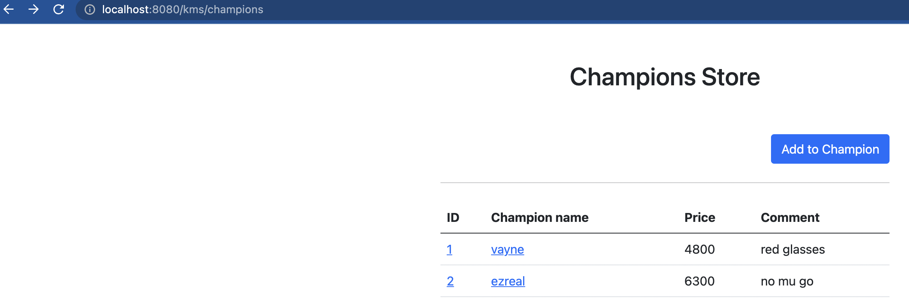
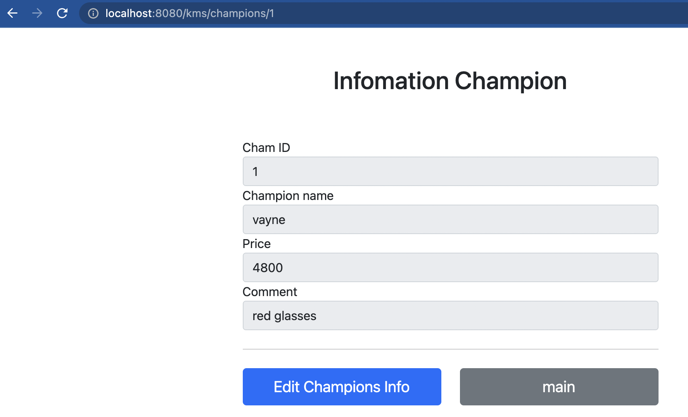
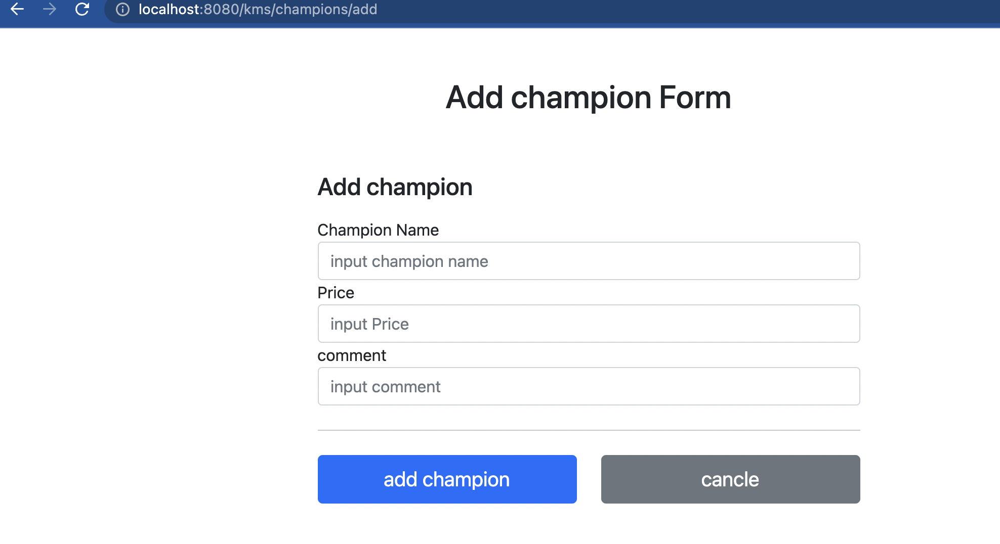
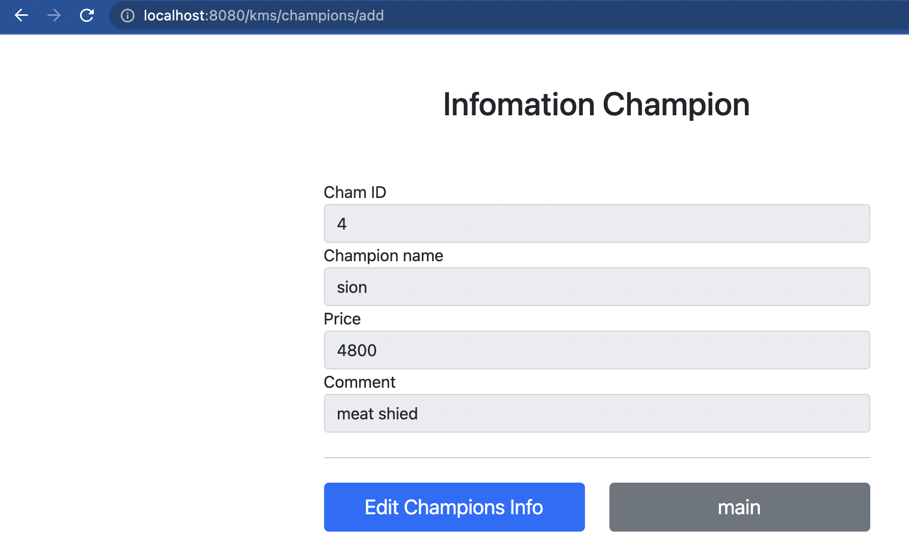

# Thymeleaf를 사용해서 동적뷰로 변환

퍼블리셔분이 HTML을 작성했다고 치고, 해당 HTML을 동적 view로 바꿔보겠다.

먼저 컨트롤러를 작성해야한다.

## 1. 컨트롤러 작성


```java
package kms.itemservice.domain.champion.kms;

import kms.itemservice.domain.champion.Champion;
import kms.itemservice.domain.champion.ChampionRepository;
import lombok.RequiredArgsConstructor;
import org.springframework.stereotype.Controller;
import org.springframework.ui.Model;
import org.springframework.web.bind.annotation.GetMapping;
import org.springframework.web.bind.annotation.RequestMapping;

import javax.annotation.PostConstruct;
import java.util.List;

@Controller
@RequestMapping("/kms/champions")
//의존성 관리
@RequiredArgsConstructor
public class ChampionController {
    private final ChampionRepository championRepository;

    @GetMapping
    public String champions(Model model){
        List<Champion> findallcham = championRepository.findAll();
        model.addAttribute("allcham",findallcham);
        return "/kms/champions";
    }

    /**
     * Test용
     */
    @PostConstruct
    public void Test(){
        championRepository.save(new Champion("vayne",4800,"red glasses"));
        championRepository.save(new Champion("ezreal",6300,"no mu go"));
    }
}

```

요청이 들어오면 레포지토리에 저장된 모든 객체를 가져와서 모델에 넣고 '/kms/champions'라는 뷰로 반환한다.

근데 처음 접근하면 객체가 아무것도 없을테니 새로운 객체를 생성하기 위해 밑의 코드처럼 *@PostConstruct* 사용해서 초기값을 셋팅해준다.

### PostConstruct?

>@PostConstruct는 의존성 주입이 이루어진 후 초기화를 수행하는 메서드이다. @PostConstruct가 붙은 메서드는 클래스가 service(먼저 호출되는 함수 위에서는 champions()인듯)를 수행하기 전에 발생한다. 이 메서드는 다른 리소스에서 호출되지 않는다해도 수행된다. 


컨트롤러에서 '/kms/champions'로 데이터를 보내기로 했으니까 해당 경로에 동적뷰페이지를 만들어야 한다.

## 2. /kms/champions.html 작성 - 경로 : /resources/templates/kms/champions.html

여기서는 thymeleaf를 사용해서 뷰를 바꿀것이다.

```html
<!DOCTYPE HTML>
<html xmlns:th="http://www.thymeleaf.org">
<head>
    <meta charset="utf-8">
    <link href="../css/bootstrap.min.css"
          th:href="@{/css/bootstrap.min.css}" rel="stylesheet">
</head>
<body>
<div class="container" style="max-width: 600px">
    <div class="py-5 text-center">
        <h2>Champions Store</h2>
    </div>
    <div class="row">
        <div class="col">
            <button class="btn btn-primary float-end"
                    onclick="location.href='chamaddForm.html'"
                    th:onclick="|location.href='@{/kms/champions/add}'|" type="button">Add to Champion</button>
        </div>
    </div>
    <hr class="my-4">
    <div>
        <table class="table">
            <thead>
            <tr>
                <th>ID</th>
                <th>Champion name</th>
                <th>Price</th>
                <th>Comment</th>
            </tr>
            </thead>
            <tbody>
            <tr th:each="champion : ${champions}">
                <td><a href="champion.html"
                th:href="@{/kms/champions/{chamId}(chamId = ${champion.id})}" th:text="${champion.id}">Champion id</a></td>
                <td><a href="champion.html"
                th:href="@{|/kms/champions/${champion.id}|}"th:text="${champion.chamName}">Test ChampionName</a></td>
                <td th:text="${champion.price}">6400</td>
                <td th:text="${champion.comment}">none comment</td>
            </tr>
            </tbody>
        </table>
    </div>
</div> <!-- /container -->
</body>
</html>
```

바뀐 부분은 세 부분이다.

```html
<html xmlns:th="http://www.thymeleaf.org">

<button class="btn btn-primary float-end"
    onclick="location.href='chamaddForm.html'"
    th:onclick="|location.href='@{kms/champions/add}'|" type="button">Add to Champion</button>

<link href="../css/bootstrap.min.css"
    th:href="@{/css/bootstrap.min.css}" rel="stylesheet">


<tr th:each="champion : ${champions}">
    <td><a href="champion.html"
    th:href="@{/kms/champions/{chamId}(chamId = ${champion.id})}" th:text="${champion.id}">Champion id</a></td>
    <td><a href="champion.html"
    th:href="@{|/kms/champions/${champion.id}|}"th:text="${champion.chamName}">Test ChampionName</a></td>
    <td th:text="${champion.price}">6400</td>
    <td th:text="${champion.comment}">none comment</td>
</tr>
```

thymeleaf까지 설명하면 글이 너무 길어지므로 pass..

리터럴 대체 문법, @{}식, ${}식, th:xxx문법에 대해서 알아보면 좋을것 같다.  



컨트롤러에 매핑한 url로 들어가서 다음과 같이 뜨니까 성공!!

초기값도 잘 들어갔다.

## 3. 챔피언 상세 컨트롤러 작성

컨트롤러에 챔피언 상세 페이지 관련 컨트롤러를 추가해줘야한다.

프로젝트 규모가 작으므로 하나의 컨트롤러에 몰아 넣겠다.

```java
//컨트롤러 추가
@GetMapping("/{championid}")
public String info(@PathVariable Long championid, Model model){
    Champion findcham = championRepository.findId(championid);
    model.addAttribute("champion",findcham);
    return "/kms/champion";
}
```

이제 리턴값으로 주어진 'kms/champion.html'을 만들어보자.

```html
<!DOCTYPE HTML>
<html xmlns:th="http://www.thymeleaf.org">
    <meta charset="utf-8">
    <link href="../css/bootstrap.min.css"
          th:href="@{/css/bootstrap.min.css}"
          rel="stylesheet">
    <style>
        .container {
            max-width: 560px;
        }
    </style>
</head>
<body>
<div class="container">
    <div class="py-5 text-center">
        <h2>Infomation Champion</h2>
    </div>
    <div>
        <label for="chamId"> Cham ID</label>
        <input type="text" id="chamId" name="chamId" class="form-control"
               value="1" th:value="${champion.id}" readonly>
    </div>
    <div>
        <label for="chamName">Champion name</label>
        <input type="text" id="chamName" name="chamName" class="form-control"
               value="Champion None" th:value="${champion.chamName}" readonly>
    </div>
    <div>
        <label for="price">Price</label>
        <input type="text" id="price" name="price" class="form-control"
               value="10000" th:value ="${champion.price}"readonly>
    </div>
    <div>
        <label for="comment">Comment</label>
        <input type="text" id="comment" name="comment" class="form-control"
               value="10" th:value="${champion.comment}"readonly>
    </div>
    <hr class="my-4">
    <div class="row">
        <div class="col">
            <button class="w-100 btn btn-primary btn-lg"
                    onclick="location.href='editForm.html'"
                    th:onclick="|location.href='@{/kms/champions/{championId}/edit(championId=${champion.id})}'|"
                    type="button">Edit Champions Info</button>
        </div>
        <div class="col">
            <button class="w-100 btn btn-secondary btn-lg"
                    onclick="location.href='champions.html'"
                    th:onclick="|location.href='@{/kms/champions}'|"
                    type="button">main</button>
        </div>
    </div>
</div> <!-- /container -->
</body>
</html>
```

여기서 th:value 문법이 등장한다. 모델에 있는 champion값을 가져오고 프로퍼티 방식으로 접근한다.(getcomment() 등)



이렇게 목록에서 링크를 눌렀을때 뜨면 성공


## 4. 챔피언 추가 컨트롤러, view 작성

컨트롤러에 추가추가

```java
    @GetMapping("/add")
    public String add(){
        return "/kms/chamaddForm";
    }
```

해당 경로의 html을 작성작성

```html
<!DOCTYPE HTML>
<html xmlns:th="http://www.thymeleaf.org">
<head>
    <meta charset="utf-8">
    <link href="../css/bootstrap.min.css"
          th:href="@{/css/bootstrap.min.css}"
          rel="stylesheet">
    <style>
        .container {
            max-width: 560px;
        }
    </style>
</head>
<body>
<div class="container">
    <div class="py-5 text-center">
        <h2>Add champion Form</h2>
    </div>
    <h4 class="mb-3">Add champion</h4>
    <form action="champion.html" th:action method="post">
        <div>
            <label for="chamName">Champion Name</label>
            <input type="text" id="chamName" name="chamName" class="form-control" placeholder="input champion name">
        </div>
        <div>
            <label for="price">Price</label>
            <input type="text" id="price" name="price" class="form-control"
                   placeholder="input Price">
        </div>
        <div>
            <label for="comment">comment</label>
            <input type="text" id="comment" name="comment" class="form-control" placeholder="input comment">
        </div>
        <hr class="my-4">
        <div class="row">
            <div class="col">
                <button class="w-100 btn btn-primary btn-lg"
                        type="submit">add champion</button>
            </div>
            <div class="col">
                <button class="w-100 btn btn-secondary btn-lg"
                        onclick="location.href='champions.html'"
                        th:onclick="|location.href='/kms/champions'|"
                        type="button">cancle</button>
            </div>
        </div>
    </form>
</div> <!-- /container -->
</body>
</html>
```

th:action 문법이 나온다. 저렇게 th:action만 써주면 같은 경로로 post를 보낸다.

같은경로에 post로 보낼것이므로 생략한다.



이렇게 add 폼이 뜨면 성공!

## 5. 챔피언 등록 컨트롤러, 상세페이지로 넘어가기

add Champion 버튼을 누르면 서버에 저장되고, 상세페이지로 넘어가게 로직을 작성하겠다.

메시지 바디에 쿼리파라미터 형식으로 전달할것이므로 @RequestParam, @ModelAttribute를 사용할 수 있다.

### 5.1 @RequestParam을 사용한 방식

```java
    @PostMapping("/add")
    public String addCham(@RequestParam("chamName") String chamName,
                          @RequestParam("price") int price,
                          @RequestParam("comment") String comment,Model model){
        Champion champion = new Champion();
        champion.setComment(comment);
        champion.setChamName(chamName);
        champion.setPrice(price);

        championRepository.save(champion);

        model.addAttribute("champion",champion);

        return "/kms/champion";
    }
```

@RequestParam을 이용하면 파라미터값들도 많아지고, 모델에 값들을 담아줘야하는 과정이 있다.

일단 제대로 성공하는지 확인하였다.

  

url을 보면 ~/add인데, 상세페이지로 잘 넘어간걸 볼 수 있다.

더 좋은 방법이 없을까?

ModelAttribute를 사용해봐야겠다.

### 5.2 @ModelAttribute를 사용하기.

```java
    @PostMapping("/add")
    public String addCham1(@ModelAttribute("champion") Champion champion,Model model){
        championRepository.save(champion);

        //model.addAttribute("champion",champion);//자동 등록 생략 가능. ModelAttribute가 자동으로 해준다.!!

        return "/kms/champion";
    }
```

실행해보면 잘 된다.

*@ModelAttribute*를 사용하면 @RequestParam을 덕지덕지 안 붙여도 되고, 객체에 자동으로 필요한 값들을 넣어준다는 점이 있다. 심지어 Model객체에도 자동으로 값을 넣고 뷰에 넘겨준다.

@ModelAttribute("뷰로 전달할 이름") 이렇게 작성하여 뷰에는 'champion'이 넘어간다.

만약 

```java
@ModelAttribute("cham") Champion champion
```
로 작성하였다면, Model에는 다음과 같이 코드가 생성되어 넘어간다.

```java
model.addAttribute("cham",champion);
```

참고로 *ModelAttribute*의 파라미터를 생략할 수 있다.

```java
    @PostMapping("/add")
    public String addCham1(@ModelAttribute Champion champion,Model model){
        championRepository.save(champion);

        //model.addAttribute("champion",champion);//자동 등록 생략 가능. ModelAttribute가 자동으로 해준다.!!

        return "/kms/champion";
    }
```

이런식으로 작성하면 뒤에 있는 클래스 이름(Champion)의 앞글자만 소문자로 치환해서 모델에 넘긴다.

즉

```text
Champion champion -> model.addAtrribute(champion);
Helloworld hd -> model.addAttribute(helloworld);
```

이런식으로 넘어간다.

또한 *@ModelAttribute*를 생략해버릴 수 있다. 마찬가지로 클래스 이름의 앞글자만 소문자로 치환해서 넘겨버린다.

즉

```java
    @PostMapping("/add")
    public String addCham1( Champion champion){
        championRepository.save(champion);
        return "/kms/champion";
    }
```

극한으로 줄이면 이렇게까지도 된다는 것이다. Model객체도 파라미터에 안 넣어줘도 되는게, 생략된 ModelAttribute가 자동으로 Model에 넣어주기 때문이다.

하지만, 생략된게 너무 많아서 헷갈리는건 사실이다.

이렇게 모델까지 생략하면 누가 생성하고 전달하는것인가? -> RequestMappingHandlerAdapter가 해준다.!!


아무튼 적절하게 사용하자!!


## 6. 챔피언 수정 컨트롤러, 페이지 작성

컨트롤러를 작성하자.

```java
    @PostMapping("/{chamId}/edit")
    public String edit(@PathVariable Long chamId, Model model){
        Champion findcham = championRepository.findId(chamId);
        model.addAttribute("champion",findcham);
        return "/kms/editForm";
    }
```

수정 버튼을 누르기 전 뷰에서 chamId를 던지면 그걸 컨트롤러가 받아서 객체를 찾고 해당 객체를 edit뷰에 넘기는 작업이다.

뷰를 작성하자. 경로는 /kms/editForm.html

```html
<!DOCTYPE HTML>
<html xmlns:th="http://www.thymeleaf.org">
<head>
    <meta charset="utf-8">
    <link href="../css/bootstrap.min.css"
          th:href="@{/css/bootstrap.min.css}"
          rel="stylesheet">
    <style>
        .container {
            max-width: 560px;
        }
    </style>
</head>
<body>
<div class="container">
    <div class="py-5 text-center">
        <h2>Edit Champion info form</h2>
    </div>
    <form action="champion.html" th:action method="post">
        <div>
            <label for="id">Champion ID</label>
            <input type="text" id="id" name="id" class="form-control" value="1"
                   th:value="${champion.id}"
                   readonly>
        </div>
        <div>
            <label for="chamName">Champion Name</label>
            <input type="text" id="chamName" name="chamName" class="form-control" value="ChampionA"
                   th:value="${champion.chamName}">
        </div>
        <div>
            <label for="price">Price</label>
            <input type="text" id="price" name="price" class="form-control"
                   value="10000"
                   th:value="${champion.price}">
        </div>
        <div>
            <label for="quantity">comment</label>
            <input type="text" id="quantity" name="comment" class="form-control" value="10"
            th:value="${champion.comment}">
        </div>
        <hr class="my-4">
        <div class="row">
            <div class="col">
                <button class="w-100 btn btn-primary btn-lg" type="submit">save
                </button>
            </div>
            <div class="col ">
                <button class="w-100 btn btn-secondary btn-lg"
                        onclick="location.href='champion.html'"
                        th:onclick="|location.href='@{/kms/champions/{chamId}(chamId = ${champion.id})}'|"
                        type="button">cancle</button>
            </div>
        </div>
    </form>
</div> <!-- /container -->
</body>
</html>
```

save 버튼을 누르면 똑같은 url로 Post요청이 갈것이다. Post요청 처리를 해줘야하므로 해당 컨트롤러도 작성해주자.

```java
    @PostMapping("/{chamId}/edit")
    public String editpost(@PathVariable Long chamId,@ModelAttribute Champion champion){
        championRepository.update(chamId,champion);
        return "redirect:/kms/champions/{chamId}";
    }
```

의심의 여지없이 잘 돌아간다.

여기서 redirect문법이 나와있는데, {chamId}를 쓰면 PathVariable 어노테이션에 적용된 변수가 그대로 들어간다. 


