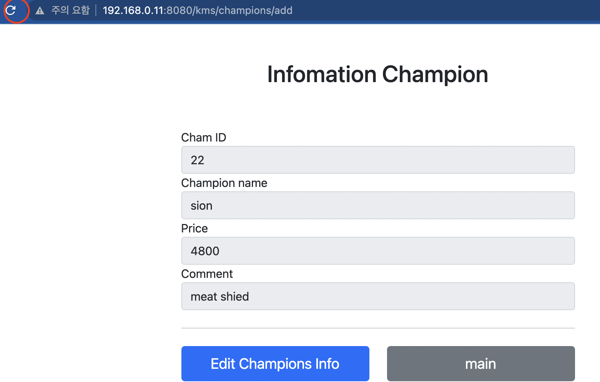
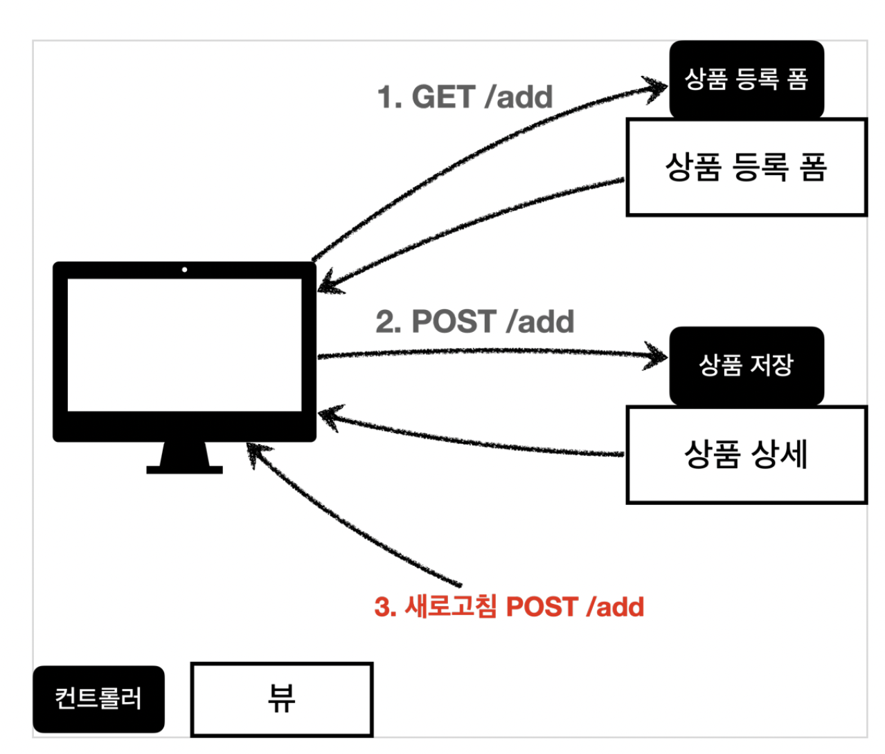
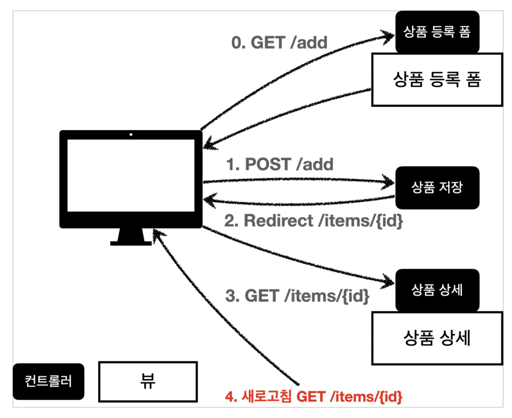
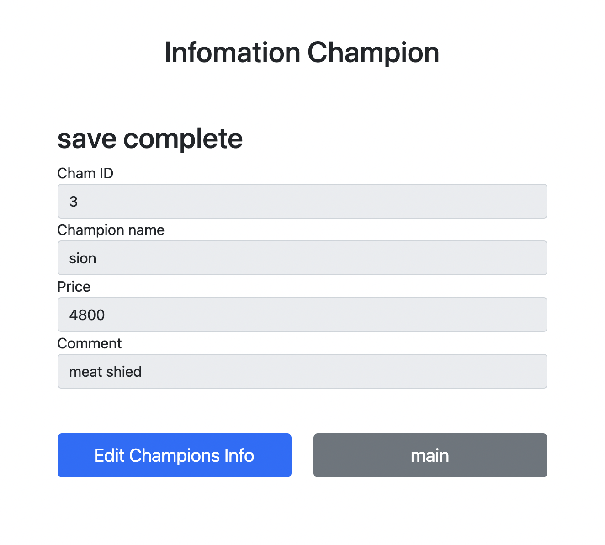
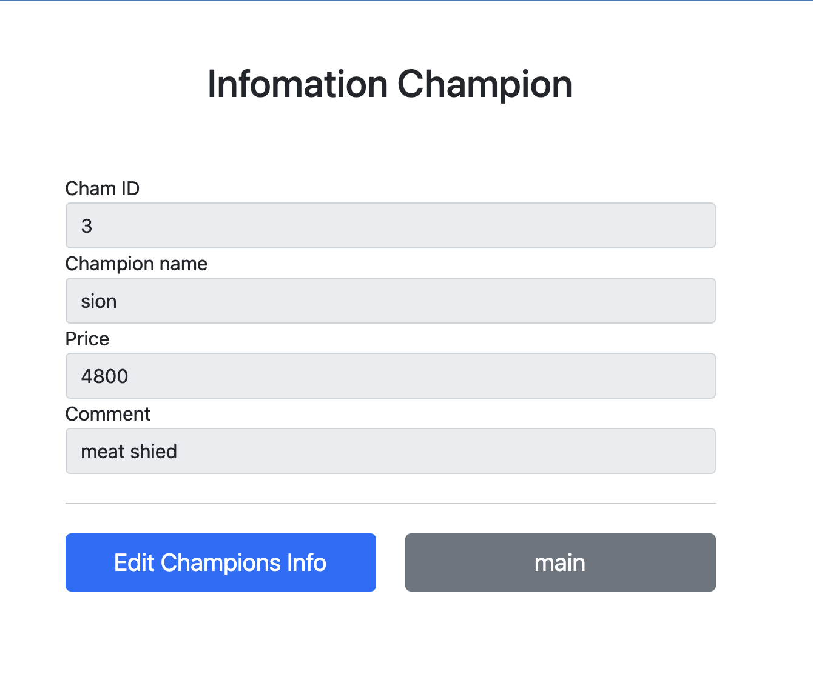

# PRG(Post + Redirect + Get) 기법

챔피언을 등록한 상태에서 새로고침을 하면 어떻게 될까?



새로고침을 하면 post요청이 계속 가서 Cham ID가 결국 22번까지 올란간 것을 볼 수 있다.

왜 이런 상황이 발생한걸까?

  
>출처 : 김영한 선생님 강의자료

이렇듯 Post를 보낸 상태에서 새로고침을 누르면 다시 post요청을한다는 것이다.

이를 해결하는 방법이 PRG기법이다.

하지만 PRG를 사용해서 사용자의 동적인 요청들을 전부 막을순 없다.

  

>출처 : 김영한 선생님 강의자료

리다이렉트로 get요청을 보내서 새로고침해도 get요청만 하도록 하면 되는것이다.

컨트롤러를 다음과 같이 수정한다.

```java
    @PostMapping("/add")
    public String addCham1( Champion champion,Model model){
        championRepository.save(champion);
        return "redirect:/kms/champions/" +champion.getId();
    }
```

참고로 이렇게 champion.getId()같이 URL에 변수를 더하며 코딩하면 인코딩 문제가 생길 수 있다고 한다.

그렇기 때문에 RedirectAttributes를 사용할것이다.

# RedirectAttributes

저장이 되었으면 "저장이 완료되었습니다."라는 문구를 추가하고 싶다.

뜬금없지만 사용자를 배려해야겠다.

컨트롤러에 다음과 같이 추가하자.

```java
    @PostMapping("/add")
    public String addCham1(Champion champion, RedirectAttributes redirectAttributes){
        Champion svchampion = championRepository.save(champion);
        redirectAttributes.addAttribute("championId",svchampion.getId());
        redirectAttributes.addAttribute("status",true);
        return "redirect:/kms/champions/{championId}" ;
    }
```

요로콤 하면 인코딩에러는 방지할 수 있겠다.

뷰도 수정해주자. 저기의 컨트롤러를 타고가면 결국 경로가 '/kms/champions'이므로 여길 수정해주겠다.

```html
~~
<!-- 추가 -->
<h2 th:if="${param.status}" th:text="'save complete'"></h2>
<div>
<label for="chamId"> Cham ID</label>
<input type="text" id="chamId" name="chamId" class="form-control"
        value="1" th:value="${champion.id}" readonly>
</div>

~~
```

요로콤 작성하면 저장시 결과가 이렇게 뜬다.



main에서 타고들어가면 'save complelte'가 없이 상세화면이 뜬다.



끝

